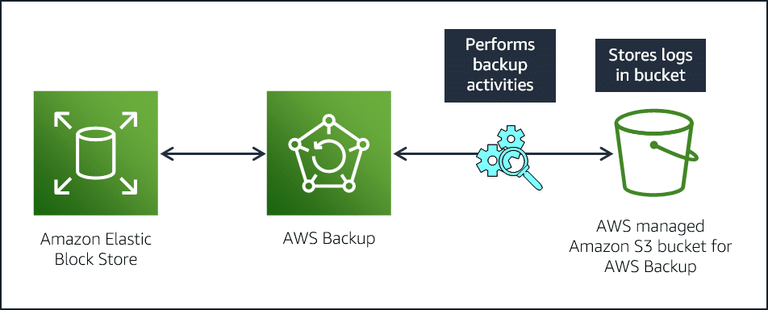

# AWS Backup

AWS Backup lets you centralize and automate data protection across AWS services. AWS Backup offers a cost-effective, fully managed, policy-based service that further simplifies data protection at scale. AWS Backup also helps you support your regulatory compliance obligations and meets your business continuity goals. 

Together with AWS Organizations, AWS Backup lets you centrally deploy data protection (backup) policies to configure, manage, and govern your backup activity across your organization’s AWS accounts and resources. Supported AWS services include Amazon EC2 instances, Amazon EBS volumes, Amazon Relational Database Service (RDS) databases (including Amazon Aurora clusters), Amazon DynamoDB tables, Amazon EFS, Amazon FSx for Lustre, Amazon FSx for Windows File Server, and AWS Storage Gateway volumes. 

## AWS Backup vs. EBS snapshots

AWS Backup extends your data backup beyond the Amazon EBS service. Amazon EBS Snapshots functions within the Amazon EBS service. Both AWS Backup and Amazon EBS Snapshots store the data backups of your EBS volume in a AWS managed Amazon S3 bucket. 

AWS Backup offers a more robust backup solution when compared to EBS Snapshots. With AWS Backup, you have additional features to meet your organizational requirements. Amazon EBS Snapshots service is tightly integrated with Amazon EC2 and Amazon EBS services. AWS Backup, however, operates as a separate service. 

* **Policy-based backup solution** - You can create backup policies called backup plans that enable you to define your backup requirements and then apply them to the AWS resources you want backed up. You can create separate backup plans that meet specific business and regulatory compliance requirements, helping to ensure that each of your AWS resources are backed up and protected.

* **Tag-based backup policies** - AWS Backup lets you apply backup plans to your AWS resources by tagging them, making it easier to implement your backup strategy across all your applications and ensure that all your AWS resources are backed up and protected.

* **Automated backup scheduling** - AWS Backup allows you to create backup schedules that you can customize to meet your business and regulatory backup requirements. You can also choose from predefined backup schedules based on common best practices. AWS Backup will automatically backup your AWS resources according to the policies and schedules you define. A backup schedule includes the backup start time, backup frequency, and backup window. 

* **Automated retention management** - With AWS Backup, you can set backup retention policies that will automatically retain and expire backups according to your business and regulatory backup compliance requirements. Automated backup retention management makes it easy to minimize backup storage costs by retaining backups for only as long as they are needed.

* **Backup activity monitoring** - AWS Backup provides a dashboard for you to audit your backup and restore activity across AWS services. With just a few clicks in the AWS Backup dashboard, you can view the status of recent backup jobs and restore jobs across AWS services to ensure that your AWS resources are properly protected.

* **Lifecycle management policies** - AWS Backup enables you to meet compliance requirements while minimizing backup storage costs by storing backups in a low-cost cold storage tier. You can configure lifecycle policies that will automatically transition backups from warm storage to cold storage according to a schedule that you define.

* **Backup access policies** - With AWS Backup, you can set resource-based access policies on Backup Vaults. A Backup Vault is a container used for organizing your backups. Resource-based access policies let you control access to backups in a Backup Vault across all users, rather than having to define permissions for each user. This provides a central and secure way to control access to your backups across AWS services and helps meet your backup compliance requirements.

* **Cross-region backup** - AWS Backup lets you copy backups across multiple AWS services to different regions from a central console, making it easier to meet your compliance and disaster recovery needs. With AWS Backup, you can copy backups either manually, as on-demand copy or automatically as part of a scheduled backup plan to multiple different regions. You can also recover from those backups in the new region, reducing the risk of downtime and ensuring disaster recovery and business continuity requirements are met.

* **Cross-account backup** - AWS Backup now supports cross-account backup, lets you securely copy your backups across all AWS accounts within your AWS organizations. With AWS Backup, you can copy backups either manually, as an on-demand copy, or automatically as part of a scheduled backup plan to only the trusted destination accounts in your organization. In the event anything happens to a backup and its source account, you can easily restore from the destination account or, alternatively, to the third account. Cross-account backup feature provides you an additional layer of protection should the source account experience disruption from accidental or malicious deletion, disasters, or ransomware. 
