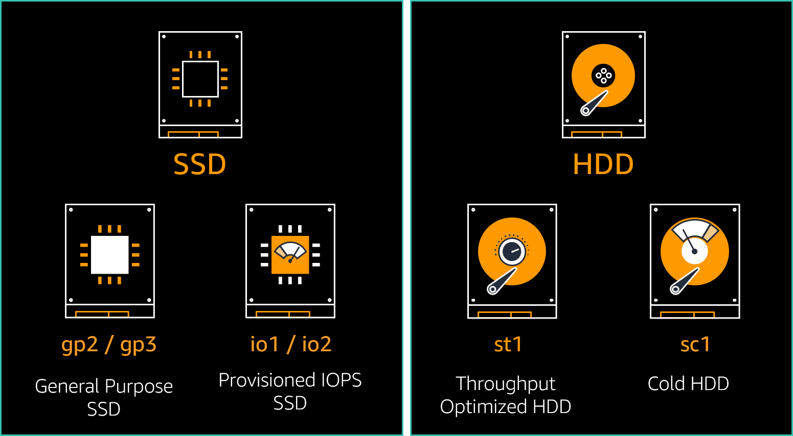

# EBS Volume Types

Amazon EBS provides the following volume types: **General Purpose SSD**, **Provisioned IOPS SSD**, **Throughput Optimized HDD**, **Cold HDD**, and **Magnetic (standard)**. They differ in performance characteristics and cost, which lets you to tailor your storage performance and cost to the needs of your applications.

* You can attach multiple EBS volumes to a single instance. The volume and instance must be in the same Availability Zone.

* Depending on the EBS volume type and EC2 instance types, you can use multi-attach to mount a volume to multiple instances at the same time.

## General Purpose SSDs

> General Purpose SSD-backed volumes provide a balance of price and performance. AWS recommends these for most workloads. The current General Purpose SSD offering includes **gp2** and **gp3** volume types.

> ### gp2 General Purpose SSD volumes
>
> gp2 General Purpose SSD volumes offer cost-effective storage that is ideal for a broad range of workloads. These volumes deliver single-digit millisecond latencies and the ability for smaller volumes to burst to 3,000 IOPS for extended periods of time. gp2 volume performance scales with the volume size.

> ### gp2 I/O burst credits and burst performance
>
> gp2 volume performance is tied to volume size, which determines the baseline performance level of the volume and how quickly it accumulates I/O or burst credits. I/O credits represent the available bandwidth that your gp2 volume can use to burst large amounts of I/O when more than the baseline performance is needed.

> ### gp3 General Purpose SSD volumes
>
> gp3 General Purpose SSD volumes offer cost-effective storage that is ideal for a broad range of workloads. gp3 volumes deliver a consistent baseline rate of 3,000 IOPS and 125 megabytes per second (MB/s) of throughput included with the price of storage. With gp3, you scale IOPS and throughput independent from the volume size.

## Provisioned IOPS SSDs

Provisioned IOPS SSD-backed volumes provide high performance for mission-critical, low-latency, or high-throughput workloads. Provisioned IOPS SSD volumes are designed to meet the needs of I/O-intensive workloads, particularly database workloads, that are sensitive to storage performance and consistency. AWS recommends these for most of your demanding workloads.

The current Provisioned IOPS SSD offering includes io1 and io2 volume types. io2 offers performance for most demanding workloads.

> ### io1 and io2 Provisioned IOPS SSD volume comparison
>
> io1 and io2 Provisioned IOPS SSD volumes are similar in most aspects; however, there are some differences. io2 volumes are the most current Provisioned IOPS SSD volumes available and are recommended by AWS for all new deployments.

## HDD-backed volumes

The HDD-backed volumes that Amazon EBS provides fall into two categories: st1 Throughput Optimized HDD volumes and sc1 Cold HDD volumes.

> ### Throughput Optimized HDD
>
> Throughput Optimized HDD provides low-cost HDD designed for frequently accessed, throughput-intensive workloads. Throughput Optimized HDD (st1) volumes provide low-cost magnetic storage that defines performance in terms of throughput rather than IOPS. st1 volumes are designed to support frequently accessed data. This volume type is optimized for workloads involving large, sequential I/O. AWS recommends that you use gp3 General Purpose SSD volumes for workloads performing small, random I/O.
>
> This volume type is a good fit for large, sequential workloads such as Amazon EMR, data warehouses, log processing, and extract, transform, and load (ETL) workloads.

> ### st1 throughput credits and burst performance
>
> st1 volume performance is tied to volume size, which determines the baseline throughput of your volume and how quickly it accumulates throughput burst credits. Throughput burst credits represent the available bandwidth that your st1 volume can use to burst large amounts of throughput when more than the baseline performance is needed. 

> ### Cold HDD
>
> Cold HDD provides the lowest-cost HDD design for less frequently accessed workloads. Use cases include throughput-oriented storage for data that is infrequently accessed and scenarios where the lowest storage cost is important.

> ### sc1 throughput credits and burst performance
>
> sc1 volume performance is tied to volume size, which determines the baseline throughput of your volume and how quickly it accumulates throughput burst credits. sc1 throughput credit and burst performance behave the same as st1 volumes although at a lower scale.

## Select volume type for workload characteristics

With EBS Elastic Volumes, you can make changes as needed to optimize your EBS volumes. EBS Elastic Volumes let you change the volume type, dynamically increase the volume size, and modify performance characteristics. For gp3 and io2 volumes types, you can dynamically change the provisioned IOPS or provisioned throughput performance settings for your volume.

## Workload characteristics questions

* Is your workload more IOPS-intensive or throughput-intensive? If your workload is IOPS- intensive, start with the SSD volume types and review the performance characteristics. If your workload is more throughput-intensive, you can start with HDD volume types to see if their performance can meet your performance requirements.

* Do the workload requirements exceed the maximum performance characteristics for a selected EBS volume type? If yes, eliminate the volume type from consideration for that volume. Review characteristics for the next higher performing EBS volume type.

* What is the application's latency sensitivity? If it is very low and sub-millisecond to single-digit millisecond latency is needed, io2 Provisioned IOPS could be required. If single-digit to low two-digit latency is tolerable, gp3 General Purpose SSD could be the correct choice. If your workload is not latency sensitive, HDD volume types could be the most cost effective choice.

* Do you prefer to optimize for price or performance? When comparing the EBS volume types, multiple volumes types could satisfy the requirements. Compare the EBS volume configurations required. Which configuration is more cost-effective? Does a configuration offer additional desirable performance characteristics? Is there a trade-off and what is the value to your workload?

## AWS Compute Optimizer for EBS volumes

Once your EBS volumes are in operation, you can monitor them and verify that your volumes are providing optimal performance and cost effectiveness using AWS Compute Optimizer.

Compute Optimizer is a service that analyzes the configuration and utilization metrics of your AWS resources. It reports if your resources are optimized and generates optimization recommendations to reduce the cost and improve the performance of your workloads. 

Compute Optimizer also provides graphs showing recent utilization metric data and projected utilization for recommendations. You can use this information to evaluate which recommendation provides the best price-performance trade-off. 

The analysis and visualization of your usage patterns can help you decide when to move or resize your running resources and still meet your performance and capacity requirements.

Compute Optimizer generates recommendations for EC2 instances, Amazon EC2 Auto Scaling groups, EBS volumes, and Lambda functions.

For Compute Optimizer to generate recommendations for these resources, they must meet a specific set of requirements and must have accumulated sufficient metric data.

You must opt-in to have Compute Optimizer analyze your AWS resources. The service supports standalone AWS accounts, member accounts of an organization, and the management account of an organization.

After you opt-in, Compute Optimizer begins analyzing the specifications and the utilization metrics of your resources from CloudWatch. The Compute Optimizer dashboard displays the optimization findings for your resources. 
