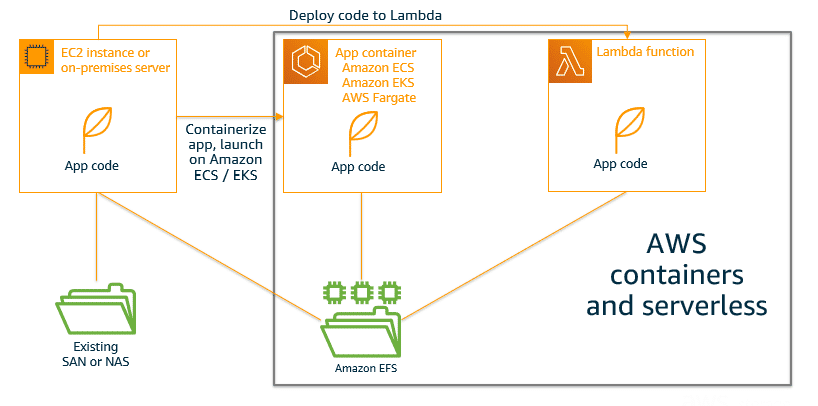

# Elastic File Storage

Amazon Elastic File System (Amazon EFS) is a file storage service for Amazon Elastic Compute Cloud (Amazon EC2) instances. Amazon EFS is easy to use and provides a simple interface that allows you to create and configure file systems quickly and easily. W/ Amazon EFS, storage capacity is elastic, growing and shrinking automatically as you add and remove files, so your applications have the storage they need, when they need it.

Similar to Elastic Block Store (EBS), but with EBS, you can only mount your virtual disk to one EC2 instance. We cannot have two EC2 instances sharing an EBS volume. However, you can have them sharing an EFS volume.

> It is built to scale on demand to petabytes w/o disrupting applications. It grows and shrinks automatically as you add and remove files, eliminating the need to provision and manage capacity to accommodate growth.

If you provision an EFS instance, storage needs will grow dynamically according to our needs. We won't need to pre-provision storage like we do with EBS. EFS is great for file servers and sharing files between different EC2 instances.

File storage has a structure. You can create folders and it can be mounted, but it is not boot-able. If you want to share a file system across multiple servers, then file storage EFS is a great solution.

## Fully managed shared file system

Amazon EFS is serverless, so you don’t need to provision or manage any infrastructure or capacity. 

Amazon EFS file systems can be shared with up to tens of thousands of concurrent clients, no matter the type. These could be traditional EC2 instances. They could be containers running in one of your self-managed clusters. They could be containers running in one of the AWS container services—Amazon Elastic Container Service (Amazon ECS), Amazon Elastic Kubernetes Service (Amazon EKS), or AWS Fargate. Or they could be in a serverless function running in Lambda.

## Scalable storage and performance

Amazon EFS provides a scalable elastic file system for use with AWS Cloud services and on-premises resources. A file system can grow to store petabytes of data.

As a managed service, the appropriate storage size is allocated so that you don’t have to worry about administration tasks. Amazon EFS automatically scales capacity out or in to meet your changing storage demands. This scalability means that you avoid overprovisioning storage, and you pay only for storage that you use.

With Amazon EFS, your performance can scale along with your capacity. Your performance can scale to up to tens of GB per second of throughput and over 500,000+ IOPS.

## High availability and durability

Amazon EFS is highly available and designed to be highly durable. It offers a 99.99% availability service-level agreement (SLA) and is designed for 11 nines of data durability.

## Security

With Amazon EFS, you control access to your files in multiple ways. 

You can control what network resources have access to your file systems using Amazon Virtual Private Cloud (Amazon VPC) routing and security group firewall rules. You can further control user and application access to your file systems using AWS Identity and Access Management (IAM) policies and Amazon EFS Access Points.

> ### POSIX permissions
>
> You can use Portable Operating System Interface (POSIX)-compliant user- and group-level permissions to control client access permissions to your file systems.

> ### Amazon VPC security groups
>
> You can restrict access over the network with Amazon VPC security groups. Security groups determine which IP addresses have network visibility to an Amazon EFS endpoint.

> ### IAM roles
>
> You can create IAM roles to control both the creation and administration of your Amazon EFS file system, in addition to client permissions. For example, you can create an IAM role in your account that has specific permissions for the creation, deletion, or modification of file systems. Then you can grant them to the users in your AWS account. Additionally, you can use roles to control client access to your data. NFS clients can identify themselves using an IAM role when connecting to an Amazon EFS file system. When a client connects to a file system through a role, Amazon EFS evaluates the AWS account permissions associated with the role and grants access to data accordingly. When you use IAM authorization for NFS clients, client connections and IAM authorization decisions are logged to AWS CloudTrail for an additional layer of observability.

> ### AWS KMS
>
> To protect data at rest, use AWS Key Management Service (KMS) to manage the keys to encrypt the data that resides in the file system. To encrypt data in transit, you can turn on Transport Layer Security (TLS) when you mount the file system.

## Cost optimization

With Amazon EFS, you pay only for the storage used by your file system, and there is no minimum fee or setup cost. The cost of EFS storage is determined according to the Amazon EFS storage class and the lifecycle management policy you select. By default, newly created EFS file systems utilize intelligent tiering, automatically cost optimizing the data stored by moving it to the lowest cost tier of storage or optimizing for performance based upon how frequently the file is being accessed. The available storage classes include: 

> ### Standard
>
> Amazon EFS Standard and Amazon EFS Standard–Infrequent Access (EFS Standard–IA) offer multi-AZ resilience and the highest levels of durability and availability.

> ### One Zone
>
> Amazon EFS One Zone and Amazon EFS One Zone–Infrequent Access (EFS One Zone–IA) offer customers the choice of additional savings by choosing to save their data in a single Availability Zone. Amazon EFS One Zone not only offers lower cost, but also provides lower latencies because data replication occurs within a single Availability Zone.

## Amazon EFS and related AWS services

Amazon EFS offers integrations with Amazon ECS, Amazon EKS, Fargate, and Lambda. This means that applications that need shared persistent storage can be migrated to modern compute platforms and benefit from the elastic and serverless storage that Amazon EFS provides.

This is a path that many customers go down, getting rid of their self-managed storage infrastructure, adopting containers and serverless for infrastructure modernization.

> With Amazon EFS and Lambda, you can write code to parse large files quickly without worrying about managing any underlying infrastructure.

> ### Amazon EFS and Lambda
>
> **Without Amazon EFS**: Lambda could not operate on persistent data sets larger than the 512 MB of temporary disk space allocated to each function. Additionally, file data sets could not be shared across multiple Lambda functions, but instead had to be isolated and accessed as individual objects.
>
> **With Amazon EFS**: You can load any library from Amazon EFS during the very first invocation of your Lambda function. Unzipping and accessing a 1 GB file becomes trivial with a few lines of code. You can set an Amazon EFS file system as the local mount path directly within the Lambda service console.

> Amazon EFS is integrated with AWS Backup. You can use the Amazon EFS console, the API, or the AWS Command Line Interface (AWS CLI) to turn on automatic backups for your file system. 

> ### Amazon EFS and AWS Backup
>
> AWS Backup is a simple and cost-effective way to back up your Amazon EFS file systems. The systems need to be in an AWS Region where the AWS Backup service is available. AWS Backup is a unified backup service designed to simplify the creation, migration, restoration, and deletion of backups, while providing improved reporting and auditing. 
>
> Amazon EFS is natively integrated with AWS Backup. You can use the Amazon EFS console, API, or AWS CLI to turn on automatic backups for your file system. The backups will use a default backup vault and plan with the AWS Backup recommended settings for backup automation.

> Monitoring is an important part of maintaining the reliability, availability, and     performance of Amazon EFS and your AWS solutions. 

> ### Amazon EFS and monitoring: CloudWatch integration
>
> How can I determine my throughput? How can I track the number of EC2 instances that are connected to a file system?                                          
>
> The answers are in CloudWatch. You can monitor your file systems using CloudWatch, which collects and processes the data from the Amazon EFS service into readable, near-real-time metrics, at no additional cost. 
>
> These statistics are then stored for a period of 15 months so that you can access historical information and gain insights on how to optimize costs and performance.
>
> You can view, retrieve, and process Amazon EFS metrics from CloudWatch in several ways, including:
>
> * Viewing the metrics in the Amazon EFS service console
>
> * Creating alerts in the CloudWatch service console
>
> * Retrieving data through the CloudWatch command line interface (CLI)
>
> * Integrating with the CloudWatch API

## Learning summary

> * Supports the Network File System version 4 (NDSv4) protocol
>
> * You only pay for the storage you use (no pre-provisioning required)
>
> * Can scale up to the petabytes
>
> * Can support thousands of concurrent NFS connections
>
> * Data is stored across multiple AZ's within a region
>
> * Read After Write Consistency
