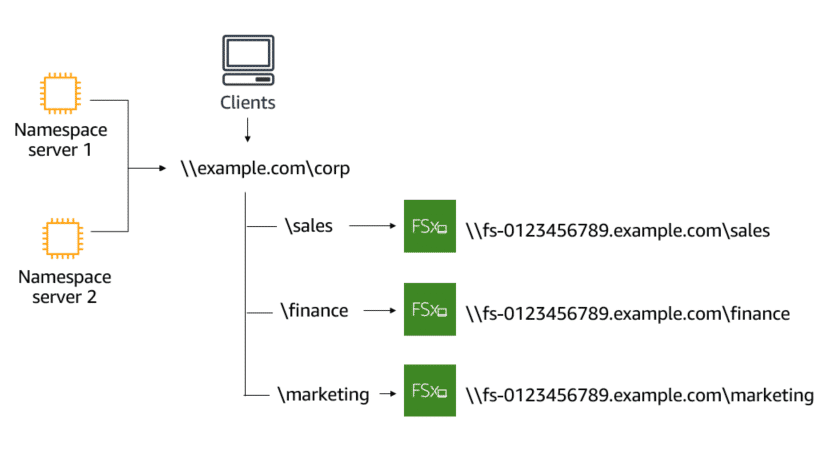

# Performance and scale of FSx for Windows File Server

## FSx for Windows File Server performance overview

FSx for Windows File Server offers file systems to meet a variety of performance needs. FSx for Windows File Server provides consistent submillisecond latencies with SSD storage, and single-digit millisecond latencies with HDD storage for file operations. All file systems, irrespective of storage type, provide a fast, in-memory cache on their Windows file servers. The in-memory cache enables your file system to get high performance and submillisecond latencies for data your users access the most frequently.  

Your file system is associated with a storage amount and a throughput capacity. Throughput capacity is the sustained speed at which the file server hosting your file system can serve data. When you create a file system, FSx for Windows File Server automatically applies the recommended throughput capacity level for your file system based on the amount of storage capacity you select. Although the recommended throughput capacity is sufficient for most workloads, you can override the recommendation and select a specific throughput capacity level.

The throughput capacity you select determines the baseline and burst network speeds at which the Windows file server hosting your file system can serve data. Burst throughput uses a credit mechanism to allocate network bandwidth based on average bandwidth utilization. File systems accrue credits when their network bandwidth usage is below their baseline limits and can use these credits when network bandwidth usage is above the baseline.

### Choosing storage and throughput independently

FSx for Windows File Server enables you to configure your file system’s storage and throughput capacity independently. By choosing these configurations independently, you can achieve a balance of cost and performance that makes sense for your needs. For example, you could choose to allocate a large amount of storage with a small amount of throughput capacity for infrequently accessed workloads to save on unnecessary throughput costs.

## Growing storage and throughput capacity

### Growing storage capacity

You can increase the storage capacity you originally assign to your file system as needed. When you grow the storage capacity, FSx for Windows File Server swaps out your file system's storage for larger disks behind the scenes. The new storage capacity is available for use within minutes. You can only increase the amount the storage capacity for your file system, not decrease it. Each storage capacity increase must be a minimum of 10 percent of the current storage capacity. 

### Growing throughput capacity

You can increase or decrease the throughput capacity originally configured on your file system. When you modify your file system's throughput capacity, FSx for Windows File Server switches out the file system's file server behind the scenes. For Single-AZ file systems, this switch causes a temporary loss of availability for a few minutes. For Multi-AZ file systems, a change on the file system's throughput causes an automatic failover and failback as FSx for Windows File Server switches out the file servers.

### When to modify storage or throughput capacity

FSx for Windows File Server integrates with Amazon CloudWatch to monitor the ongoing throughput and storage that your file system uses. You can create CloudWatch alarms and get notified when your storage or throughput metrics exceed or drop below a specific threshold.

## Grouping multiple file systems using DFS Namespaces

To scale file storage beyond what a single file system supports (64 TB), you can use Microsoft Distributed File System (DFS) Namespaces. Using DFS Namespaces, you can also unify access to your file shares across multiple file systems. With DFS Namespaces, you group file shares on multiple file systems into one common folder structure, allowing your users and organizations to access their data using a common namespace. Each namespace supports up to 50,000 file shares and hundreds of petabytes of storage capacity in aggregate.

In this example, you use two namespace servers to host the namespace **example.com\corp**. Under this namespace, you consolidate file shares stored on three file systems (sales, finance, and marketing). This allows your users to access the contents of these file shares using the example.com\corp namespace.

Another use case for DFS Namespaces is scaling out performance. This involves dividing your file data into smaller datasets (or shards) and storing them across different file systems. As a result, applications accessing your data from multiple instances can achieve high levels of performance by reading and writing to these shards in parallel.
