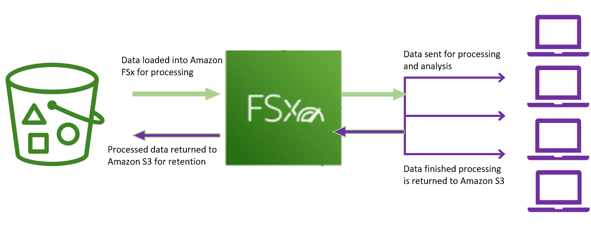

# Amazon S3 Service Integration

As organizations are collecting and analyzing increasing amounts of data, traditional on-premises solutions for data storage, data management, and analytics can no longer keep pace. Data silos that aren't built to work well together make it difficult to consolidate storage so that you can perform comprehensive and efficient analytics. This limits an organization's agility, and ability to derive more insights and value from its data. It also limits the capacity to adopt more sophisticated analytics tools and processes as its needs evolve.

Amazon S3 has a broad integration w/ a variety of services and use cases. In this section, we use data lakes and high performance computing as two such examples.

> ### A data lake
>
> A data lake is a centralized repository that allows you to migrate, store, and manage all structured and unstructured data at an unlimited scale. Once the data is centralized, you can extract value and gain insights from your data through analytics and machine learning.
>
> A data lake makes the data and the analytics tools available to more of your users, across more lines of business enabling them to get the business insights they need, whenever they need them.

## Amazon S3 as a data lake

The Amazon S3-based data lake solution uses Amazon S3 as its primary storage platform. Amazon S3 provides an optimal foundation for a data lake b/c of its virtually unlimited scalability. You can non-disruptively increase storage from gigabytes to petabytes of content.

Amazon S3 is designed for 99.999999999% (11 9s) of durability. It has scalable performance, ease-of-use features, native encryption, and access control capabilities. It also integrates w/ a broad portfolio of AWS and third party ISV data processing tools.

AWS has developed a data lake architecture that allows you to build data lake solutions cost-effectively using Amazon Simple Storage Service and other services.

> ### Decoupling storage from compute
>
> In traditional Hadoop and data warehouse solutions, storage and compute remain tightly coupled, making it difficult to optimize costs and data processing workflows. W/ Amazon S3, you can cost-effectively store all data types in their native formats. Then, you can launch as many or as few virtual servers as you need using Amazon Elastic Compute Cloud (EC2), and use AWS analytics tools to process your data. You can also optimize your EC2 instance to provide the right ratios of CPU, memory, and bandwidth for best performance.

> ### Centralized data architecture
>
> Amazon S3 makes it easy to build a multi-tenant environment, where many users can bring their own data analytics tools to a common set of data. This improves both cost and data governance over that of traditional solutions, which require multiple copies of data to be distributed across multiple processing platforms.

> ### Integration w/ clusterless and serverless AWS services
>
> You can use Amazon S3 w/ Amazon Athena, Amazon Redshift Spectrum, Amazon Rekognition, and AWS Glue to query and process data. Amazon S3 also integrates w/ AWS Lambda serverless computing to run code w/o provisioning or managing servers. W/ all of these capabilities, you only pay for the actual amounts of data you process or for the compute time consumed.

> ### Standardized APIs
>
> Amazon S3 REST APIs are easy to use, and supported by most major third-party independent software vendors (ISVs), including leading Apache Hadoop and analytics tool vendors. This allows customers to bring the tools they are comfortable and knowledgeable about to help them perform analytics on data in Amazon S3.

## Data cataloging

The earliest challenges that inhibited building a data lake were keeping track of all of the raw assets, as they were loaded into the data lake. Then, keeping track of all of the new data assets and version created by data transformation, data processing, and analytics.

Thus, an essential component of an Amazon S3-based data lake is the data catalog. The data catalog provides a query-able interface of all assets stored in the data lake's S3 buckets. The design of the data catalog is to provide a single source of truth about the contents of the data lake.

You can create the comprehensive data catalog by using standard AWS services like AWS Lambda, Amazon DynamoDB, and Amazon Elasticsearch Service (Amazon ES). At a high level, you can use Lambda triggers to populate DynamoDB tables w/ object names and metadata. When those objects are put into Amazon S3 then Amazon ES is used to search for specific assets, related metadata, and data classifications.

## AWS Glue

AWS Glue is a fully managed ETL (extract, transform, and load) service that makes it simple and cost-effective to categorize your data. You can use AWS Glue to organize, cleanse, validate, and format data for storage in a data warehouse or data lake. The AWS Glue Data Catalog is an index to the location, schema, and runtime metrics of your data. In order to create your data warehouse or data lake, you must catalog this data.

## In-Place data querying

One of the most important capabilities of a data lake built into AWS is the ability to do in-place transformation and querying of data assets, w/o having to provision and manage clusters. This allows you to run sophisticated analytic queries directly on your data stored in Amazon S3. You don't have to copy and load data into separate analytics platforms or data warehouses.

This makes the ability to analyze vast amounts of unstructured data accessible to any data lake user who can use SQL. In addition, it makes it more cost effective than the traditional method of performing an ETL process, creating a Hadoop cluster or data warehouse, loading the transformed data into these environments, and then running query jobs.

**Amazon Athena** and **Amazon Redshift Spectrum** provide the in-place querying capabilities of an Amazon S3 data lake.

## Amazon Athena

**Amazon Athena** is an interactive query service that makes it easy for you to analyze data directly in Amazon S3, using standard SQL. You can get results in a matter of seconds.

**Athena** is serverless, so there is no infrastructure to set up or manage. You only pay for the volume of data assets scanned during the queries you run.

You can use **Athena** to process unstructured, semi-structured, and structured data sets. It integrates w/ **Amazon QuickSight** for easy visualization. It can also be used w/ third-party reporting and business intelligence tools by connecting these tools to Athena w/ a JDBC driver.

## Amazon Redshift Spectrum

> Amazon Redshift Spectrum enables you to run Amazon Redshift SQL queries directly against data stored in an Amazon S3-based data lake.

A second way to perform in-place querying of data assets in an Amazon S3-based data lake is to use **Amazon Redshift Spectrum**. **Amazon Redshift** is a large-scale, managed data warehouse service used w/ data assets in Amazon S3. However, data assets must be loaded into Amazon Redshift before queries run.

**Amazon Redshift Spectrum** enables you to run **Amazon Redshift SQL** queries directly against data stored in an Amazon S3-based data lake.

Amazon Redshift Spectrum applies sophisticated query optimization, scaling processing across thousands of nodes so results are fast-even w/ large data sets and complex queries. You can directly query a wide variety of data assets stored in the data lake, including CSV, TSV, Parquet, Sequence, and RCFile.

B/c **Amazon Athena** and **Amazon Redshift** share a common data catalog and data formats, you can use both Athena and Redshift Spectrum against the same data assets.

You would typically use Athena for ad hoc data discovery and SQL querying, and then Redshift Spectrum for more complex queries and scenarios where a large number of data lake users want to run concurrent BI and reporting workloads.

## Amazon FSx for Lustre and Amazon S3 data lakes

Amazon FSx for Lustre is a fully managed file system that is optimized for compute-intensive workloads, such as high performance computing, machine learning, and media data processing workflows.

W/ Amazon FSx for Lustre, you can launch and run a Lustre file system that can process massive data sets at up to hundreds of gigabytes per second of throughput, millions of IOPS, and sub-millisecond latencies. Amazon FSx for Lustre file systems can link to Amazon S3 buckets, allowing you to access and process data concurrently from a high-performance file system.

Amazon FSx for Lustre can use Amazon S3 as a raw data repository as well as a repository for processed data. It makes it easy to process your cloud datasets in Amazon S3.

When linked to an S3 bucket, FSx for Lustre transparently presents objects as files, allowing you to run your workload w/o managing data transfer from S3. As the constants of your S3 bucket change, FSx for Lustre automatically updates your file system w/ the latest data available to run your workload.
