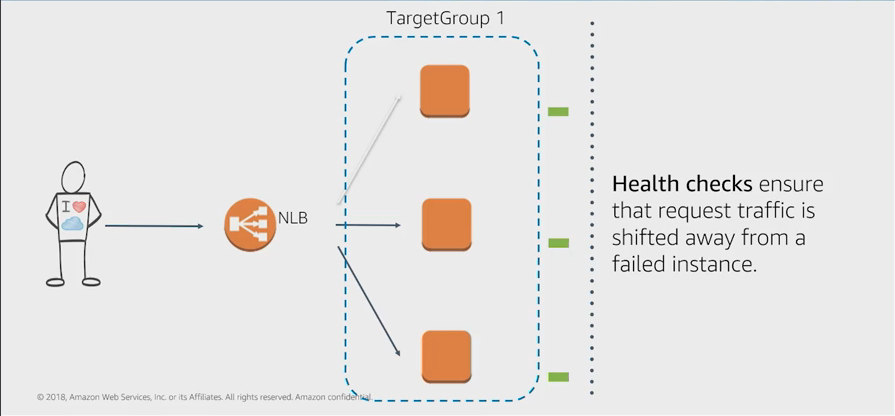

# Custom VPCs and ELBs

**EC2** ▶︎ **Load Balancers** ▶︎ **Create Load Balancer** ▶︎ **Application Load Balancer**

When we're provisioning a Load Balancer, we're going to need at least two public subnets. So we'll need at least two public subnets in order to create a Load Balancer.

## Types of Load Balancing

**Classic Load Balancer**

* Version 1, TCP, HTTP/HTTPS

* Supports EC2 Classic as well as VPC

* Operates on Layer 4

**Application Load Balancer**

* Routing decisions on Application Layer (Layer 7)

* Ideal for HTTP/HTTPS traffic

* Advanced routing targeted at delivery of modern application architectures

**Network Load Balancer**

* Routing decisions on Transport Layer 4 (Layer 4)

* Millions of requests per second, ultra-low latencies

* Uses a single static IP address per Availability Zone

* Ability to add External IP

## Health Checks

* Supports both Network and Application Target health checks

* Application-level health checks

  * HTTP, HTTPS, and TCP HC

  * Customize frequency, failure thresholds

* Customize list of successful response codes, for example 200-300

* Details of health check failures available via the API and Management Console

> Health checks are applied at the target group level.

## Amazon CloudWatch Metrics

* CloudWatch metrics provided for each load balancer

* Provide detailed insight into traffic and capacity, errors and backend health for the Network Load Balancer

* CloudWatch alarms can be configured to notify or take action should any metric go outside the acceptable range

* All metrics provided at 1-minute granularity

### Traffic and Capacity Metrics

* `ActiveFlowCount` - Total number of concurrent TCP flows (or connections) from clients to targets

* `NewFlowCount` - Total number of new TCP flows (or connections) established from clients to targets

* `ProcessedBytes` - Total number of bytes processed by the load balancer

### ResetCounts

* `TCP_Client_Reset_Count` - Number of reset (RST) packets sent from a client to a target

* `TCP_ELB_Reset_Count` - Number of reset (RST) packets generated by the load balancer

* `TCP_Target_Reset_Count` - Number of reset (RST) packets sent from a target to a client

### Back-end Health

* `HealthyHostCount` - Number of targets that are considered healthy

* `UnHealthyHostCount` - Number of targets that are considered unhealthy

## Learning summary

> **Remember the following for our exam**:
>
> * We need a minimum of two public subnets to deploy an internet facing load-balancer.
