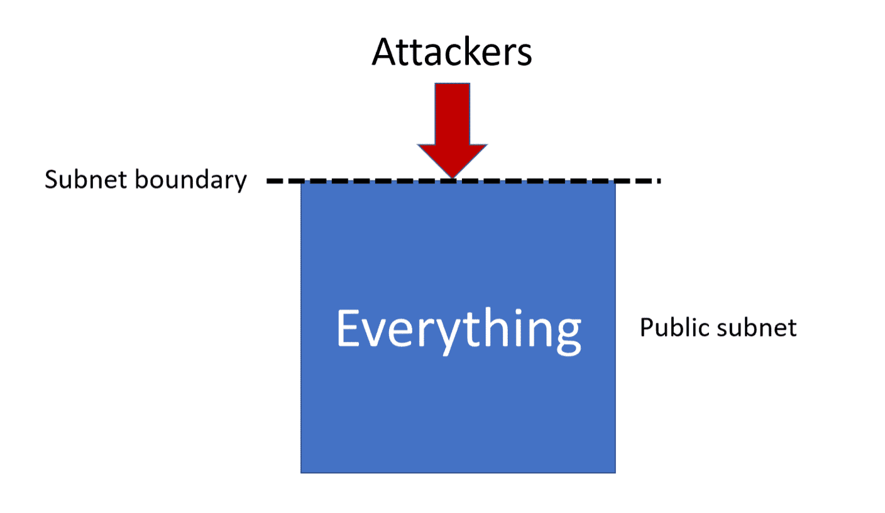
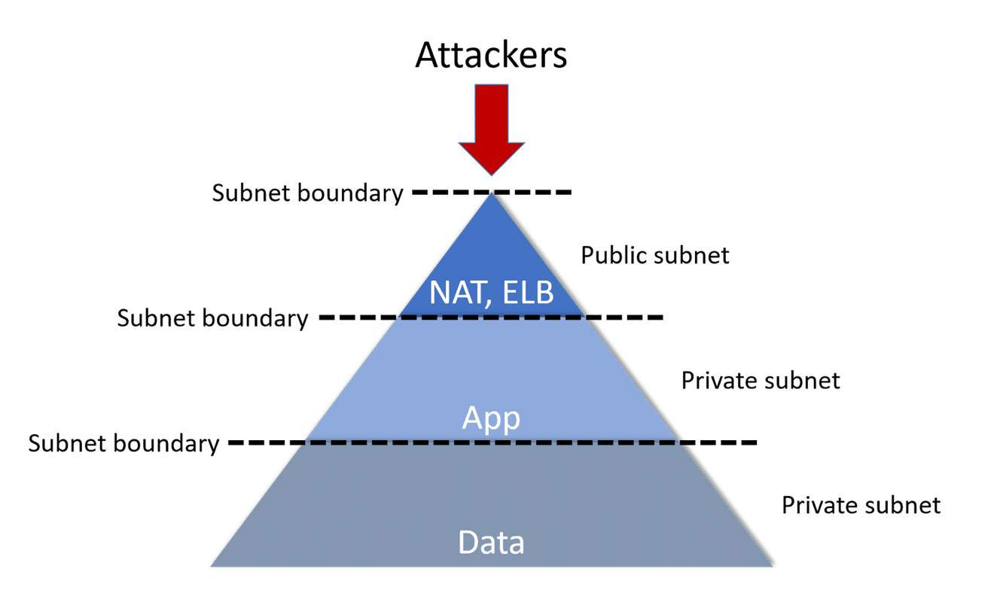
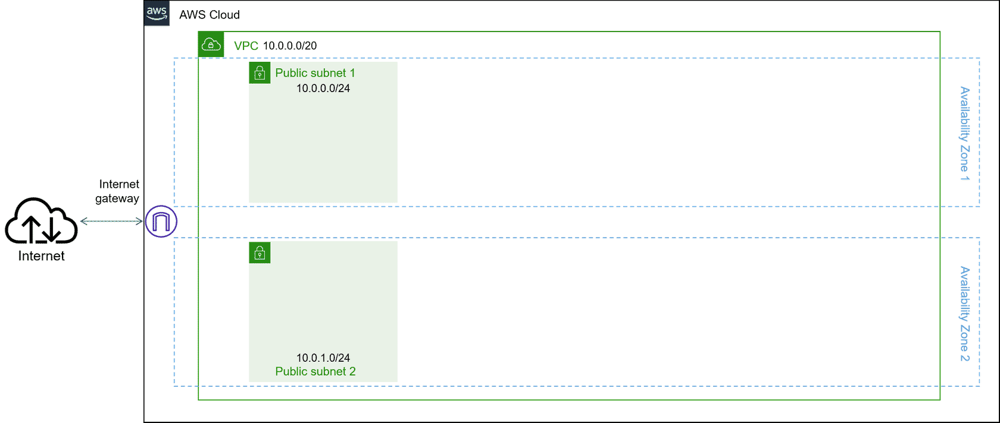
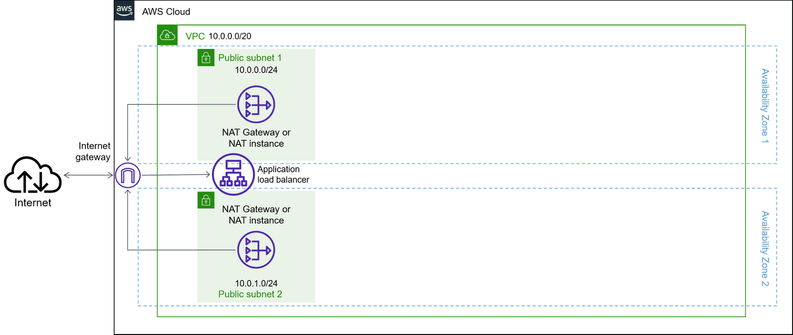
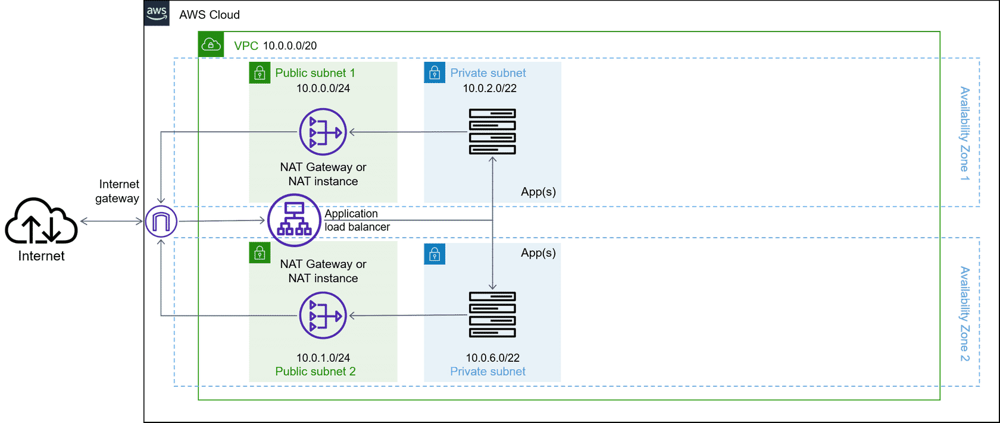
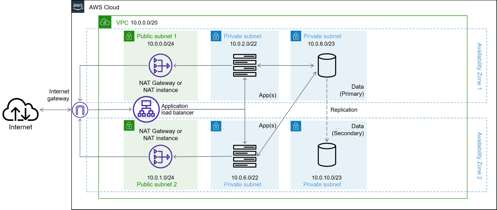

# Production–Ready: Multi-Tier Architecture for an Amazon VPC

To strengthen security for the resources and service within your Amazon VPC, utilizing a multi-tier application architecture design can provide for more granular control of network traffic.

## Amazon VPC design strategies 

What is your infrastructure design? At a high level, your infrastructure design is the document, diagram, or vision that encompasses all of the characteristics of your infrastructure that supports your hosted applications. A design will include the requirements, constraints and assumptions that address the availability, manageability, performance, recoverability, and security of the systems and resources that support and host your business automation workflows. For this section, the focus will be limited to a discussion of single-tier and multi-tier application architecture design.

An effective strategy for securing resources and sensitive data in the Cloud requires a good understanding of general data security patterns and a clear mapping of these patterns to Cloud security controls. These controls can be applied in a multi-tier application design, to implementation-level details specific to data stores, to the database layer where Amazon Relational Database Service (Amazon RDS) and Amazon DynamoDB reside or the web or application layer where Amazon EC2 instances reside. Again, what is your infrastructure design?  

AWS provides the AWS Cloud Adoption Framework (AWS CAF) which gives guidance and best practices to help build a comprehensive approach to cloud computing across your organization. Within this framework, the security perspective of the AWS CAF covers five key capabilities:

1. AWS Identity and Access Management (IAM): Define, enforce, and audit user permissions across AWS services, actions, and resources.

2. Detective control: Improve your security posture, reduce the risk profile of your environment, and gain the visibility you need to spot issues before they impact your business.

3. Infrastructure security: Reduce the surface area of the infrastructure you manage and increase the privacy and control of your overall infrastructure on AWS.

4. Data protection: Implement appropriate safeguards that help protect data in transit and at rest by using natively integrated encrypted services.

5. Incident response: Define and launch a response to security incidents as a guide for security planning.

The first step when implementing the Security Perspective of the AWS CAF is to think about security from a data perspective. It is imperative to know and understand the business needs, the business goals, the account structure from the beginning. Customers must include this early in the design process as this will push the account strategy and account design back to the AWS Well-Architected Framework. Instead of thinking about on-premises and off-premises design and data security, think about the data you are protecting, how it is stored, and who has access to it. 

What are best practices for application architecture design?

## Best practice: Limit exposure of resources

> ### Single-tier
>
> When you build your Amazon VPC, think about how many layers of security you're going to put between your potential attackers and your critical resources.
>
> A single-tier application architecture puts everything into one subnet. This exposes all of your resources to any attackers who manage to get access to your network. Using subnets, your network architecture can provide extra layers of security.
>
> 

> ### Multi-tier
>
> In a multi-tier application architecture, you can introduce extra layers of defense between attackers and your sensitive resources. In this example, data is the most sensitive resource, so you would place it at the end of a chain to introduce two more layers of defense between attackers and your data.
>
> In fact, you don't need to expose parts of your application in the public subnet at all if you use managed AWS endpoints, such as load balancers or Network Address Translation (NAT) options.
>
> 

## Design pattern: Multi-tier application architecture

### Step 1 - Layer 1: Your public subnet

> 

Here's an Amazon VPC with a CIDR of 10.0.0.0/20. It also has two public subnets, each reserving 512 IP addresses through a `/24` range.

AWS recommends reserving fewer IP addresses for your public subnets than for your private subnets (best practice is to have as few resources in your public subnet as possible).

### Step 2 - Layer 1: Internet access resources

To limit your exposure to the internet, you can use the following in your architecture:

* An internet-facing Application Load Balancer for incoming traffic

* A NAT solution (such as a NAT gateway or NAT instance on Amazon EC2) for outgoing traffic

Since load balancers and NAT gateways are managed services and are highly available by default, you don't need to worry about them being a bottleneck.

### Step 3 - Layer 2: Applications in a private subnet

This Amazon VPC also has a layer of private subnets for applications, probably running on Amazon EC2 instances. There are 1,024 IP addresses reserved in each of these subnets to accommodate each application's need for scaling. It will also accommodate new applications as the business's portfolio of applications expands.

The Application Load Balancer attached to both public subnets distributes traffic between the application resources in the private subnets.

### Step 4 - Layer 3: Data in a second private subnet

This design puts data resources into a second private subnet behind the first private subnet. This example reserves fewer IP addresses than the application subnet but more IP addresses than the public subnet (you probably need to scale application resources than the data resources behind the application). 

However, when planning your own Amazon VPC, you should always reserve IPs according to how you expect they will be needed by your applications and usage patterns.

The data layer can be an Amazon RDS deployment or a database running on Amazon EC2. In either case, use a Multi-AZ configuration, as shown here. The secondary could be a read replica or a standby configured to automatically replace the primary should a failure occur.

### Step 5 - Leave extra IP addresses available

While you should always reserve more than enough IP addresses for your deployed infrastructure, it's also important to leave some of the extra IP addresses of your Amazon VPC available for changes to your network architecture. 

In this example, the architecture reserves 1,024 IP addresses in each private subnet. You can also just leave these IP addresses entirely unreserved, if you prefer.

## Should you always use the multi-tier architecture?

You may have situations where your Amazon VPC doesn't need three tiers. It might not even need two tiers. You might even need to consider connecting multiple Amazon VPCs together instead of putting everything into one Amazon VPC. Let's briefly cover circumstances where you might consider each of these kinds of designs.

> ### The Single-tier Amazon VPC
>
> If you're just trying to run a simple application, such as a personal blog or website, it might not be cost effective to build it out into complex multi-tiered architectures. 
>
> You should consider a single-tier Amazon VPC if your application:
>
> * Doesn't use any private data
>
> * Can be unavailable for extended periods if something fails (also consider Single-AZ deployments)
>
> * Will only ever be used by you

> ### The n-tier Amazon VPC
>
> While we gave you a common design pattern here in the three-tier Amazon VPC, you could also build it with two tiers or more than three tiers, depending on how your application is architected. We call this pattern the *n*-tier Amazon VPC design.
>
> Ultimately, you should think about how many tiers you need to limit access and tight coupling as much as possible. That's why we recommend, for example, separating your data layer from your application layer.
>
> A good best practice is to only route things together that need to be routed together. Also, use security groups and network ACLs to limit the traffic routed through as much as possible. 
>
> Remember:
>
> * Subnets and Amazon VPCs don't cost money, they just cost IP addresses.
>
> * Each subnet you create has to reserve five IP addresses for AWS, the first four and the last.
>
> * You can't resize a CIDR block after it's been created, so any IP addresses you reserve in that CIDR block are potentially stuck there until you delete that subnet. 
>
> * Storing resources in separate subnets increases the layers of security between them, but too many subnets can risk your Amazon VPC running out of IP addresses.

> ### More complex designs
>
> There are many other ways to build your AWS network architecture beyond just one Amazon VPC.
>
> * VPC peering lets you connect two Amazon VPCs together without having to traverse the public internet. You can connect Amazon VPCs in your own account or different accounts, in one Region or across Regions.
>
> * Amazon VPC VPN options and AWS Direct Connect can connect your on-premises infrastructure to your Amazon VPCs and other AWS resources through private connections.
>
> * VPC endpoints are private connections between your Amazon VPC and another AWS service that doesn't live in your Amazon VPC. These connections don't require internet access.

## More Amazon VPC considerations

> ### Choose the right Amazon VPC configuration for your needs
>
> Design your Amazon VPC implementation based on your expansion requirements, looking ahead at least two years.

> ### Choose a CIDR block for your Amazon VPC implementation
>
> When designing your Amazon VPC instance, you must consider the number of IP addresses required and the connectivity type with the data center before choosing the CIDR block. The permissible size of the block ranges between a `/16` netmask and a `/28` netmask.
>
> You cannot alter or modify the CIDR block of a deployed Amazon VPC, so it is better to pick a CIDR block that has more IP addresses than needed. While designing your Amazon VPC architecture to communicate with the on-premises data center, the CIDR range used in Amazon VPC must not overlap or cause a conflict with the CIDR block in the on-premises data center.

> ### Isolate your Amazon VPC environments
>
> We recommend using separate Amazon VPCs for development, production, and staging environments. If you do decide to keep all of those environments in one Amazon VPC, make sure you provide as much isolation as possible, using network ACLs, subnets, and other Amazon VPC resources. 
