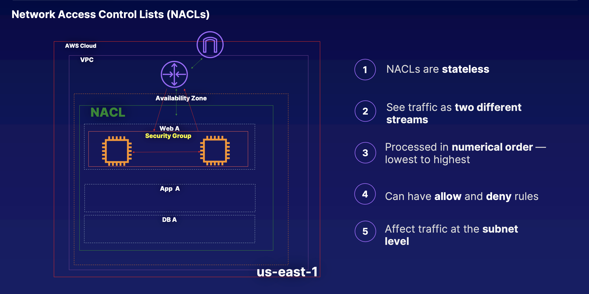

# Network Access Control Lists vs Security Groups

Whenever you create a new Network ACL, the default is to deny everything on Inbound and Outbound Rules.

A form of security filter, NACLs act as firewalls, which can filter traffic as it enters and leaves a subnet. B/c NACLs are attached at the subnet level, and by default, are created for your default VPC, and associated w/ all of the subnets in your VPC by default, NACLs are used for traffic entering or leaving a subnet as NACLs are associated w/ the subnet, not the resources.

So NACLs only manage traffic that is crossing the subnet boundary. If you have 2 EC2 instances within your VPC that are communicating, NACLs will have no involvement, b/c the communication between these 2 instances are not crossing our subnet boundary.

> 1. NACLs are **stateless**. If you add an inbound rule for your traffic, then you must also add the same rule for your outbound traffic b/c NACLs only see the traffic going one way. So if you allow an inbound rule, then you must also allow an outbound rule, so your NACLs will explicitly see that traffic that was allowed inbound should also be allowed outbound. NACLs only affect traffic crossing the subnet border, and they're only applied to the subnet. NACLs can be used to explicitly allow and explicitly deny traffic.
>
> 2. See traffic as **two different streams.** So you must have 2 rules, 1 for each stream. If you do not add your outbound rule for your traffic, then traffic is going to only be allowed in. So NACLs are made up of inbound and outbound rules.
>
> 3. Processed in **numerical order**-lowest to highest rule number. When a rule is matched and action is taken, the processing of the rules stop.
>
> 4. Can have **allow** and **deny** rules. NACLs can deny or allow specific IP addresses.
>
> 5. Affect/control traffic at the **subnet level**

Let's say we have an EC2 instance in our subnet that needs to communicate w/ the internet, then we would need to have an outbound rule for that NACL to allow that communication b/c the traffic is crossing the subnet boundary. If that traffic needs to then come back in from the internet to our EC2 instance, then we would also need to have an inbound rule for that NACL to allow that traffic back in across the subnet boundary. So now that we've added a rule to our NACL to allow the traffic out and then back in, how are these rules processed? (See no. 3 above).

Default NACLs allow all inbound and outbound rules for your VPC, but we can go in and edit our default NACLs and update rule 100. `*` translates to "if no other traffic is allowed, then all traffic is denied". Whereas custom NACLs actually deny all inbound and outbound.

All IP communications is made up of 2 parts: the initiation part and the response part. Many times, the response part does not use the same port in its response, but instead it can use ephemeral ports. So it could use any port in that ephemeral port range and the ephemeral port range is 1024 to 65,535.

W/ NACLs, it's really important to remember to add that ephemeral port range. If you have an inbound rule that uses an ephemeral outbound port, you have to know which ephemeral port that it uses.

NACLs only support IP networks and protocols, so we cannot add AWS resources and services to our NACLs. We use NACLs w/ Security Groups to add an explicit deny.

**exit** ▶︎ **exit** will take us back to our `WebServer01`.

In our public web server, execute `status httpd.service` to view Apache which shouldn't be installed. Type `yum install httpd -y` ▶︎ `chkconfig httpd on` ▶︎ run `service httpd start` ▶︎ `cd /var/www/html`

When we create our VPC, a Network ACL is created by default, our default Network ACL. Every time we add subnet to our VPC, it's going to be associated w/ our default Network ACL. You can then associate the subnet w/ a new Network ACL, but a Subnet itself can only be associated w/ one network ACL at any given time.

That being said, Network ACLs can have multiple subnets with each one.

Rules are evaluated in numerical order. If you have a DENY first, that's always going to deny, even if you ALLOW it later. So, if you're going to deny a specific IP address, you want that rule to be evaluated first.

When you're using Sub-Network ACLs, they're always going to be evaluated before Security Groups. So if you deny a specific port on your Network ACL, it's never even going to reach your Security Group. So, Network ACLs always act first before Security Groups.

To use `yum update` on the public server, enable ephemeral ports on Inbound and Outbound rules.

## Learning summary

> **Remember the following for your exam**
>
> * Your VPC automatically comes w/ a default network ACL, and by default it allows all outbound and inbound traffic.
>
> * You can create custom network ACLs. By default, each custom network ACL denies all inbound and outbound traffic until you add rules.
>
> * Each subnet in your VPC must be associated w/ a Network ACL. If you don't explicitly associate a subnet w/ a Network ACL, the subnet is automatically associated w/ the default network ACL.
>
> * Block IP Addresses using Network ACLs, not Security Groups
>
> * You can associate a network ACl w/ multiple subnets; however, a subnet can be associated w/ only one network ACL at a time. When you associate a network ACL w/ a subnet, the previous association is removed.
>
> * Network ACLs contain a numbered list of rules that is evaluated in order, starting w/ the lowest numbered rule.
>
> * Network ACLs have separate inbound and outbound rules, and each rule can either allow or deny traffic.
>
> * Network ACLs are stateless; responses to allowed inbound traffic are subject to the rules for outbound traffic (and vice versa).

Recall, if you're going to deny a IP address, set *deny* rules before *allow* rules.

* **Stateless**: if you add an inbound rule for your VPC, then you must also add an outbound rule to match your inbound rule. So, we can add allow rules and deny rules.

One subnet is associated w/ one NACL and NACLs are processed in order, so lowest number to the highest rule number, ending w/ the default asterisk, which denies everything else.
