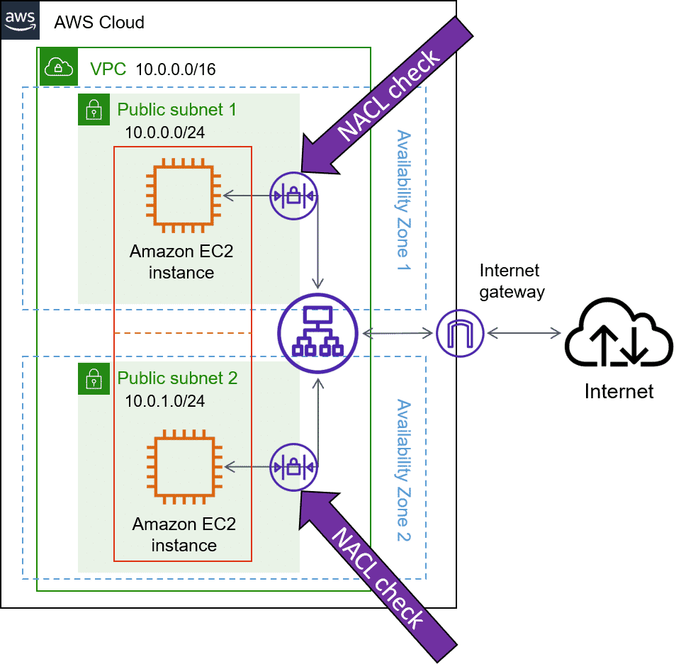
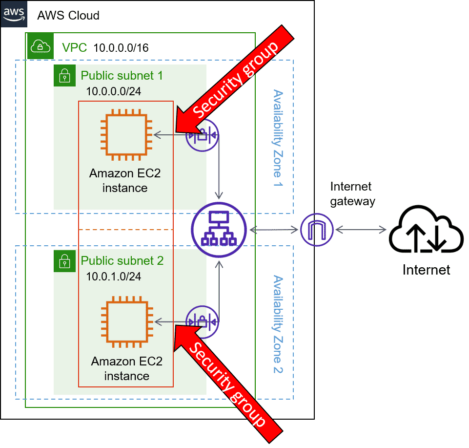
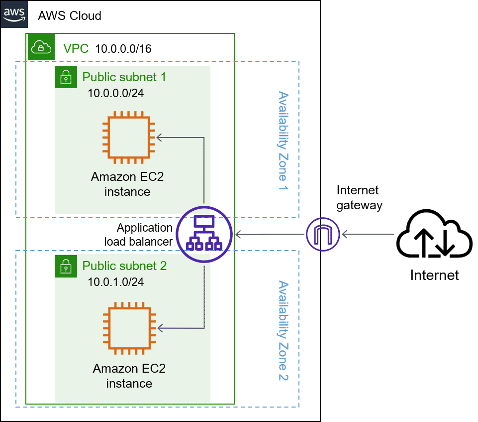

# Security Features

There are two main security features available for your Amazon VPC: network access control lists (network ACLs) and security groups.

## Network ACLs

> **Stateless**

Network access control lists (network ACLs) are a type of security filter like a firewall that can filter traffic attempting to enter or leave a subnet. Network ACLs are attached at the subnet level, and by default, a network ACL is created for a default Amazon VPC and is associated with all subnets in your default Amazon VPC. 

Network ACLs manage traffic entering or leaving a subnet because network ACLs are associated with the subnet, not with resources inside the subnet. Network ACLs only manage traffic that is crossing the subnet boundary.

If two Amazon EC2 instances in a subnet are communicating, network ACLs will have no involvement if the communication between the two instances does not cross the subnet boundary.

## Security groups

> **Stateful**

Security groups are the other security feature of an Amazon VPC. Unlike network ACLs, security groups are attached to AWS resources, specifically the elastic network interfaces (ENIs), not Amazon VPC subnets. 

Security groups offer a few advantages compared to network ACLs in that they can recognize AWS resources and filter based on them. Security groups can reference other security groups and also reference themselves.  

However, security groups are not capable of explicitly blocking traffic. If you need to block a certain IP address or a block of IP addresses, you will require assistance from network ACLs.

## Network ACLs compared to Security groups

Welcome to your VPC. You can think of it as a hardened fortress where nothing goes in or out without explicit permission. You have a gateway on the VPC that only permits traffic in or out of the VPC. But that only covers perimeter, and that's only one part of network security that you should be focusing on as part of your IT strategy. 

Today I wanna talk about a few aspects of network hardening, looking at what happens inside the VPC. Now the only technical reason to use subnets in the VPC is to control access to the gateways. 

The public subnets have access to the internet gateway, the private subnets do not, but subnets can also control traffic permissions. Packets are messages from the internet, and every packet that crosses the subnet boundaries gets checked against something called a network access control list or network ACL. This check is to see if the packet has permissions to either leave or enter the subnet based on who it was sent from and how it's trying to communicate. 

You can think of network ACLs as passport control officers. If you're on the approved list, you get through. If you're not on the list, or if you're explicitly on the do not enter list, then you get blocked. Network ACLs check traffic going into and leaving a subnet just like passport control. The list gets checked on your way into a country and on the way out. And just because you were let in, doesn't necessarily mean they're gonna let you out. Approved traffic can be sent on its way, and potentially harmful traffic like attempts to gain control of a system through administrative requests, they get blocked before they ever touch their target. 

You can't hack what you can't touch. Now this sounds like great security, but it doesn't answer all of the network control issues, because a network ACL only gets to evaluate a packet if it crosses a subnet boundary in or out, it doesn't evaluate if a packet can reach a specific EC2 instance or not. 

Sometimes you'll have multiple EC2 instances in the same subnet, but they might have different rules around who can send the messages, what port those messages are allowed to be sent to. So you need instance-level network security as well. To solve instance-level access questions, we introduce security groups.

Every EC2 instance, when it's launched, automatically comes to the security group. And by default, the security group does not allow any traffic into the instance at all. All ports are blocked, all IP addresses sending packets are blocked. That's very secure, but perhaps not very useful if you want an instance to actually accept traffic from the outside, like say a message from a front-end instance or a message from the internet. So obviously, you can modify the security group to accept a specific type of traffic. In the case of a website, you want web-based traffic or HTTPS to be accepted, but not other types of traffic, say an operating system or administration requests. 

If network ACLs are our passport control, a security group is like the doorman at your building, the building being the EC2 instance in this case. The doorman will check a list to ensure that someone is allowed to enter the building, but won't bother to check the list on the way out. With security groups, you allow specific traffic in, and by default, all traffic is allowed out. Now wait a minute, Blaine, you just described two different engines, each doing the exact same job, let good packets in, keep bad packets out. 

The key difference between a security group and a network ACL is the security group is stateful. Meaning, as we talked about, it has some kind of a memory when it comes to who to allow in or out, and the network ACL is stateless, which remembers nothing, and checks every single packet that crosses its border regardless of any circumstances. You know, this metaphor is important to understand, so I wanna illustrate the round trip of the packet as it goes from one instance to another instance in a different subnet. Now this traffic management, it doesn't care about the contents of the packet itself, in fact, it doesn't even open the envelope, it can't, all it can do is check to see if the sender is on the approved list. 

All right. Let's start with instance A. We wanna send a packet from instance A to instance B in a different subnet, same VPC, different subnets. So instance A sends a packet. Now the first thing that happens is that packet meets the boundary of the security group of instance A. By default, all outbound traffic is allowed from a security group so you can walk right by the doorman and leave. Cool, right? 

The packet made it past the security group of instance A, now it has to leave the subnet boundary. At the boundary, the passport must now make it through passport control, the network ACL. The network ACL doesn't care about what the security group allowed, it has its own list of who can pass and who can't. If the target address is allowed, you can keep going on your journey, which it is. So now we have exited the original subnet and now the packet goes to the target subnet where instance B lives. Now at this target subnet, once again we have passport control. Just because the packet was allowed out of its home country, does not mean that it can enter the destination country or subnet in this case. They both have unique passport officers with their own checklists. You have to be approved on both lists or you could get turned away at the border. Well, turns out the packet is on the approved list for this subnet so it's allowed to enter through the network ACL into the subnet. 

Almost there, now we're approaching the target instance, instance B. Every EC2 instance has their own security group. You wanna enter this instance, the doorman will need to check to see if you're allowed in, and we're on the list, the packet has reached the target instance. Once the transaction is complete, now it's just time to come home, it's the return traffic pattern, it's the most interesting. Because this is where the stateful versus stateless nature of the different engines come into play, because the packet still has to be evaluated at each checkpoint. Security groups by default allow all return traffic, so they don't have to check a list to see if they're allowed out. Instead, they automatically allow the return traffic to pass by no matter what. Passport control here at the subnet boundary, these network ACLs do not remember state, they don't care that the packet came in here. It might be on a you can't leave list, every ingress and egress is checked with the appropriate list. The package return address has to be on their approved list to make it across the border, made it to the border of the origin subnet, but we have to negotiate passport network ACL control here as well. Stateless controls means it always checks its list. The packet passed the network ACL at the subnet level, which means the packet's now made it back to instance A, but the security group, the doorman is still in charge here. The key difference though is the security groups are stateful. The security group recognizes the packet from before, so it doesn't need to check to see if it's allowed in, come on home.

## Subnet boundary: Network ACLs 

> Amazon VPC diagram with two subnets, with network ACL checks added at the point where traffic crosses the subnet boundaries.

By default, all Amazon VPCs come with a default network access control list (network ACL), automatically associated with any subnets not associated with another network ACL. The default network ACL allows all traffic in and out by default. The default network ACL only applies to subnets it is associated with.

Like with route tables, you can edit the default network ACL or create new network ACLs that can then be associated with one or more subnets.  

Network ACLs are a great way to limit broad ranges of IP addresses from getting access to or from a subnet. For example, if you're protecting a business application, and you want to stop all public traffic from getting in, you should set up the network ACL to only allow private IP addresses to get through, providing an additional line of defense.

## Instance boundary: Security groups

Amazon EC2 instances have an additional layer of traffic security through security groups. These operate at the instance boundary.

While instances can belong to the same security group (as shown here), that does not mean instances in the same group can access each other by default. Security groups are just groups of rules applied to each instance separately.

Network ACLs explicitly specify what traffic is or isn't allowed. Security group rules only specify what traffic is allowed, while all other traffic is blocked.

By default, new security groups have no inbound traffic rules, thereby blocking all inbound traffic. This prevents accidentally exposing your new instance to the internet without the proper security controls in place. 

Before changing the security group rules on your instances, make sure you restrict them properly. Security inside your Amazon VPC is your responsibility.

## Stateless compared to stateful controls

Network ACLs are stateless, which means if traffic is allowed in, the outbound response to that traffic is NOT allowed out by default. 

* For network ACL rules, inbound and outbound address and port will need to be explicitly added. 

* Network ACLs only see the traffic going one way, so if there is an allow for an inbound rule, there must also be an allow for the outbound rule. Then the network ACL will explicitly see that traffic that was allowed inbound is also allowed out. 

* Network ACLs see the traffic as two different streams, two rules are needed, one rule for each stream. If an outbound rule is not added, the traffic will only be allowed in.

Security groups, however, are stateful. If traffic is allowed in, the outbound response to that traffic is allowed out automatically. 

* Security groups have inbound and outbound rules, but because security groups are stateful, that means if traffic is allowed in, that traffic is automatically allowed back out.  

* Security groups see both the inbound and outbound traffic as part of the same stream.  

* A difference between security groups and network ACLs is that security groups recognize AWS resources. So for an Amazon EC2 instance, the instance ID could be added to the security group rule for that instance to allow traffic from the instance. Customers can also add rules for other security groups, or add a rule for the security group themselves.  

* Another big distinction is that security groups have a hidden explicit deny, which means that anything that is not explicitly allowed is denied.

## Additional Amazon VPC security best practices

> ### Use multiple Availability Zone deployments so you have high availability
>
> You learn in the next lesson that Multi-AZ deployments are considered a best practice for any applications that need high availability. Additional resources spread out the potential attack surface and provide a quick way to replace resources that have been taken down because of malicious activity.
>
> 

> ### Use Amazon CloudWatch to monitor your Amazon VPC components
>
> CloudWatch isn't just for monitoring your capacity needs; it's also another way to know if your infrastructure has been compromised. 
>
> Detecting and alerting your administrators to unusual spikes in CPU, memory, or network capacity needs helps you identify malicious activity to be taken care of as soon as possible. 
>
> CloudWatch can also monitor your VPN endpoints, NAT gateways, and AWS Transit Gateways, all of which are Amazon VPC resources.

> ### Use VPC flow logs to capture traffic information
>
> VPC flow logs capture information about IP traffic going to and from network interfaces in your Amazon VPC. They're a great tool for identifying problems with your network's traffic, including from undesired activity or even just to identify security rules that are creating unnecessary blocks in the flow of your desired traffic.
>
> Flow log data does not affect network throughput or latency because it's collected outside of the path of your network traffic.
>
> Once you've set up a flow log for your Amazon VPC, you can designate an Amazon S3 bucket to store them in. Those logs can then be reviewed manually or even handled by a data processing solution to automate detection of problems in your network traffic.
>
> Note: VPC flow logs do not capture packet payload.

> ### Chaining security groups together
>
> Chaining together security groups adds layered security. 
>
> * Allow port 22 [Secure Shell (SSH)] access to every tier for administration.
>
> * Only allow your web servers to have port 80 (HTTP) or port 443 (HTTPS) open to the internet.
>
> * Your application servers would only allow traffic that originated from the web server security group.
>
> * Your database servers would only allow traffic that originated from the application server security group.
>
> In this way, your security groups are *chained* together from web server to application server to database, preventing unauthorized access that didn't follow that pattern.
