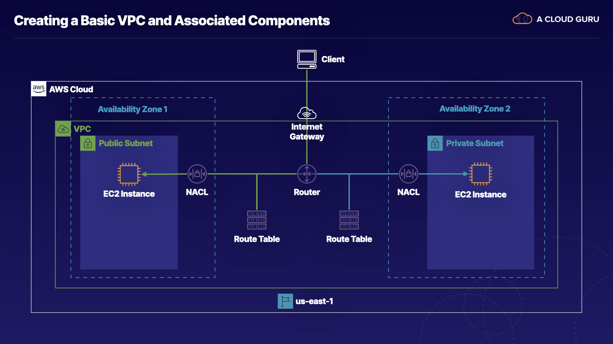

# Creating a Basic VPC and Associated Components in AWS

## Learning Objectives

[ ] Create a vpc

[ ] Create an internet gateway, and connect it to the VPC

[ ] Create a public and private subnet in different availability zones

[ ] Create two route tables, and associate them with the correct subnet

[ ] Create two network access control lists (nacls), and associate each with the proper subnet

> **About this lab**
>
> AWS networking consists of multiple components, and understanding the relationship between the networking components is a key part of understanding the overall functionality and capabilities of AWS. In this hands-on lab, we will create a VPC w/ an internet gateway, as well as create subnets across multiple Availability Zones.



Our goal for this lab is to set up our VPC so that the resources that reside in the public subnet will be accessible from the internet. We'll be creating a VPC in the `us-east-1` or Northern Virginia region. Once we've created that VPC, we're going to attach an **Internet Gateway** to the VPC.

We're going to create 2 different subnets in 2 different availability zones. One will be a public subnet and the other a private Subnet. We'll then attach a **Route Table** to the public subnet and ensure that there's a route to the **Internet Gateway**.

This will allow traffic to flow from our clients over the public internet and through the **Internet Gateway** over to the public subnet. But before the traffic can get into the public subnet, we need to update the network access control list, or **NACL**, to ensure the proper traffic is allowed into the public subnet.

Now this **Route Table** will also have an entry that will allow the public subnet to be able to communicate w/ the private subnet. In order to set up access for our private subnet, we're going to set up a second **Route Table**, and this **Route Table** will not have a route to the **Internet Gateway**, but will allow the private subnet to be able to communicate w/ resources in our public subnet. 

> **Introduction**
>
> In this hands-on lab, we will create a VPC w/ an internet gateway, as well as create subnets across multiple Availability Zones.

## Guide

### Create a VPC

* Let's create a virtual private cloud, a **VPC**, which serves as our network within AWS.

> 1. Navigate to the VPC dashboard.
>
> 2. Click **Your VPCs** in the left-hand menu.
>
> 3. Click **Create VPC**, and set the following values:
>
>    * *Name tag*: **VPC1**
>
>    * *IPv4 CIDR block*: **172.16.0.0/16**
>
> 4. Leave the *IPv6 CIDR block* and *Tenancy* fields as their default values.
>
> 5. Click **Create**.

* This VPC does not have an Internet Gateway. It has no Subnets and has one default Route Tables, but our own custom route table is best practice. It doesn't have any of the components we need to make the VPC functional.

### Create an Internet Gateway, and Connect it to the VPC

> 1. Click **Internet Gateways** in the left-hand menu.
>
> 2. Click **Create internet gateway**.
>
> 3. Give it a **Name tag** of "IGW".
>
> 4. Click **Create internet gateway**.
>
> 5. Once it's created, click **Actions** ▶︎ **Attach to VPC**
>
> 6. In the *Available VPCs* dropdown, select our **VPC1**.
>
> 7. Click **Attach internet gateway**

### Create a Public and Private Subnet in different Availability Zones

> ### Create Public Subnet
>
> 1. Click **Subnets** in the left-hand menu.
>
> 2. Click **Create subnet**, and set the following values:
>
>    * *Name tag*: **Public1**
>
>    * *VPC*: **VPC1**
>
>    * *Availability Zone*: **us-east-1a**
>
>    * *IPv4 CIDR block*: **172.16.1.0/24**
>
> 3. Click **Create**.

* Notice how this IPV4 CIDR block starts w/ the same 2 octets as the CIDR block for our VPC: `172.16`

* The IPv4 CIDR block of `172.16.1.0` is what's going to allow any EC2 instances assigned to this subnet this prefix. The CIDR block will give any EC2 instances assigned to this subnet the prefix of `172.16.1`

> ### Create Private Subnet
>
> 1. Click **Create subnet**, and set the following values:
>
>    * *Name tag*: **Private1**
>
>    * *VPC*: **VPC1**
>
>    * *Availability Zone*: **us-east-1b**
>
>    * *IPv4 CIDR block*: **172.16.2.0/24**
>
> 2. Click **Create**.

Recall that the public subnet was `1.0`

### Create two Route Tables, and associate them w/ the correct Subnet

> ### Create and Configure Public Route Table
>
> [!NOTE]
> The VPC has a default route table, but we will be creating custom route tables.
>
> 1. Click **Route Tables** in the left-hand menu.
>
> 2. Click **Create route table**, and set the following values:
>
>    * *Name tag*: **PublicRT**
>
>    * *VPC*: **VPC1**
>
> 3. Click **Create**.

* Now, we need to add the entry to the public route table so that it has a route to our internet gateway.

> 4. W/ *PublicRT* selected, click the **Routes** tab on the page.
>
> 5. Click **Edit routes**.

* We need to add a route for the **Internet Gateway** now, so that this subnet-once the **Route Table** is attached-is able to to have access to the internet.

> 6. Click **Add route**, and set the following values:
>
>    * *Destination*: **0.0.0.0/0**
>
>    * *Target*: **Internet Gateway** ▶︎ **IGW**
>
> 7. Click **Save routes**.

* Any traffic that's not destined for our local network is routed out to the **Internet Gateway**

* What we've done so far is we've set up our VPC so that any traffic that comes through the **Internet Gateway** will go to this public **Route Table** and the public route table will then direct the traffic off to whichever subnet that'll be attached to it, which in this case, is going to be our public subnet.

> 8. Select **PublicRT**, then click the **Subnet Associations** tab.
>
> 9. Click **Edit subnet associations**.
>
> 10. Select our **Public1** subnet.
>
> 11. Click **Save**.

* The association is made so traffic into and out of the Public Subnet will look at this public **Route Table** and see that it has the **Internet Gateway** attached, and it'll allow the traffic to route between the internet and our public subnet.

> ### Create and Configure Private Route Table
>
> 1. Click **Create route table**, and set the following values:
>
>    * *Name tag*: **PrivateRT**
>
>    * *VPC*: **VPC1**
>
> 2. Click **Create**.
>
> 3. Select **PrivateRT**, then click the **Subnet Associations** tab.
>
> 4. Click **Edit subnet associations**.
>
> 5. Select our **Private1** subnet.
>
> 6. Click **Save**.

*  This associates the Route Table w/ this Private Subnet and b/c it only has a local route, meaning that it can only send traffic between the public and private subnet, it's not able to access the internet. B/c the public subnet has the local route table entry, the public subnet is also able to communicate w/ the private subnet.

### Create two Network Access Control Lists (NACLs), and associate each w/ the proper Subnet

> [!NOTE]
> There's already a default NACL and we don't want to use the default NACL b/c, under **Inbound Rules**, all traffic is allowed. We don't want to necessarily allow all traffic to both subnets b/c if you take a look, both subnets are associated w/ this particular NACL. So we're going to create a new NACL.

> ### Create and configure public NACL
>
> 1. Click **Network ACLs** in the left-hand menu.
>
> 2. Click **Create network ACL**, and set the following values:
>
>    * *Name tag*: **Public_NACL**
>
>    * *VPC*: **VPC1**
>
> 3. Click **Create**.

* Anytime you use the default NACL, all traffic in and out of the associated subnets will automatically be allowed.

> 4. W/ *Public_NACL* selected, click the **Inbound Rules** tab below.
>
> 5. Click **Edit inbound rules**.
>
> 6. Click **Add Rule**, and set the following values:
>
>    * *Rule #*: **100**
>
>    * *Type*: **HTTP (80)**
>
>    * *Port Range*: **80**
>
>    * *Source*: **0.0.0.0/0**
>
>    * *Allow / Deny*: **ALLOW**
>
> 7. Click **Add Rule**, and set the following values:
>
>    * *Rule #*: **110**
>
>    * *Type*: **SSH (22)**
>
>    * *Port Range*: **22**
>
>    * *Source*: **0.0.0.0/0**
>
>    * *Allow / Deny*: **ALLOW**

* SSH is not typically a rule that you would want to create and allow all traffic to have access to. We're doing that in this lab so that you don't have to worry about determining your own personal IP address, and then adding that IP address into the configuration. But when you think about this in terms of setting up your own environment, you'd want to make sure that you restrict this to either your own personal address or to the addresses of the admins on your team.

> 8. Click **Save**.
>
> 9. Click the **Outbound Rules** tab.
>
> 10. Click **Edit outbound rules**.
>
> [!NOTE]
> Recall NACLs are stateless. So unless we create those Outbound rules, the traffic won't be allowed back out of the subnet.
>
> 11. Click **Add Rule**, and set the following values:
>
>    * *Rule #*: **100**
>
>    * *Type*: **Custom TCP Rule**
>
>    * *Port Range*: **1024-65535**
>
>    * *Source*: **0.0.0.0/0**
>
>    * *Allow / Deny*: **ALLOW**

* Port Range `1024-65535` allows for what's called the ephemeral port range. The ephemeral port range says "whenever traffic is sent into your subnet, that traffic comes from a random port on the source computer. As that traffic comes into the subnet, we have to send it back to the source computer on the same port. So that port is going to be one of the ports in this range. Make sure to have the entire range allowed or else the traffic can't return back to its original source reliably.

> 12. Click **Save**.
>
> 13. Click the **Subnet associations** tab.
>
> 14. Click **Edit subnet associations**.
>
> 15. Select the **Public1** subnet, and click **Save changes**.

* So now our public subnet is finally accessible to the internet. It's accessible b/c we have the Internet Gateway attached to the VPC. We have a Route Table that has a route to the Internet Gateway. We have our Subnet created, and our Subnet has the NACL and the Route Table associated w/ it. So this makes our complete path for internet accessible traffic.

* Now we need to associate our public NACL w/ our public subnet

> ### Create and configure private NACL
>
> 1. Click **Create network ACL**, and set the following values:
>
>    * *Name tag*: **Private_NACL**
>
>    * *VPC*: **VPC1**
>
> 2. Click **Create**.
>
> 3. W/ *Private_NACL* selected, click the **Inbound Rules** tab below.
>
> 4. Click **Edit inbound rules**.
>
> 5. Click **Add Rule**, and set the following values:
>
>    * *Rule #*: **100**
>
>    * *Type*: **SSH (22)**
>
>    * *Port Range*: **22**
>
>    * *Source*: **172.16.1.0/24**
>
>    * *Allow / Deny*: **ALLOW**
>
> 6. Click **Save**.
>
> 7. Click the **Outbound Rules** tab.
>
> 8. Click **Edit outbound rules**.
>
> 9. Click **Add Rule**, and set the following values:
>
>    * *Rule #*: **100**
>
>    * *Type*: **Custom TCP Rule**
>
>    * *Port Range*: **1024-65535**
>
>    * *Source*: **0.0.0.0/0**
>
>    * *Allow / Deny*: **ALLOW**
>
> 10. Click **Save**.
>
> 11. Click the **Subnet associations** tab.
>
> 12. Click **Edit subnet associations**.
>
> 13. Select the **Private1** subnet, and click **Save changes**.

* We've set it up such that when we have an EC2 instance in our public subnet, and we have an instance in the private subnet, that communication will be able to flow using SSH over our private subnet and the return traffic will be allowed back. That's the only traffic that's allowed right now into our pivate subnet

* Wheras, again, our public subnet has the NACL that allows both HTTP and SSH traffic to go through the NACL via the route table, and through the internet gateway to communicate w/ any source on the internet.

## Additional resources

Log in to the live AWS environment using the credentials provided. Make sure you are using `us-east-1` (N. Virginia) as the selected region.

> [!NOTE]
> Please use the original, older user interface of Athena for this hands on lab activity. We have notified the lab creator, who will be scheduling an update to the lab.

### CloudWatch Log Metric Filter Pattern

```script
[version, account, eni, source, destination, srcport, destport="22", protocol="6", packets, bytes, windowstart, windowend, action="REJECT", flowlogstatus]
```

### Custome Log Data to Test

```script
2 086112738802 eni-0d5d75b41f9befe9e 61.177.172.128 172.31.83.158 39611 22 6 1 40 1563108188 1563108227 REJECT OK
2 086112738802 eni-0d5d75b41f9befe9e 182.68.238.8 172.31.83.158 42227 22 6 1 44 1563109030 1563109067 REJECT OK
2 086112738802 eni-0d5d75b41f9befe9e 42.171.23.181 172.31.83.158 52417 22 6 24 4065 1563191069 1563191121 ACCEPT OK
2 086112738802 eni-0d5d75b41f9befe9e 61.177.172.128 172.31.83.158 39611 80 6 1 40 1563108188 1563108227 REJECT OK
```

### Create Athena Table

```script
CREATE EXTERNAL TABLE IF NOT EXISTS default.vpc_flow_logs (
  version int,
  account string,
  interfaceid string,
  sourceaddress string,
  destinationaddress string,
  sourceport int,
  destinationport int,
  protocol int,
  numpackets int,
  numbytes bigint,
  starttime int,
  endtime int,
  action string,
  logstatus string
) PARTITIONED BY (
  dt string
) ROW FORMAT DELIMITED FIELDS TERMINATED BY ' ' LOCATION 's3://{your_log_bucket}/AWSLogs/{account_id}/vpcflowlogs/us-east-1/' TBLPROPERTIES ("skip.header.line.count"="1");
```

### Create Partitions

```script
ALTER TABLE default.vpc_flow_logs
ADD PARTITION (dt='{Year}-{Month}-{Day}') location 's3://{your_log_bucket}/AWSLogs/{account_id}/vpcflowlogs/us-east-1/{Year}/{Month}/{Day}';
```

### Analyze Data

```script
SELECT day_of_week(from_iso8601_timestamp(dt)) AS
  day,
  dt,
  interfaceid,
  sourceaddress,
  destinationport,
  action,
  protocol
FROM vpc_flow_logs
WHERE action = 'REJECT' AND protocol = 6
order by sourceaddress
LIMIT 100;
```
