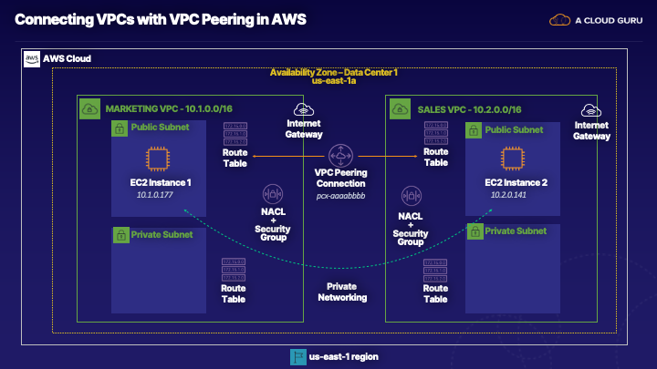

# Connecting VPCs w/ VPC peering in AWS

## Learning objectives

> ✓ Secure the EC2 Instance
>
> ✓ Create a VPC Peering Connection
>
> ✓ Configure Routing

## About this lab

> In this hands-on lab scenario, you're a cloud network engineer working for a large organization that has multiple VPCs. Each VPC is dedicated to a business unit (e.g., Marketing, Sales, Services, etc.). The Marketing department requires access to all resources in the Sales department, and vice versa. We will create a VPC peering connection between the Marketing and Sales VPCs, allowing them to act as if they are on the same network. We'll also add the necessary routes to the associated network route tables.



## Guide

### Secure the EC2 Instance

> 1. In the AWS Management Console, navigate to VPC.
>
> 2. Under **SECURITY**, select **Network ACLs**.
>
> 3. Select **Public2-NACL**
>
> 4. At the bottom, select **Inbound Rules**.
>
> 5. Notice Rule # `104`, which makes our EC2 instances publicly available to anyone on the internet. This is not a secure connection, and VPC peering will allow us to properly secure our network.
>
> 6. Click **Edit Inbound Rules**.
>
> 7. Change the source for Rule # `104` from `0.0.0.0/0` to `10.0.0.0/13`.
>
> 8. Click **Save**.
>
> 9. To test our configuration, open a terminal window and connect to EC2 `INSTANCE1` using the provided lab credentials:

```zsh
ssh cloud_user@<INSTANCE1_PUBLIC_IP_ADDRESS>
```

> 10. Navigate to the EC2 dashboard and click **Instances (running)**.
>
> 11. Select `Instance2`.
>
> 12. At the bottom under *Details*, copy the public and private IPv4 addresses and save them in a text file.
>
> 13. Return to the terminal and ping `Instance 2` using the public IP address:

```zsh
ping <INSTANCE2_PUBLIC_IP_ADDRESS>
```

>   * There should be no response since we've now restricted public access.
>
> 14. Hit **Ctrl + C** to cancel the command.
>
> 15. Ping `Instance 2` using the private IP address:

```zsh
ping <INSTANCE2_PRIVATE_IP_ADDRESS>
```

>   * There should be no response since again since private connectivity has not yet been configured between the two instances.

### Create a VPC Peering Connection

> 1. Navigate to VPC.
>
> 2. Under **VIRTUAL PRIVATE CLOUD**, select **Peering Connections**.
>
> 3. Click **Create Peering Connection**.
>
> 4. Set the following values:
>
>   * *Peering connection name tag*: **Marketing<->Sales**
>
>   * *VPC (Requester)*: **Marketing-VPC**
>
>   * *VPC (Accepter)*: **Sales-VPC**
>
> 5. Leave the rest as their defaults and click **Create Peering Connection**.
>
> 6. Click **OK**. The *Status* should now be *Pending Acceptance*.
>
> 7. To accept the VPC peering connection, select the new connection and click **Actions** ▶︎ **Accept Request**.
>
> 8. Review and click **Yes, Accept**
>
> 9. Click **Close**.
>
> 10. To test our configuration, return to the terminal and connect to EC2 `INSTANCE1` using the provided lab credentials:

```zsh
ssh cloud_user@<INSTANCE1_PUBLIC_IP_ADDRESS>
```

> 11. Attempt to ping the private IP address of `INSTANCE2`:

```zsh
ping <INSTANCE2_PRIVATE_IP_ADDRESS>
```

>   * There should be no response again. We now have private connectivity configured, but we've not yet set up our routing tables.

### Configure routing

> 1. Under **VIRTUAL PRIVATE CLOUD**, select **Route Tables**.
>
> 2. Select **Public1-RT**.
>
> 3. At the bottom, select **Routes**.
>
> 4. Click **Edit Routes**.
>
> 5. Click **Add Route** and enter the following values:
>
>   * Destination: 10.2.0.0/16
>
>   * Target: **Marketing<->Sales**
>
> 6. Click **Save routes**
>
> 7. Repeat the steps above for **Private1-RT**
>
> 8. Repeat the steps above for **Public2-RT** and **Private2-RT**, setting the *Destination* to **10.1.0.0/16**.
>
> 9. To test our configuration, return to the terminal and connect to EC2 `INSTANCE1` using the provided lab credentials:

```zsh
ssh cloud_user@<INSTANCE1_PUBLIC_IP_ADDRESS>
```

> 10. Attempt to ping the private IP address of `INSTANCE2`:

```zsh
ping <INSTANCE2_PRIVATE_IP_ADDRESS>
```

>   * Our private VPC peering connection now works successfully.

## Notes

> **Virtual Private Cloud (VPC)**
>
> * A **private** network isolated from other private networks in AWS.
>
> * By default, VPCs are isolated and there is no connectivity between VPCs.
>
> * VPC peering establishes a route between two or more VPCs that are in the same region and even between different AWS accounts.

VPC peering is a networking connection that allows for the routing of traffic between VPCs privately using IPv4 or IPv6 addresses.

* Setting up a VPC peering connection also requires setting up the necessary routes to the respective route tables.
