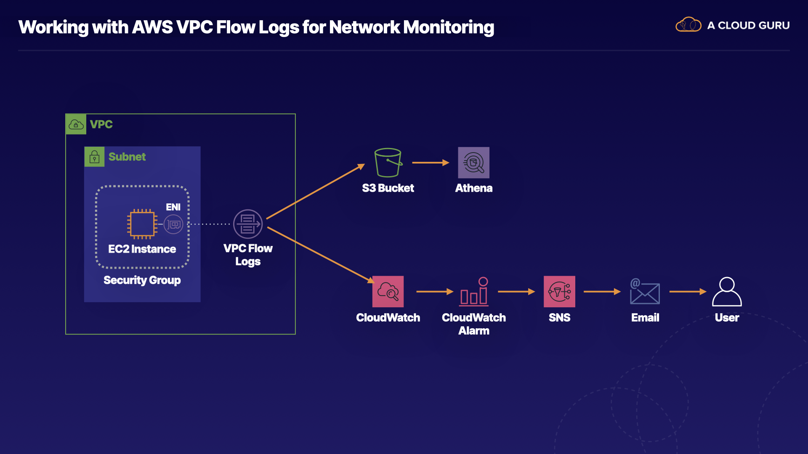

# Creating a Basic VPC and Associated Components in AWS

## Learning Objectives

[ ] Create CloudWatch Log Group and VPC Flow Log to CloudWatch

[ ] Create CloudWatch Filters and Alerts

[ ] Use CloudWatch Insights

[ ] Analyze VPC Flow Logs Data in Athena

> **About this lab**
>
> Monitoring network traffic is a critical component of security best practices to meet compliance requirements, investigate security incidents, track key metrics, and configure automated notifications. AWS VPC Flow logs captures information about the IP traffic going to and from network interfaces in your VPC. In this hands-on lab, we will set up and use VPC Flow Logs published to Amazon CloudWatch, create custom metrics and alerts based on the CloudWatch logs to understand trends and receive notifications for potential security issues, and use Amazon Athena to query and analyze VPC Flow Logs stored in S3.

## Introduction



Monitoring network traffic and alerting on suspicious activity are critical components of a security strategy. In this lab, we'll be setting up AWS VPC flow logs to capture information about the IP traffic to network interfaces in your VPC.

Now, there are many uses for this kind of data, including alerting on failed SSH attempts, determining the source IP addresses that are port probes, and performing ad hoc queries.

This lab is already pre-provisioned w/ the following resources: 

* A virtual private cloud (VPC)

* One public subnet

* An EC2 instance, and

* Several security groups

In order to see the records in our VPC flow logs, we'll generate some network traffic to the EC2 instance later in this lab. To accomplish this, we'll be changing the EC2 instances' security groups to control whether SSH access is allowed or denied to the instance. Then we'll be using our terminal to attempt to SSH into the instance. 

If the security group allows us SSH access, then the VPC flow logs will show a record from the source IP address on port 22 as accepted. If the security group does not allow SSH access, you'll see a record that shows rejected.

These VPC flow logs can be configured at the VPC, subnet, or network interface level. In this lab, we'll configure the Flow Logs at the VPC level, which means that the flow log data will be tracked for every network interface in the VPC.

By the end of this lab, we'll know how to set up and use VPC Flow Logs, publish to both CloudWatch and an S3 bucket, and create custom metrics and alerts based on CloudWatch logs to receive notifications for potential security issues. Additionally, you will know how to perform queries against Flow Logs using CloudWatch Insights.

CloudWatch is great for generating metrics for dashboards and alerts, but S3 offers more cost-effective long-term storage. For the logs stored in S3, you'll create an Amazon Athena table and run a query based on the data stored on that table.

Athena is a serverless interactive query service to query data in S3 using familiar SQL statements.

## Solution

Log in to the live AWS environment using the credentials provided.

Once inside the AWS account, make sure you are using `us-east-1` (N. Virginia) as the selected region.

## Create CloudWatch Log Group and VPC Flow Logs to CloudWatch and S3

> We'll configure VPC Flow Logs to log to both S3 and CloudWatch.

### Create VPC Flow Log to S3

1. Navigate to **VPC** ▶︎ **Your VPCs**

2. Select the `A Cloud Guru` VPC.

3. At the bottom of the screen, select the *Flow logs* tab.

4. Click **Create flow log**, and set the following values:

    * *Filter*: **All**

    * *Maximum aggregation interval*: **1 minute**

    * *Destination*: **Send to an Amazon S3 bucket**

    * *S3 bucket ARN*:

        1. Navigate to S3 in a new browser tab.

        2. Select the provided bucket (it should have `vpcflowlogsbucket` in its name).

        3. Click **Copy ARN**.

        4. Return to the VPC tab and paste in the value.

            * This value can also be found on the lab page.

5. Leave the rest as their defaults and click **Create flow log**.

6. Select the *Flow logs* tab and verify the flow log shows an *Active* status.

7. In the S3 browser tab, click to open the bucket.

8. Click the *Permissions* tab.

9. Scroll down to *Bucket policy*.

10. Notice the bucket path in the policy includes **AWSLogs**.

> [!NOTE]
> It can take 5-15 minutes before logs appear, so let's move on while we wait for that to happen.

### Create CloudWatch Log Group

> So we just set up VPC Flow Logs to write its data to an S3 bucket. Now, we're going to repeat the procedure to also write the same logs to CloudWatch.

1. In a new browser tab, navigate to **CloudWatch** ▶︎ **Logs** ▶︎ **Log groups**.

> A Log groups is a container for our logs.

2. Click **Create log group**.

3. In *Log group name*, enter "VPCFlowLogs".

4. Click **Create**.

> Now that we've created the Log group in CloudWatch, we can go back to VPC and create another Flow Log to write its logs to CloudWatch instead of S3.

### Create VPC Flow Log to CloudWatch

1. Back in the VPC browser tab, click **Create flow log**, and set the following values:

    * *Filter*: **All**

    * *Maximum aggregation interval*: **1 minute**

    * *Destination*: **Send to CloudWatch Logs**

    * *Destination log group*: **VPCFlowLogs**

    * *IAM role*: Select the role w/ **DeliverVPCFlowLogsRole** in the name.

> This is an IAM role that gives the VPC Flow Logs service permission to write to our CloudWatch Logs group.

2. Leave the rest as their defaults and click **Create flow log**.

3. Under the *Flow logs* tab, verify the flow log shows an *Active* status.

4. In the CloudWatch browser tab, click the `VPCFlowLogs` log group to open it.

> There will no **Log streams**. You are going to see a **Log stream** for each Elastic Network Interface or ENI attached to your EC2 instances.

> [!NOTE]
> It can take 5-15 minutes before logs start to show up, so let's move on while we wait for that to happen.

### Generate Traffic

1. In a new browser tab, navigate to **EC2**.

2. Under *Resources* on the EC2 dashboard, select **Instances (running)**.

3. Select the provisioned `Web Server` instance.

4. At the bottom under *Details*, copy the public IPv4 address to the clipboard.

5. Open a terminal session and log in to the EC2 instance via SSH (the password is provided on the lab page):

```zsh
ssh cloud_user@<PUBLIC_IP>
```

6. Exit the terminal:

```zsh
logout
```

7. Return to the EC2 dashboard.

8. With `Web Server` selected, click **Actions** ▶︎ **Security** ▶︎ **Change security groups**.

9. Under *Associated security groups*, click **Remove** to remove the attached security group.

10. In the search bar, search for and select the security group w/ `HTTPOnly` in the name.

11. Click **Add security group**.

12. Click **Save**.

13. Return to the terminal and attempt to connect to the EC2 instance again via SSH using the provided lab credentials.

> [!NOTE]
> We expect this connection to time out since we just selected a security group w/ no SSH access.

14. After about 15 seconds, press **Ctrl-C** to cancel the SSH command.

15. Return to the EC2 dashboard.

16. W/ `Web Server` selected, click **Actions** ▶︎ **Security** ▶︎ **Change security groups**.

17. Under *Associated security groups*, click **Remove** to remove the `HTTPOnly` security group.

18. In the search bar, search for and select the security group w/ `HTTPAndSSH` in the name.

19. Click **Add security group**.

20. Click **Save**.

21. Attempt to log in to the EC2 instance again via SSH using the credentials provided. This time, it should work.

22. Exit the terminal:

```zsh
logout
```

> **Let's review what we've done so far**.
>
> In our VPC, we configured 2 Flow Logs:
>
> * One to an S3 bucket, and
>
> * The other to CloudWatch Logs
>
> We generated traffic to an EC2 instance in our VPC and we blocked access to port 22 (SSH) so we should see reject messages in our Flow Logs as well as accept messages.

## Create CloudWatch Filters and Alerts

> We'll set up a CloudWatch metric and alarm based on the VPC log data stored in CloudWatch. Next, we'll run a SQL query against that same data using CloudWatch Insights. And finally, we'll create an Amazon Athena table and run a SQL query against that using the VPC Flow Log data stored in S3.

### Create CloudWatch Log Metric Filter

1. Navigate to **CloudWatch** ▶︎ **Logs** ▶︎ **Log groups**.

2. Select the `VPCFlowLogs` log group. You should now seee a log stream.

> [!NOTE]
> If you don't see a log stream listed yet, wait a few more minutes and refresh the page until the data appears.

3. Click the listed log stream (it should start w/ `eni`).

4. Go back to the *VPCFlowLogs* page and select the **Metric filters** tab.

5. Click **Create metric filter**. We can use this metric filter to create a CloudWatch alarm.

6. Enter the following in the *Filter pattern* field to track failed SSH attempts on port 22:

```script
[version, account, eni, source, destination, srcport, destport="22", protocol="6", packets, bytes, windowstart, windowend, action="REJECT", flowlogstatus]
```

> What we're interested in seeing here is a destination port of 22, the SSH port; Protocol 6, which represents TCP; and the action being "REJECT". We're going to create this filter pattern so that the metric filter can be used to create an alarm whenever we have reject messages in our VPC Flow Log.

7. In the *Select log data to test* dropdown, select **Custom log data**.

8. Replace the existing log data w/ the following:

```script
2 086112738802 eni-0d5d75b41f9befe9e 61.177.172.128 172.31.83.158 39611 22 6 1 40 1563108188 1563108227 REJECT OK
2 086112738802 eni-0d5d75b41f9befe9e 182.68.238.8 172.31.83.158 42227 22 6 1 44 1563109030 1563109067 REJECT OK
2 086112738802 eni-0d5d75b41f9befe9e 42.171.23.181 172.31.83.158 52417 22 6 24 4065 1563191069 1563191121 ACCEPT OK
2 086112738802 eni-0d5d75b41f9befe9e 61.177.172.128 172.31.83.158 39611 80 6 1 40 1563108188 1563108227 REJECT OK
```

9. Click **Test pattern**.

10. Click **Next**.

11. Set the following values:

    * *Filter name*: **dest-port-22-rejects**

    * *Metric namespace*: **VPC Flow Logs**

    * *Metric name*: **ssh-rejects**

    * *Metric value*: **1**

> This will register one metric every time there's an SSH reject message in our VPC Flow Log.

12. Click **Next**.

13. Click **Create metric filter**.

### Create Alarm based on the Metric Filter

1. Once created, click the checkbox in the top right corner of the metric filter.

2. Click **Create alarm**.

3. In the *Metric* section, change *Period* to **1 minute**.

4. In the *Conditions* section, set *Whenever SSH-rejects is...* to **Greater/Equal** than **1**.

5. Click **Next**.

6. In the *Notification* section, set the following values:

    * *Select an SNS topic*: **Create new topic**

    * *Create a new topic...*: Leave default

    * *Email endpoints that will receive the notification...*: Enter **user@example.com** or your email address

7. Click **Create topic**.

8. Click **Next**.

9. In *Alarm name*, type "SSH Rejects" and click **Next**.

10. Click **Create alarm**.

11. If you entered your email address earlier, open your email inbox and click the **Confirm Subscription** link in the received SNS email.

### Generate Traffic for Alerts

1. In the terminal, log in to the `Web Server` instance via SSH using the lab credentials.

2. Exit the terminal:

```zsh
logout
```

3. In a new browser tab, navigate to **EC2** ▶︎ **Instances(running)**.

4. Select the `Web Server` instance.

5. Click **Actions** ▶︎ **Security** ▶︎ **Change security groups**.

6. Under *Associated security groups*, click **Remove** to remove the attached security group.

7. In the search bar, search for and select the `HTTPOnly` security group.

8. Click **Add security group**.

9. Return to the terminal and attempt to connect to the EC2 instance via SSH.

> [!NOTE]
> We expect this totime out since we just selected a security group w/ no SSH access.

10. Press **Ctrl-C** to cancel the SSH command.

11. Return to EC2.

12. W/ the `Web Server` instance still selected, click **Actions** ▶︎ **Security** ▶︎ **Change security groups**.

13. Click **Remove** to remove the `HTTPOnly` security group.

14. Select again the `HTTPAndSSH` security group and click **Add security group**.

15. Click **Save**.

16. Go back to **CloudWatch** ▶︎ **Alarms**. We should see our `SSH Rejects` alarm enter an *In alarm* state shortly.

> [!NOTE]
> If you don't see the alarm listed yet, wait a few more minutes and refresh the page until it appears.

## Use CloudWatch Insights

1. In the left-hand menu, select **Logs Insights**.

2. In the *Select log group(s)* search bar, select **VPCFlowLogs**.

3. In the right-hand pane, select **Queries**.

4. Under *Sample queries*, click **VPC Flow logs** ▶︎ **Top 20 source IP addresses with highest number of rejected requests**.

5. Click **Apply**.

6. Observe the query changes.

7. Click **Run query**. After a few moments, we'll see some data start to populate.

> **Let's review what we've done so far**.
>
> In CloudWatch, we created a metric filter. We created a CloudWatch alarm, which provided notifications to an SNS topic that sent us an email when that condition was met. We also performed this ad hoc query based on the data in CloudWatch. Recall CloudWatch is great for generating metrics for dashboard and alerts like this, but S3 offers much more cost-effective, long-term storage.

## Analyze VPC Flow Logs Data in Athena

> For the logs stored in S3, we'll now create an Athena table to run a query based off the data stored in that table.

### Record Reference Information to be used in Athena Queries

> [!NOTE]
> Before attempting to run a query in Athena, you have to specify an S3 bucket for the results to be saved.

1. In a new browser tab, navigate to S3.

2. Select the provisioned bucket to open it.

3. Navigate through the bucket folder structure: **AWSLogs** ▶︎ **{ACCOUNT_ID}** ▶︎ **vpcflowlogs** ▶︎ **us-east-1** ▶︎ **{YEAR}** ▶︎ **{MONTH}** ▶︎ **{DAY}**.

4. At the top right, click **Copy S3 URI**.

5. Paste the URI into a text file, as we'll need it shortly.

## Create the Athena Table

1. Navigate to Athena.

2. If you come to the Amazon Athena landing page, click **Get Started**. Otherwise, skep this step.

3. Above the new query window, click **set up a query result location in Amazon S3**.

4. In *Query result* location, enter **s3://** and paste in the S3 bucket path previously copied w/ a forward slash at the end (`s3://{BUCKET_NAME}/AWSLogs/{ACCOUNT_ID}/vpcflowlogs/us-east-1/{YEAR}/{MONTH}/{DAY}/`).

5. Click **Save**.

6. Paste the following DDL code in the new query window, replacing `{your_log_bucket}` and `{account_id}` w/ your unique values (you can obtain them from the bucket path you've been using):

```sql
CREATE EXTERNAL TABLE IF NOT EXISTS default.vpc_flow_logs (
  version int,
  account string,
  interfaceid string,
  sourceaddress string,
  destinationaddress string,
  sourceport int,
  destinationport int,
  protocol int,
  numpackets int,
  numbytes bigint,
  starttime int,
  endtime int,
  action string,
  logstatus string
)
PARTITIONED BY (dt string)
ROW FORMAT DELIMITED
FIELDS TERMINATED BY ' '
LOCATION 's3://{your_log_bucket}/AWSLogs/{account_id}/vpcflowlogs/us-east-1/'
TBLPROPERTIES ("skip.header.line.count"="1");
```

7. Click **Run query**.

    * Once executed, a `Query successful` message should display.

### Create Partitions to be able to read the data

1. Click the `+` icon to open a new query window.

2. Paste the following code, replacing `{Year}-{Month}-{Day}` w/ today's date and the location w/ your full S3 bucket location like before:

```sql
ALTER TABLE default.vpc_flow_logs
    ADD PARTITION (dt='{Year}-{Month}-{Day}')
    location 's3://{your_log_bucket}/AWSLogs/{account_id}/vpcflowlogs/us-east-1/{Year}/{Month}/{Day}';
```

3. Click **Run query**. A `Query successful` message should display.

## Analyze VPC Flow Logs Data in Athena

1. Open a new query window and paste in the following:

```script
SELECT day_of_week(from_iso8601_timestamp(dt)) AS
    day,
    dt,
    interfaceid,
    sourceaddress,
    destinationport,
    action,
    protocol
FROM vpc_flow_logs
WHERE action = 'REJECT' AND protocol = 6
order by sourceaddress
LIMIT 100;
```

2. Click **Run query**. Our formatted data should appear underneath.

> **Let's review what we've done so far**.
>
> We created VPC Flow Logs to both CloudWatch and an S3 bucket. We created a CloudWatch metric based on failed attempts to access port 22 and we created a CloudWatch alarm based off that metric and configured automatic email notifications using Amazon SNS. Then we used CloudWatch Insights to run ad hoc SQL queries against the log data stored in CloudWatch Logs. Then we created a table in Amazon Athena for the S3 log data from the VPC Flow Logs. And finally, we ran an ad hoc SQL query against Amazon Athena for he log data stored in S3.
