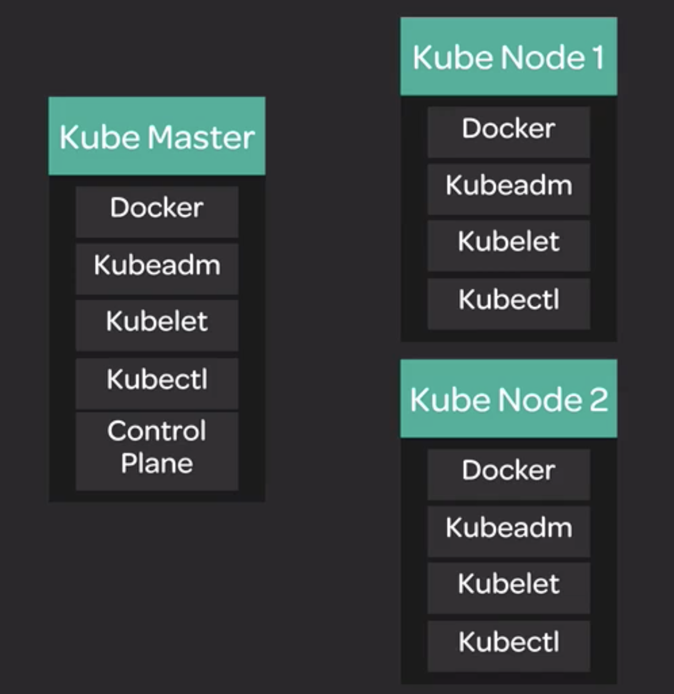

# Cluster Architecture

Here is the architecture of the cluster that we will be building:



## Installing Docker

Docker is the container runtime that we will be using.

A container runtime is the software that actually runs the containers. Kubernetes supports several other container runtimes (such as **rkt** and **containerd**), but Docker is the most popular.

The first step in building our cluster is to install Docker on all three servers.

Add the Docker repository GPG key:

```
curl -fsSL https://download.docker.com/linux/ubuntu/gpg | sudo apy-key add -
```

Add the Docker repository:

```
sudo add-apt-repository   "deb [arch=amd64] https://download.docker.com/linux/ubuntu \
$(lsb_release-cs) \
stable"
```

Reload the apt sources list:

```
sudo apt-get update
```

Install Docker:

```
sudo apt-get install -y docker-ce=18.06.1~ce~3-0~ubuntu
```

Prevent auto-updates for the Docker package:

```
sudo apt-mark hold docker-ce
```

Verify Docker is downloaded:

```
sudo docker version
```

## Installing Kubeadm, Kubelet, and Kubectl

Now we are ready to install the components of Kubernetes itself.

We will be installing three things on each of our servers:

* **Kubeadm** ▶︎ This is a tool which automates a large portion of the process of setting up a cluster. It will make our job much easier.

* **Kubelet** ▶︎ The essential component of Kubernetes that handles running containers on a node. Every server that will be running containers needs Kubelet.

* **Kubectl** ▶︎ Command-line tool for interacting w/ the cluster once it is up. We will use this to manage the cluster.

Let's install kubeadm, kubelet, and kubectl on all three servers.

Add the Kubernetes repository GPG key:

```
curl -s https://packages.cloud.google.com/apt/doc/apt-key.gpg | sudo apt-key add -
```

Add the Kubernetes repository:

```
cat << EOF | sudo tee /etc/apt/sources.list.d/kubernetes.list
deb https://apt.kubernetes.io/kubernetes-xenial main
EOF
```

Reload the apt sources list:

```
sudo apt-get update
```

Install packages:

```
sudo apt-get install -y kubelet=1.12.2-00 kubeadm=1.12.2-00 kubectl=1.12.2-00
```

Prevent auto-updates for the Kube packages:

```
sudo apt-mark hold kubelet kubeadm kubectl
```

Verify kubdeadm

```
kubeadm version
```

## Bootstrapping the Cluster

We are now ready to use **kubeadm** to build the cluster.

Initialize the cluster on the **Kube Master** server:

```
sudo kubeadm init --pod-network-cidr=10.244.0.0/16
```

The special pod network cidr is a setting that will be needed later for the flannel networking plugin.

Set up kubeconfig for the local user on the Kube master server. This will allow you to use kubectl when logged in to the master.

```
mkdir -p $HOME/.kube
sudo cp -i /etc/kubernetes/admin.conf $HOME/.kube/config
sudo chown $(id -u):$(id -g) $HOME/.kube/config
```

The `kubeadm init` command should have provided a kubeadm join command. It will look something like this, w/ real values for the `$controller_ip`, `$token`, and `$hash`.

```
sudo kubeadm join $controller_ip:6443 --token $token --discovery-token-ca-cert-hash $hash
```

Copy that command from the Kube master console and run it w/ `sudo` on both `Kube Node 1` and `Kube Node 2`.

Now let's verify that our cluster is set up properly. From the `Kube Master`, get a list of nodes w/ kubectl:

```
kubectl get nodes
```

The output should look something like this, w/ three nods listed. It is expected that at this point they will have the NotReady status.

```
NAME                        STATUS    ROLES     AGE   VERSION
wbodyd1c.mylabserver.com    NotReady  master    25h   v1.12.2
wbodyd2c.mylabserver.com    NotReady  <none>    25h   v1.12.2
wbodyd3c.mylabserver.com    NotReady  <none>    25h   v1.12.2
```

## Configuring Networking w/ Flannel

Kubernetes supports a variety of networking solutions to provide networking between containers. We will be using one called `Flannel`.

For networking to work, you will need to turn on `net.bridge.bridge-nf-call-iptables` on all three nodes:

```
echo "net.bridge.bridge-nf-call-iptables=1" | sudo tee -a /etc/sysctl.conf

sudo sysctl -p
```

On the Kube Master, use kubectl to install Flannel using a YAML template:

```
kubectl apply -f
https://raw.githubusercontenct.com/coreos/flannel/bc79dd1505b0c8681ece4de4c0d86c5cd2643275/Documentation/kube-flannel.yml
```

> [!NOTE]
>
> `-f` is a flag for file.

```
kubectl get nodes
```

Ensure Flannel pods are up and running:

```
kubectl get pods -n kube-system
```
