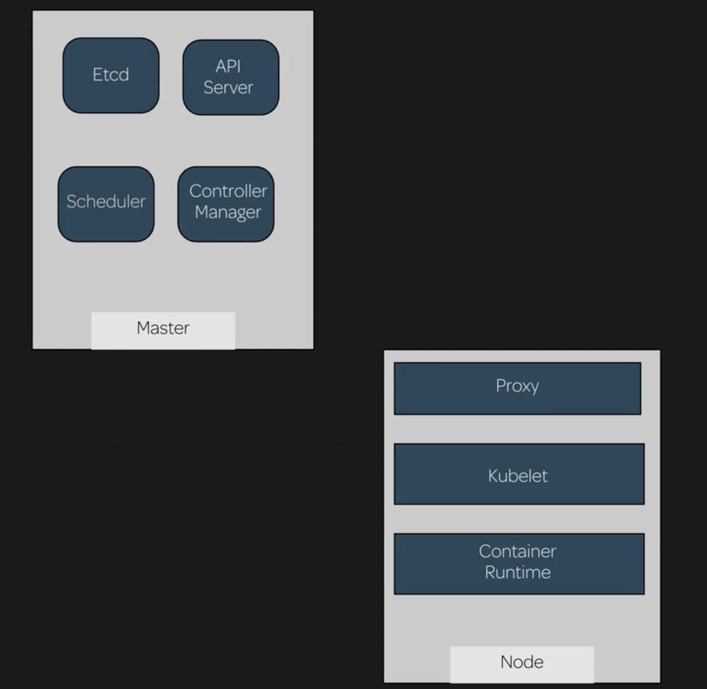

# Kubernetes Architecture and Components

Kubernetes includes multiple components that work together to provide the functionality of a Kubernetes cluster.



View pods responsible for running Kubernetes cluster:

```
kubectl get pods -n kube-system
```

## Control Plane / Master Node

The control plane components manage and control the cluster:

> ### Etcd
>
> Provides distributed, synchronized data storage for the cluster state.
> 
> This is the key value store for the cluster. When an object is created, that object's state is stored here.
>
> `etcd` acts as the reference for the cluster state. If the cluster differs from what is indicated here, the cluster is changed to match.

> ### kube-apiserver
>
> Serves the Kubernetes API, the primary interface fro the cluster.
>
> This is the front end for the Kubernetes control plane. All API calls are sent to this server, and the server sends commands to the other services.

> ### kube-controller-manager
>
> Bundles several components into one package
>
> Operates the cluster controllers
>
> **Node Controller**: Responsible for noticing and responding when nodes go down.
>
> **Replication Controller**: Responsible for maintaining the correct number of pods for every replication controller object in the system.
>
> **Endpoints Controller**: Populates the Endpoints object (i.e., joins services and pods).
>
> **Service Account & Token Controllers**: Creates default accounts and API access tokens for new namespaces.

> ### kube-scheduler
>
> Schedules pods to run on individual nodes.
>
> When a new pod is created, the scheduler determines which node the pod will be run on.
>
> This decision is based on many factors, including hardware, workloads, affinity, etc.

## Nodes

```
kubectl get pods --all-namespaces -o wide | grep <NODE_SERVER_NAME>
```

Nodes are fairly lightweight.

In addition to the control plane (master), each node also has:

> ### kubelet
>
> Agent that executes containers on each node.
>
> This is the primary node agent that runs on each node. It uses a PodSpec, a provided object that describes a pod, to monitor the pods on its node. The kubelet checks the state of its pods and ensures that they match the spec.

```
kubectl get nodes
```

```
kubectl get pods --all-namespaces -o wide
```

```
kubectl get pods --all-namespaces -o wide | grep <MASTER_SERVER_NAME>
```

View all pods and containers:

```
sudo docker ps
```

> ### kube-proxy
>
> Handles network communication between nodes by adding firewall routing rules
>
> This runs on the nodes and provides network connectivity for services on the nodes that connect to the pods. Services must be defined via the API in order to configure the proxy.

W/ `kubeadm`, many of these components are run as pods within the cluster itself.

## Container Runtime

This is the container manager. It can be any container runtime that is compliant w/ the Open Container Initiative (such as Docker). When Kubernetes needs to instantiate a container inside of a pod, it interfaces w/ the container runtime to build the correct type of container.
