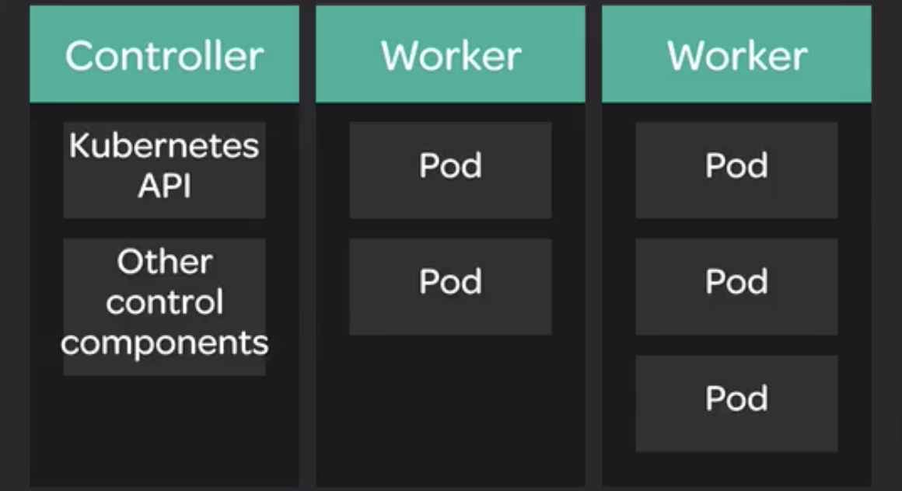

# Clustering and Nodes

Kubernetes implements a clustered architecture. In a typical production environment, you will have multiple servers that are able to run your workloads (containers).

These servers which actually run the containers are called nodes.

A Kubernetes cluster has one or more control servers which manage and control the cluster and host the Kubernetes API. These control servers are usually separate from worker nodes, which run applications within the cluster.



You can use `kubectl` to list nodes in the cluster and get more information about them:

Show list of nodes:

```
kubectl get nodes
```

Get more information about particular node:

```
kubectl describe node $node_name
```
