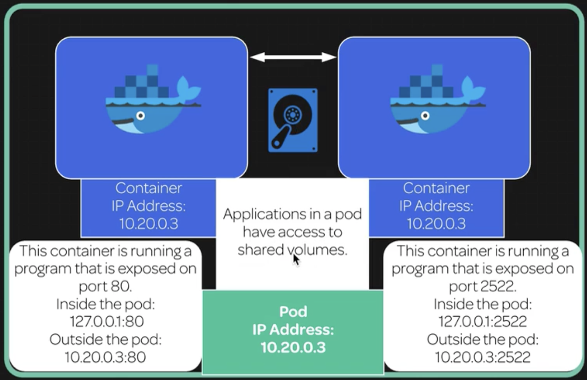

# Containers and Pods

Pods are the smallest and most basic building block of the Kubernetes model.

A pod consists of one or more containers, storage resources, and a unique IP address in the Kubernetes cluster network.



In order to run containers, Kubernetes schedules pods to run on servers in the cluster. When a pod is scheduled, the server will run the containers that are part of that pod.

Let's create a simple pod that runs on an Nginx web server:

```
cat << EOF | kubectl create -f -
apiVersion: v1
kind: Pod
metadata:
  name: nginx
spec:
  containers:
  - name: nginx
   image: nginx
EOF
```

```
kubectl get pods
```

...or...

```
kubectl get pods --all-namespaces
```

```
kubectl describe pod $pod_name -n $namespace
```

For example:

```
kubectl describe pod nginx
```

Will allow you to view information regarding that certain pod.

## Further demonstration


All containers can communicate w/ all other containers w/o NAT. Containers in the same pod can communicate on localhost.

All nodes can communicate w/ all containers (and vice versa) w/o NAT.

The IP that a container sees itself as is the IP that others see it as.

Applications in a pod have access to shared volume.

```
kubectl get namespaces
```

Create a namespace:

```
kubectl create namespace <NAMESPACE> | podexample
```

```
cat ./pod-example.yaml
```

```yml
apiVersion: v1
kind: Pod
metadata:
  name: examplepod
  namepspace: pod-example
spec:
  volumes:
  - name: html
    emptyDir: {}
  containers:
  - name: webcontainer
    image: nginx
    volumeMounts:
    - name: html
      mountPath: /usr/share/nginx/html
  - name: filecontainer
    image: debian
    volumeMounts:
    - name: html
      mountPath: /html
    command: ["/bin/sh", "-c"]
    args:
      - while true; do
         date >> /html/index.html;
         sleep 1;
       done
```

```
kubectl --namespace=podexample get pods
```

```
kubectl --namespace=podexample delete pod <POD_NAME>
```

Create pod:

```
kubectl create -f ./pod-example.yaml
```

View pod:

```
kubectl --namspace=podexample get pods
```

```
kubectl --namspace=podexample get pods -o wide
```

```
curl <IP_ADDRESS>
```
