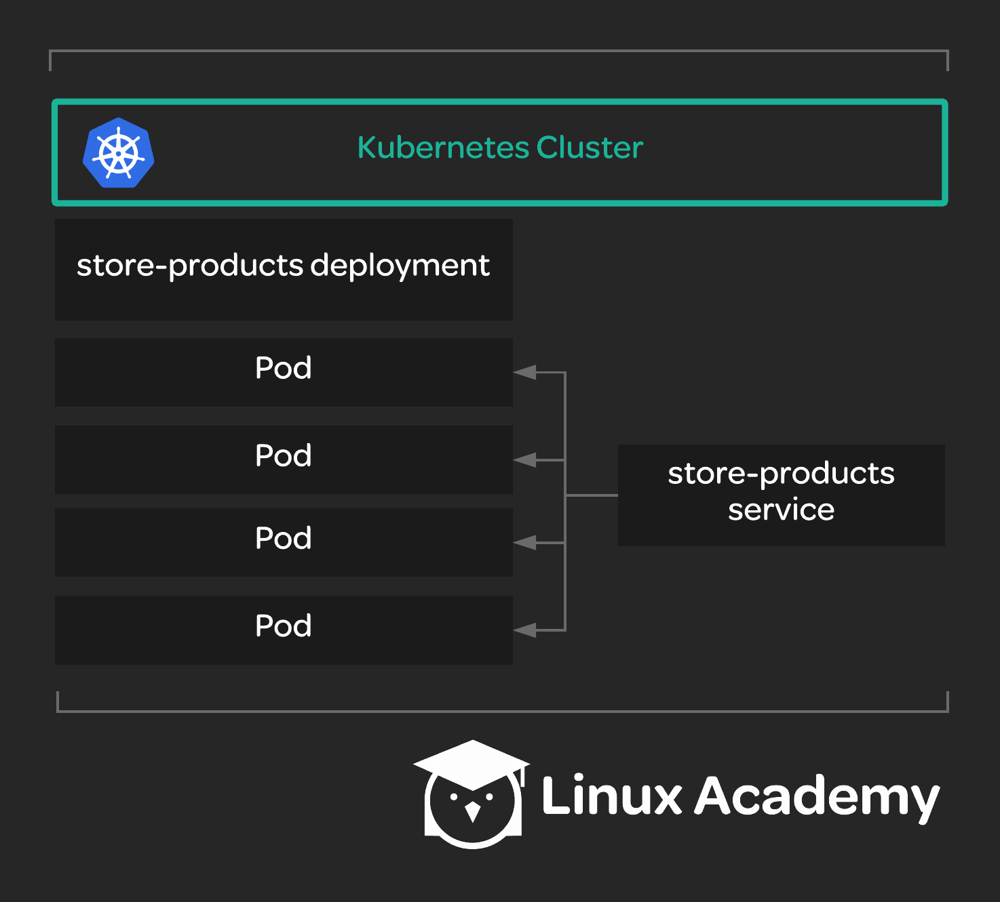

# Deploying a Simple Service to Kubernetes

## About this lab

Deployments and services are at the core of what makes Kubernetes a great way to manage complex application infrastructures. In this hands-on lab, you will have an opportunity to get hands-on with a Kubernetes cluster and build a simple deployment, coupled with a service providing access to it. You will create a deployment and a service which can be accessed by other pods in the cluster.

Your team manages an online storefront. They want to have a simple service in their Kubernetes cluster that is able to provide a list of products. Other pieces of the application, running as other pods in the cluster, will use this service in the future. For now, all you need to do is deploy the service's pods to the cluster and create a Kubernetes service to provide access to those pods. The team estimates that you will need four replicas of the service pod for the time being. There is already a busybox testing pod in the cluster that you can use to test your new service once it is created.

There is a public Docker image for the store-products app called `linuxacademycontent/store-products:1.0.0`.

You will need to do the following:

* Create a deployment for the store-products service with four replicas.

* Create a store-products service and verify that you can access it from the busybox testing pod.

## Learning objectives

[ ] Create a deployment for the store-products service with four replicas.

[ ] Create a store-products service and verify that you can access it from the busybox testing pod.
