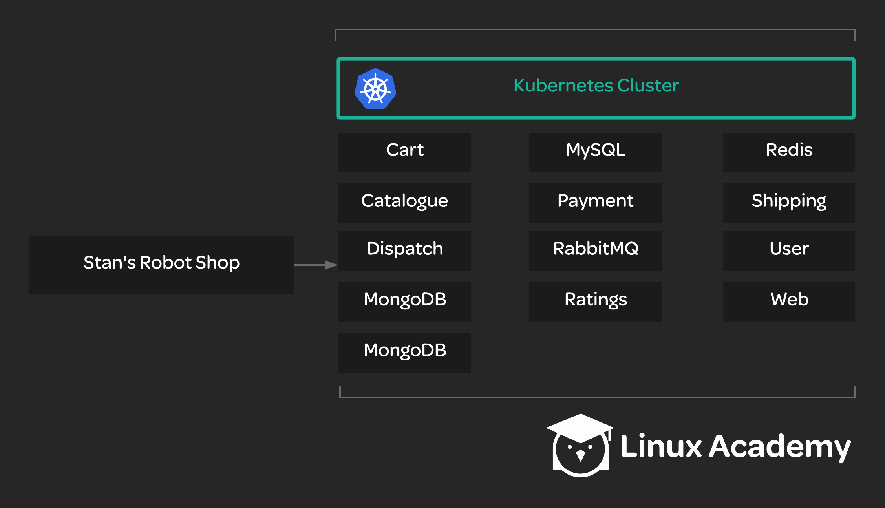

# Deploying a Microservice Application to Kubernetes

## About this lab

Microservice applications can be quite complex but that complexity can offer many benefits. Kubernetes can help you take advantage of those benefits by making these complex infrastructures easier to manage through automation. In this hands-on lab, you will see the value of Kubernetes firsthand as you deploy a complex microservice architecture to the cluster and then independently scale some of its components.

Your team manages an online storefront called Stan's Robot Shop. Your company sells robots, and the team has built a rather complex micrservice-based application in order to serve the online store. You have been given the task of deploying this application to the cluster. Luckily, there are some pre-made Kubernetes YAML descriptors to make this easier, contained in a Git repository at https://github.com/linuxacademy/robot-shop.

However, the team anticipates that the search feature of the online store will need to handle some additional load soon after the store launches. After deploying the app, you will need to scale up the MongoDB service responsible for handling product searches.

You will need to do the following:

* Deploy the Stan's Robot Shop app to the cluster.

* Scale up the MongoDB service to two replicas instead of just one.

Once the app is deployed, you should be able to reach it in a browser using the Kube master node's public IP: `http://$kube_master_public_ip:30080`

## Learning objectives

[ ] Deploy the Stan's Robot Shop app to the cluster.

[ ] Scale up the MongoDB deployment to two replicas instead of just one.
