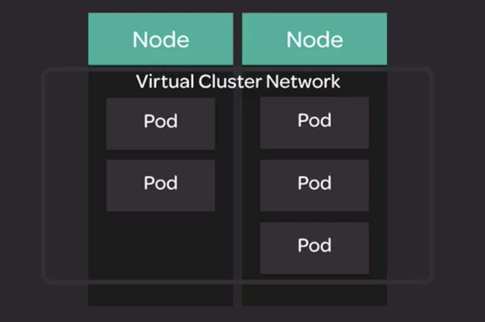
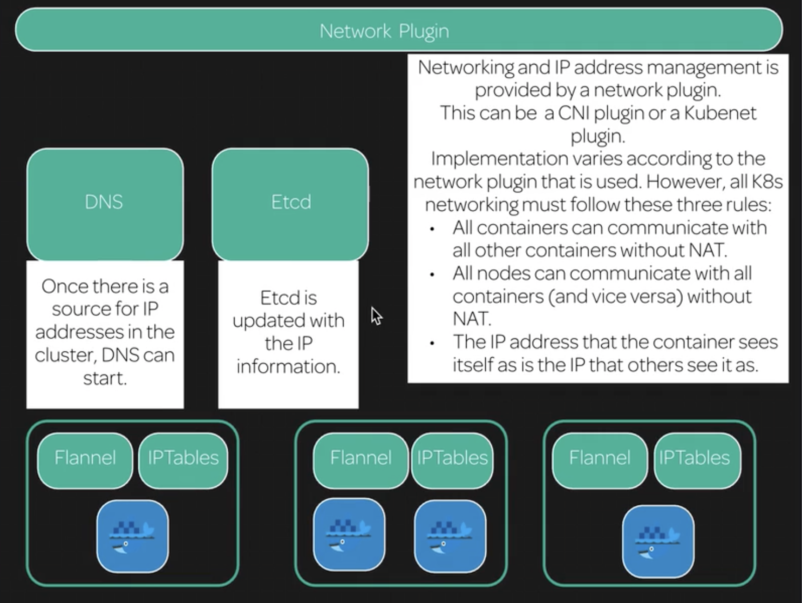

# Networking in Kubernetes

When using Kubernetes, it is important to understand how Kubernetes implements networking between pods (and services) in the cluster.

The Kubernetes networking model involves creating a virtual network across the whole cluster. This means that every pod on the cluster has a unique IP address, and can communicate w/ any other pod in the cluster, even if that other pod is running on a different node.



Kubernetes supports a variety of networking plugins that implement this model in various ways. In this course, we will be using `Flannel`.

Create deployment w/ two pods w/ simple nginx web servers:

```
cat << EOF | kubectl create -f -
apiVersion: apps/v1
kind: Deployment
metadata:
  name: nginx
  labels:
    app: nginx
spec:
  replicas: 2
  selector:
    matchLabels:
      app: nginx
  template:
    metadata:
      labels:
        app: nginx
    spec:
      containers:
      - name: nginx
        image: nginx: 1.15.4
        ports:
        - containerPort: 80
EOF
```

```
kubectl get pods
```

Create a test pod w/ the ability to run `curl` commands in that pod:

```
cat << EOF | kubectl create -f -
apiVersion: v1
kind: Pod
metadata:
  name: busybox
spec:
  containers:
  - name: busybox
    image: radial/busyboxplus:curl
    args:
    - sleep
    - "1000"
EOF
```

```
kubectl get pods -o wide
```

```
kubectl exec busybox -- curl <IP_ADDRESS_OF_NGINX_POD_ON_SEPARATE_NODE>
```

## Further demonstration

On master node:

```
ip route
```

flannel runs on each of the nodes as well as master, enabling communication:

```
ps -ax | grep [f]lannel
```



Networking and IP address management is provided by a network plugin.

This can be a CNI plugin or a Kubenet plugin.

Implementation varies according to the network plugin that is used. However, all K8s networking must follow these three rules:

* All containers can communicate w/ all other containers w/o NAT.

* All nodes can communicate w/ all containers (and vice versa) w/o NAT.

* The IP address that the container sees itself as is the IP that others see it as.

All of the primary services run in the host node's network whereas the coredns services run in the pod IP address:

```
kubectl get pods --all-namespaces -o wide
```
