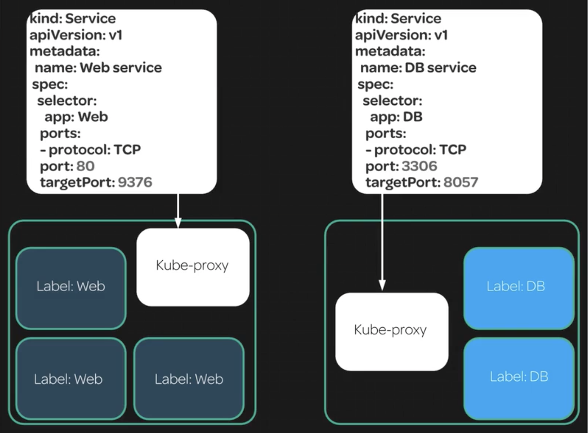
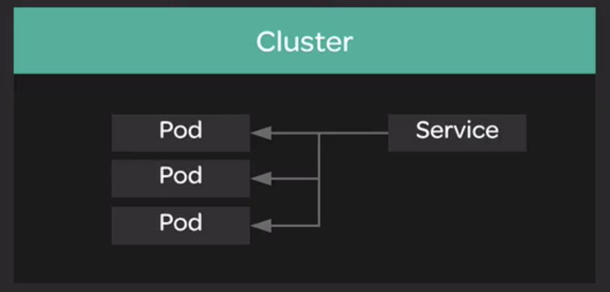

# Services

Services obfuscate the Pods in the background, enabling high availability.



The service definition selector (left) matches pods w/ the "Web" label. It exposes port 80 and targets port 9376 on the pods.

The service definition selector (right) matches the pods w/ the "DB" label. It exposes port 3306 and targets port 8057 on the pods.

**Services** are another important component of deploying apps w/ Kubernetes.

Services allow you to dynamically access a group of replica pods. Replica pods are often being created and destroyed, so what happens to other pods or external entities which need to access those pods?

A Service creates an **abstraction layer** on top of a set of replica pods. You can access the service rather than accessing the pods directly, so as pods come and go, you get uninterrupted, dynamic access to whatever replicas are up at the time.



Let's create a simple service on top of our Nginx deployment:

```
cat << EOF | kubectl create -f -
kind: Service
apiVersion: v1
metadata:
  name: nginx-service
spec:
  selector:
    app: nginx
  ports:
  - protocol: TCP
   port: 80
   targetPort: 80
   nodePort: 30080
  type: NodePort
EOF
```

List services:

```
kubectl get svc
```

...or...

```
kubectl get service
```

Test out nodePort:

```
curl localhost:30080
```

## Alternative walk-through

Create a service:

```
kubectl get pods
```

Use replica set:

```
kubectl create -f ./replicas-example.yaml
```

```
kubectl get pods
```

```
kubectl describe pod <POD_NAME>
```

```
cat ./service-example.yaml
```

```yml
kind: Service
apiVersion: v1
metadata:
  name: my-awesome-service
spec:
  selector:
    app: nginx
  ports:
  - protocol: TCP
    port: 32768
    targetPort: 80
```

```
kubectl create -f ./service-example.yaml
```

```
kubectl describe service <SERVICE_NAME>
```

```
kubectl create -f ./dnstestpod.yaml
```

```
kubectl exec -it testbox /bin/bash
```

```
nslookup <SERVICE_NAME>
```

```
curl <SERVICE_NAME>:32768
```

```
kubectl scale rs/frontend --replicas=4
```

Verify that 4 endpoints now show as a result of scaling the replica set:

```
kubectl describe service <SERVICE_NAME>
```
