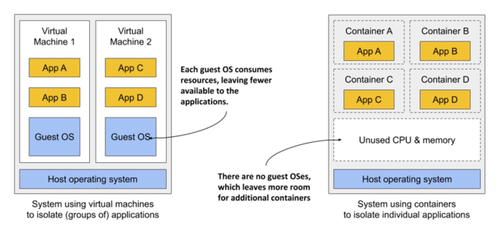
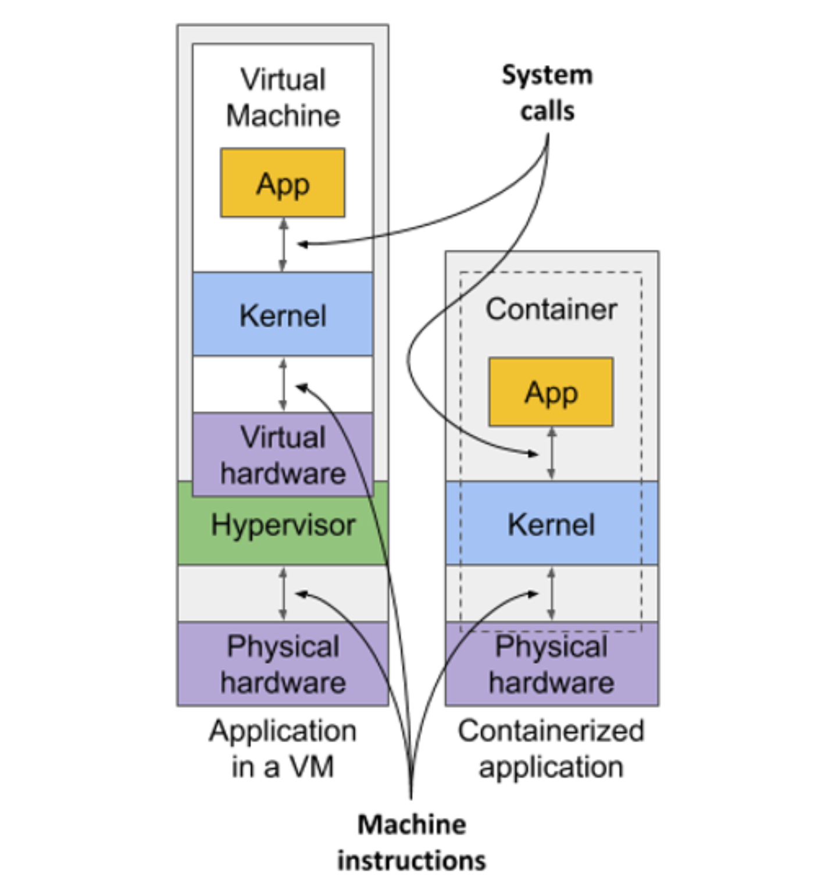
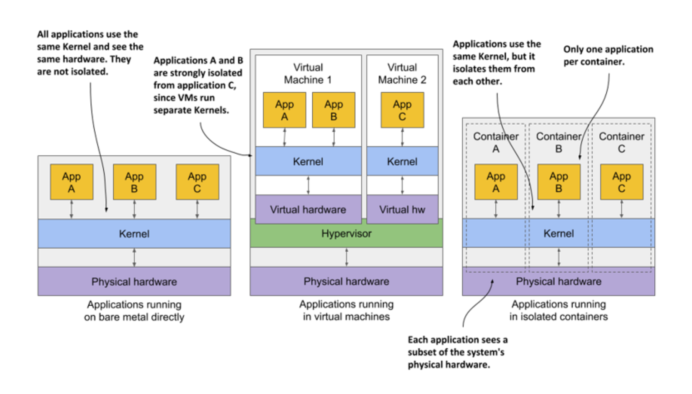

# 2.1.1 Comparing containers to virtual machines

Instead of using virtual machines to isolate the environments of individual microservices (or software processes in general), most development and operations teams now prefer to use containers. They allow you to run multiple services on the same host computer, while keeping them isolated from each other. Like VMs, but with much less overhead.

Unlike VMs, which each run a separate operating system w/ several system processes, a process running in a container runs within the existing host operating system. B/c there is only one operating system, no duplicate system processes exist. Although all the application processes run in the same operating system, their environments are isolated, though not as well as when you run them in separate VMs. To the process in the container, this isolation makes it look like no other processes exist on the computer.

## Comparing the overhead of containers and virtual machines

Compared to VMs, containers are much lighter, because they don’t require a separate resource pool or any additional OS-level processes. While each VM usually runs its own set of system processes, which requires additional computing resources in addition to those consumed by the user application’s own process, a container is nothing more than an isolated process running in the existing host OS that consumes only the resources the app consumes. They have virtually no overhead.

Figure 1 shows two bare metal computers, one running two virtual machines, and the other running containers instead. The latter has space for additional containers, as it runs only one operating system, while the first runs three – one host and two guest OSes.

Because of the resource overhead of VMs, you often group multiple applications into each VM. You may not be able to afford dedicating a whole VM to each app. But containers introduce no overhead, which means you can afford to create a separate container for each application. In fact, you should never run multiple applications in the same container, as this makes managing the processes in the container much more difficult. Moreover, all existing software dealing with containers, including Kubernetes itself, is designed under the premise that there’s only one application in a container. Kubernetes provides a way to run related applications together, yet still keep them in separate containers.

## Comparing the start-up time of containers and virtual machines

In addition to the lower runtime overhead, containers also start the application faster, b/c only the application processes itself to be started. No additional system processes need to be started first, as is the case when booting up a new virtual machine.

## Comparing the isolation of containers and virtual machines

You'll agree that containers are clearly better when it comes to the use of resources, but there's also a disadvantage. When you run applications in virtual machines, each VM runs its own operating system and kernel. Underneath those VMs is the hypervisor (and possibly and additional operating system), which splits the physical hardware resources into smaller sets of virtual resources that the operating system in each VM can use. As figure 2 shows, applications running in these VMs make system calls (_sys-calls_) to the guest OS kernel in the VM, and the machine instructions that the kernel then executes on the virtual CPUs are then forwarded to the host's physical CPU via the hypervisor.

> [!NOTE]
> 
> Two types of hypervisors exist. Type 1 hypervisors don't require running a host OS, while type 2 hypervisors do.

Containers, on the other hand, all make system calls on the single kernel running in the host OS. This single kernel is the only one that executes instructions on the host's CPU. The CPU doesn't need to handle any kind of virtualization the way it does w/ VMs.

Examine the following figure to see the difference btwn running three applications on bare metal, running them in two separate virtual machines, or running them in three containers:

In the first case, all three applications use the same kernel and aren’t isolated at all. In the second case, applications A and B run in the same VM and thus share the kernel, while application C is completely isolated from the other two, since it uses its own kernel. It only shares the hardware with the first two.

The third case shows the same three applications running in containers. Although they all use the same kernel, they are isolated from each other and completely unaware of the others’ existence. The isolation is provided by the kernel itself. Each application sees only a part of the physical hardware and sees itself as the only process running in the OS, although they all run in the same OS.

## Understanding the security-implications of container isolation

The main advantage of using virtual machines over containers is the complete isolation they provide, since each VM has its own Linux kernel, while containers all use the same kernel. This can clearly pose a security risk. If there's a bug in the kernel, an application in one container might use it to read the memory of applications in other containers. If the app runs in different VMs and therefore share only the hardware, the probability of such attacks is much lower. Of course, complete isolation is only achieved by running applications on separate physical machines.

Additionally, containers share memory space, whereas each VM uses its own chunk of memory. Therefore, if you don't limit the amount of memory that a container can use, this could cause other containers to run out of memory or cause their data to be swapped out to disk.

## Understanding what enables containers and what enables virtual machines

While virtual machines are enabled through virtualization support in the CPU and by virtualization software on the host, containers are enabled by the Linux kernel itself.
