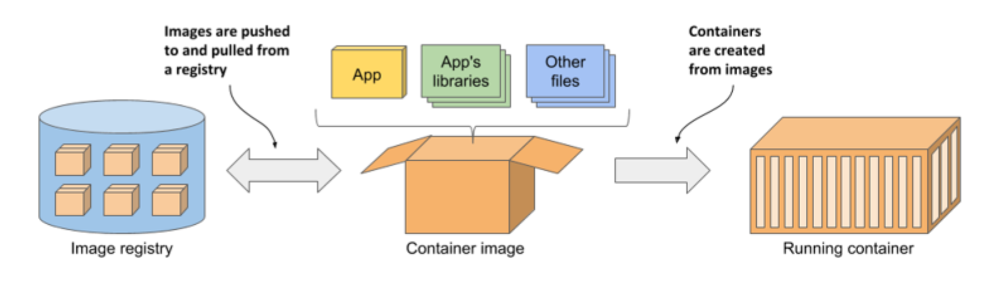

# What is Docker?

Containers allow a developer to package up and application w/ all of the parts it needs, such as libraries and other dependencies, and ship it all out in one pretty package

Meaning, it's **not** about what is inside your app to a large extent. It's about packaging, shipping, and delivering your app in a standard way. Simplify development, testing, deployment, and operation of your software w/ the use of Docker.

**Docker** is primarily a **container runtime**.

This means that Docker is a piece of software that is designed to implement and support containers.

At its core, Docker allows you to run containers on systems. It also offers a variety of tools for creating and managing **containers** and **container images**.

## Introducing containers, images, and registries

Docker is a platform for packaging, distributing and running applications. As mentioned earlier, it allows you to package your application along w/ its entire environment.This can be just a few dynamically linked libraries required by the app, or all the files that are usually shipped w/ an operating system. Docker allows you to distribute this package via a public repository to any other Docker-enabled computer.

* _Images_ ▶︎ A container image is something you package your application and its environment into. Like a zip file or a tarball. It contains the whole filesystem that the application will use and additional metadata, such as the path to the executable file to run when the image is executed, the ports the application listens on, and other information about the image.

* _Registries_ ▶︎ A registry is a repository of container images that enables the exchange of images between different people and computers. After you build your image, you can either run it on the same computer, or _push_ (upload) the image to a registry and then _pull_ (download) it to another computer. Certain registries are public, allowing anyone to pull images from it, while others are private and only accessible to individuals, organizations or computers that have the required authentication credentials.

* _Containers_ ▶︎ A container is instantiated from a container image. A running container is a normal process running in the host operating system, but its environment is isolated from that of the host and the environments of other processes. The file system of the container originates from the container image, but additional file systems can also be mounted into the container. A container is usually resource-restricted, meaning it can only access and use the amount of resources such as CPU and memory that have been allocated to it.

## Docker functionalities

* **Portable Deployment Across Machine** ▶︎ Docker allows for the bundling of an application, and all its dependencies into a single object called a container.

* **Application-Centric** ▶︎ Docker is optimized for deployment of applications instead of machines.

* **Automatic Build** ▶︎ Docker allows for automatic assembly of containers from source code, w/ full control over dependencies. Developers are free to use chef, puppet, salt or any combination automation tools.

* **Versioning** ▶︎ Docker includes git like capabilities that allow for tracking version of containers, inspecting their differences and committing new versions. The ability to see the history of a container is also included.

* **Component Re-use** ▶︎ Any container can be used to create a new image that is more specialized for our needs.

* **Sharing Images** ▶︎ The Docker Hub makes it possible to share images and has been open-sourced so anyone can deploy their own private or public registry.

* **Tool Ecosystem** ▶︎ Docker defines an API for automating and customizing of containers. Docker can be integrated w/ tools such as Salt, Mesos, OpenStack Nova, OpenStack horizon and Jenkins.

## Docker Containers

* A container is a standard unit of software that packages up code and all its dependencies so the application runs quickly and reliably from one computing environment to another. A Docker container image is a lightweight, standalone, executable package of software that includes everything needed to run an application: code, runtime, system tools, system libraries, and settings.

* Containers ▶︎ Virtualized operating system - libraries and applications are isolated within their own namespace.

* A container can be compared to a process on your computer. A Container uses the Kernel of the Host operating system. Containers have their own allocated file system and IP. Libraries, binaries and services are installed inside a container, however, all the system calls and Kernel functionality come from the underlying host OS. To put it simply, a container is kind of like a application for your phone w/ app-scoped resources. Containers are **super** lightweight. The boot up and redeploying of containers happens in seconds, b/c they don't need to start up the Kernel every time

## Docker Linux Containers

Docker image containers can run natively on Linux and Windows. However, Windows images can run only on Windows hosts and Linux images can run on Linux hosts and Windows hosts (using a Hyper-V Linux VM, so far), where host means a server or a VM. Linux containers are still the default for the majority of companies, and we will be using Linux container for this course

## Docker Engine (Build System)

Docker Engine is the technology that is often represented as the Docker we know-it's the "brain of docker." The Docker Engine is a lightweight and powerful open source containerization technology. The Docker engine is responsible for running processes in isolated environments. It consists of the core applications that run Containers and a Restful HTTP API that allows an interface such as the Docker CLI/terminal tool to interact w/ the Engine. The Docker CLI uses the Docker REST API to control or interact w/ the Docker daemon through scripting or direct CLI commands. The daemon creates and manages Docker objects, such as `images`, `containers`, `networks`, and `volumes`

## Docker Hub

Docker Hub is a docker image registry provided by Docker itself. It enables users to push images to their own repository, make them public or private, and push and pull different images, all using the docker CLI

## Dockerfile (Build System)

As we've learned the building blocks of Docker are containers. Yet, every container is built upon an `image`. An `image` is a collection of dependencies that an app needs to run and `images` are built by a Dockerfile. A Dockerfile will install dependencies, create data stores, and ensure that the development environment is configured correctly. The Build System is used to convert a Dockerfile into an image

## Docker Compose

Compose is a tool for defining and running multi-container Docker applications. It allows you to easily manage multiple containers dependent on each other within one docker host via the `docker-compose` CLI. You use a `YAML` file to configure all the containers needed and the interactions necessary btwn those containers. W/ one command you can start multiple containers in the correct order and properly set up networking btwn them

## Docker Machine

Docker Machine is a tool that lets you install a Docker Engine on virtual hosts, and manage the hosts w/ `docker-machine` commands. You can use Machine to create Docker hosts on your local Mac or Windows machine, on a company network, or on cloud providers like Azure, AWS, or Digital Ocean

## Docker Swarm

Docker Swarm is an orchestration tool used to manage a cluster of docker hosts. While `docker-compose` manages multiple Docker containers within one docker host, `docker swarm` manages multiple docker hosts managing multiple Docker containers. Swarm mode is built into the docker engine and is managed through the Docker client. Swarm is still relatively new and still lacks some fundamental features that would make it useful for orchestration in production. Instead, **Kubernetes** is currently one of the most popular tools for orchestration in production

