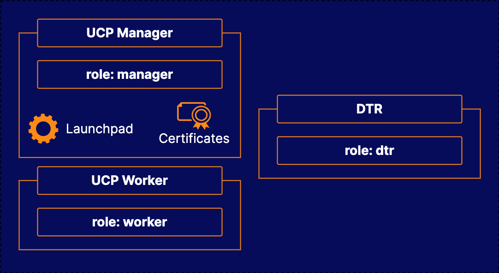

# Building a Docker Enterprise Infrastructure with Mirantis Launchpad

## About this Lab

Docker Enterprise is a complex tool with many components available for use. Luckily, Mirantis Launchpad makes the installation process for Docker EE clusters easier. In this lab, you will have the opportunity to build your own multi-server Docker EE cluster using Launchpad.

## Learning Objectives

[ ] Install Mirantis Launchpad

[ ] Generate Certificates for DTR

[ ] Create the Cluster

## Additional Resources

Your company has been using Docker to orchestrate container applications. However, they are considering taking advantage of some of the additional features offered as part of Docker Enterprise. You have been asked to set up a Docker Enterprise cluster. Your colleagues will use this cluster to experiment with Docker Enterprise as they make their decision.

Your task is to set up a three-node Docker Enterprise cluster running with the Universal Control Plane (UCP). In addition to this, you will need to install Docker Trusted Registry (DTR) on one of the worker nodes within the cluster. You can do this using Mirantis Launchpad.

* **Three servers**: You will need to turn these servers into a Docker Enterprise cluster.

* Install Mirantis Launchpad

* Create DTR Certificates

* Build the cluster using Launchpad.
