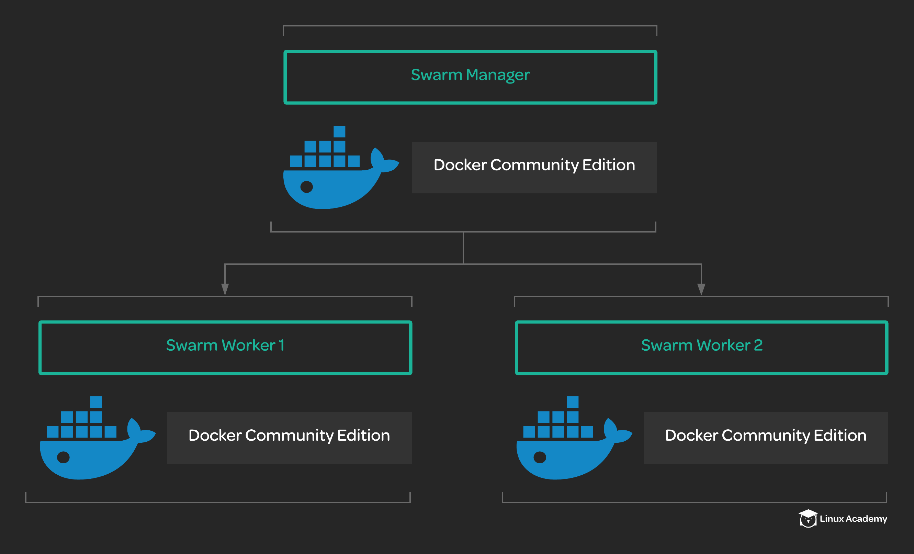

# Building a Docker Swarm

## About this Lab

Docker swarm allows you to quickly move beyond simply using Docker to run containers. With swarm, you can easily set up a cluster of Docker servers capable of providing useful orchestration features. This lab will allow you to become familiar with the process of setting up a simple swarm cluster on a set of servers. You will configure a swarm master and two worker nodes, forming a working swarm cluster.

Your company is ready to move forward with using Docker to run their applications. However, they have some complex container apps that can take advantage of the cluster management and orchestration features of Docker swarm. You have been asked to stand up a simple Docker swarm cluster to be used for some initial testing. A set of servers has already been provisioned for this purpose. The swarm cluster should meet the following criteria:

* One Swarm manager.

* Two worker nodes.

* All nodes should use Docker CE version `5:18.09.5~3-0~ubuntu-bionic`.

* Both worker nodes should be joined to the cluster.

* `cloud_user` should be able to run docker commands on all three servers.

## Learning objectives

[ ] Install Docker CE on all three nodes.

[ ] Configure the swarm manager.

[ ] Join the worker nodes to the cluster.
