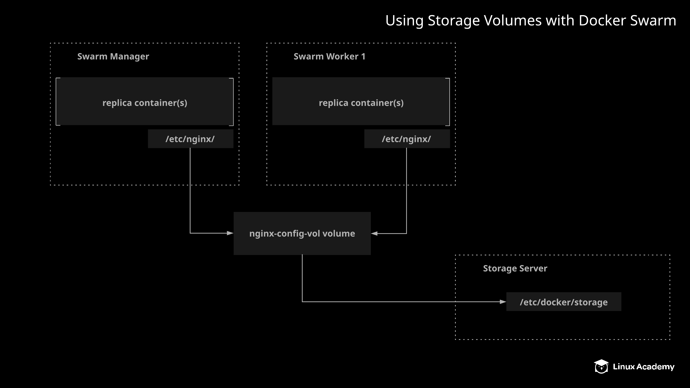

# Using Storage Volumes with Docker Swarm

## About this Lab

Storage volumes provide a powerful and flexible way to add persistent storage to your containers, but what if you need to share storage volumes across multiple Docker hosts, such as a Swarm cluster? In this lab, you will have the opportunity to work with a simple method of creating shared volumes usable across multiple swarm nodes using the `sshfs` volume driver.

## Learning Objectives

[ ] Set up the external storage location.

[ ] Install the `vieux/sshfs` plugin.

[ ] Create the nginx service that uses the shared volume.

## Additional Resources

Your team wants to run an nginx service in a Docker Swarm cluster with multiple replicas, but they want to run these containers with a customized nginx configuration file. The same file can be used for all replicas, and the team wants to store this file externally in a central location so that the nginx configuration can be changed without the need to re-create containers.

Your task is to create a shared storage volume housed on an external storage server. This volume should be accessible to all containers in the cluster regardless of which node they are running on. This volume will contain the nginx configuration file and will be mounted to each of the service's replica containers.

Configure the swarm so that it meets the following criteria:

* Create a shared storage directory at `/etc/docker/storage` on the external storage server. Make sure `cloud_user` can read and write to this directory.

* Place the nginx config file at `/etc/docker/storage/nginx.conf`. You can find a copy of this file on the external storage server at `/home/cloud_user/nginx.conf`.

* Install the `vieux/sshfs` docker plugin on the swarm cluster.

* Create a service called `nginx-web` using the `nginx:latest` image with `3` replicas. Mount the shared volume to the service's containers at `/etc/nginx/`. Publish port `9773` on the service containers to port `8080` on the swarm nodes.

* Create a Docker volume called `nginx-config-vol` using the `vieux/sshfs` driver that stores data in `/etc/docker/storage` on the external storage server. You can use the `cloud_user` credentials to do this. Note that you should create the volume as part of the `docker service create` command so that the volume will be configured automatically on all swarm nodes that execute the service's tasks.
