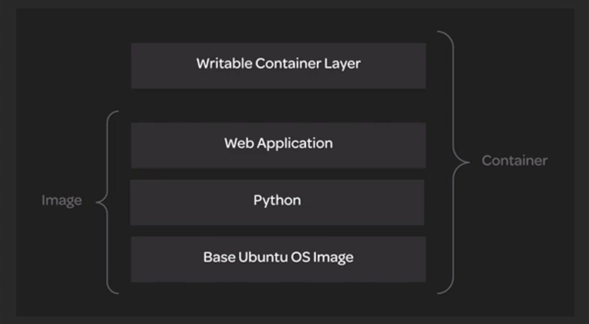

# Image Basics

## What is an Image?

The Docker Image is the source of a Container. The Docker image is a file containing the code and components needed to run software in a container; An executable package containing all of the software that's needed to run a container.

Containers and images use a layered file system. Each layer contains only the differences from the previous layer.

> [!NOTE]
>
> **Layered File System**: Images and containers use a layered file system. Each layer contains only the differences from the previous layer.

View file system layers in an image with:

```
docker image history <IMAGE>
```

The image consists of one or more read-only layers, while the container adds one addition writable layer.



The layered file system allows multiple images and containers to share the same layers. This results in:

* Smaller overall storage footprint.

* Faster image transfer.

* Faster image build.

✓ **Comprised of layers** ▶︎ All code, runtime, libraries, variables, and configurations are supplied via a layered Dockerfile.

✓ **Layers are cached** ▶︎ This means images are more reusable, quicker to deploy, and take up less space than a standard virtual machine image.

✓ **Everything we need** ▶︎ Everything the container needs to perform its job successfully should be added to the image.

✓ **Base images on other images** ▶︎ Images can have a **parent image** on which they are based; there's no need to recreate the wheel each time. Images w/ no parent are called **base images**.

Run a container using an image with:

```
docker run IMAGE
```

Download an image from a remote registry to the local machine:

```
docker image pull IMAGE
docker pull IMAGE
```

List the layers used to build an image:

```
docker image history IMAGE
```

## Dockerfiles

**Dockerfile**: A file that defines a series of directives and is used to build an image.

An example of a Dockerfile:

```
# Simple nginx image
FROM ubuntu:bionic

ENV NGINX_VERSION 1.14.0-0ubuntu1.7

RUN apt-get update && apt-get install -y curl
RUN apt-get update && apt-get install -y nginx=$NGINX_VERSION

CMD ["nginx", "-g", "daemon off;"]
```

If you want to create your own images, you can do so w/ a Dockerfile.

Build an image with:

```
docker build -t TAG_NAME DOCKERFILE_LOCATION
```

A Dockerfile is a set of instructions which are used to construct a Docker image. These instructions are called **directives**.

Dockerfile Directives:

* `FROM`: Specifies the base image to build from. Starts a new build stage and sets the base image. Usually must be the first directive in the Dockerfile (except ARG can be placed before `from`).

* `ENV`: Sets environment variables that are visible in later build steps as well as during container runtime. These can be referenced in the Dockerfile itself and are visible to the container at runtime.

* `RUN`: Executes a command and commits the result to the image file system. Creates a new layer on top of the previous layer by running a command inside that new layer and committing the changes.

* `CMD`: Specify a default command used to run a container at execution time. This gets overridden if a command gets specified at container runtime.

* `ENTRYPOINT`: Sets the default executable for containers. This can still be overridden at container runtime, but requires a special flag. When `ENTRYPOINT` and `CMD` are both used, `ENTRYPOINT` sets the default executable, and
  `CMD` sets default arguments.

Then you can run your image:

```
docker run IMAGE
```

### hello-world Line-by-Line

```dockerfile
FROM scratch
COPY hello /
CMD ["/hello"]
```

`FROM scratch` layer indicates that the container is created from a base image.

`COPY  hello` layer copies the binary to create the initial root file system `/`.

`CMD ["/hello"]` layer is set to run the `hello` binary script.

## Learning Summary

**Every container has a source image**

* A **base image** is an image based on the **scratch** template, w/ the first layer defining the file system.

* A **parent image** is the image the current Docker image is based on.

* Images are comprised of cached layers. This increases reusability, decreases disk space, and ensures fast deploy speeds.
