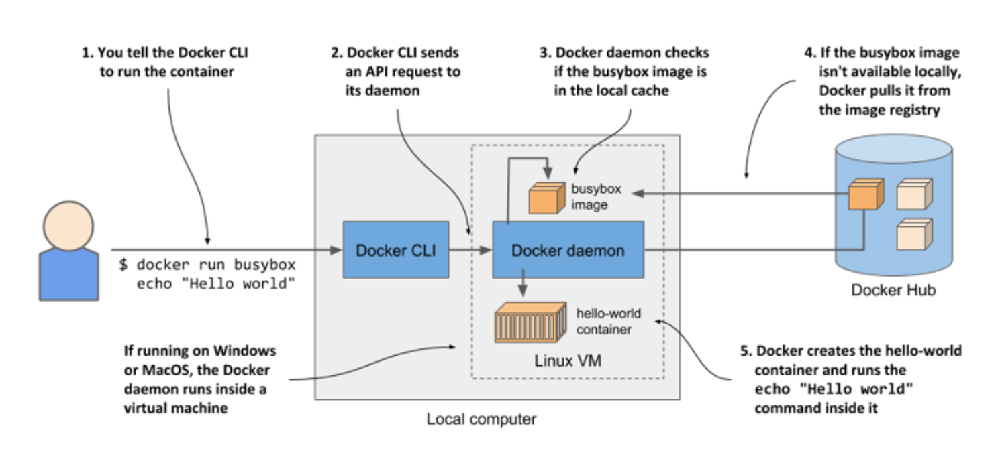

# Building a Docker Image via Dockerfile

## About this Lab

When creating Docker images for websites, applications, and any service that may require any code change in the future, it's best to build in a way that can be quickly and easily rebuilt when any changes occur. Dockerfiles provide an in-platform way to do just that. In this lab, we'll be building a Dockerfile that can generate an image of our website that will make sure that when changes happen with the website code, we won't have to change the Dockerfile itself.

## Learning Objectives

[ ] Create the Dockerfile

[ ] Test the Image

## Lab Overview

Your company's landing page needs to be Dockerized!

* Use Alpine Linux container

* Nginx web server

* Website files and Nginx configuration provided

1. **Write the Dockerfile** ▶︎ The Dockerfile should define the parent image, install Nginx, then move the configuration and website files to the desired locations.

2. **Build the Image** ▶︎ Build an image using the Dockerfile; tag the image w/ the name `web`.

3. **Launch a Container** ▶︎ Launch a `web01` container using the new image; map port 80 on the container to 80 on the host.


## 2.1.3 Installing Docker and running a Hello World container

### Running a Hello World container

Let’s try pulling and running an existing image from Docker Hub, the public image registry that contains ready-to-use container images for many well-known software packages. One of them is the `busybox` image, which you’ll use to run a simple `echo "Hello world"` command in your first container.


If you’re unfamiliar with `busybox`, it’s a single executable file that combines many of the standard UNIX command-line tools, such as `echo`, `ls`, `gzip`, and so on. Instead of the `busybox` image, you could also use any other full-fledged OS container image like Fedora, Ubuntu, or any other image that contains the echo executable file.

Once you’ve got Docker installed, you don’t need to download or install anything else to run the `busybox` image. You can do everything with a single `docker run` command, by specifying the image to download and the command to run in it. To run the Hello World container, the command and its output are as follows:

```zsh
$ docker run busybox echo "Hello World"
Unable to find image 'busybox:latest' locally   #A
latest: Pulling from library/busybox    #A
7c9d20b9b6cd: Pull complete   #A
Digest: sha256:fe301db49df08c384001ed752dff6d52b4...    #A
Status: Downloaded newer image for busybox:latest   #A
Hello World   #B
```

**#A Docker downloads the container image**

**#B The output produced by the echo command**

With this single command, you told Docker what image to create the container from and what command to run in the container. This may not look so impressive, but keep in mind that the entire “application” was downloaded and executed with a single command, without you having to install the application or any of its dependencies.

In this example, the application was just a single executable file, but it could also have been a complex application with dozens of libraries and additional files. The entire process of setting up and running the application would be the same. What isn’t obvious is that it ran in a container, isolated from the other processes on the computer.

## Understanding what happens when you run a container

Figure 1 shows exactly what happens when you execute the `docker run` command:



The `docker` CLI tool sends an instruction to run the container to the Docker daemon, which checks whether the `busybox` image is already present in its local image cache. If it isn’t, the daemon pulls it from the Docker Hub registry.

After downloading the image to your computer, the Docker daemon creates a container from that image and executes the `echo` command in it. The command prints the text to the standard output, the process then terminates and the container stops.

If your local computer runs a Linux OS, the Docker CLI tool and the daemon both run in this OS. If it runs macOS or Windows, the daemon and the containers run in the Linux VM.

## Running other images

Running other existing container images is much the same as running the `busybox` image. In fact, it’s often even simpler, since you don’t normally need to specify what command to execute, as with the echo command in the previous example. The command that should be executed is usually written in the image itself, but you can override it when you run it.

For example, if you want to run the Redis datastore, you can find the image name on
http://hub.docker.com or another public registry. In the case of Redis, one of the images is called `redis:alpine`, so you’d run it like this:

```zsh
$ docker run redis:alpine
```

To stop and exit the container, press Control-C.

> [!NOTE]
> 
> If you want to run an image from a different registry, you must specify the registry along with the image name. For example, if you want to run an image from the Quay.io registry, which is another publicly accessible image registry, run it as follows: `docker run quay.io/some/image`.
