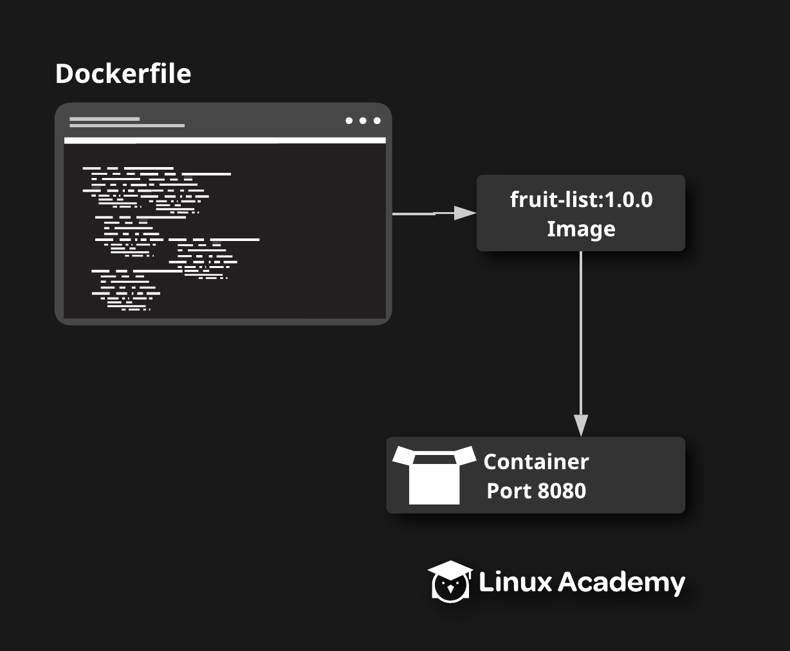

# Creating your own Docker Image

## About this lab

Docker Hub provides many useful, pre-made images which you can use for a variety of applications. However, if you want to use Docker in the real world, you will likely be required to design and build your own Docker images, either to customize existing images or to run your own software.

In this lab, you will have the opportunity to work with Docker images by designing your own image to a set of specifications using a Dockerfile. You will then be able to run a container using your image to verify that it works.



## Learning Objectives

[ ] Create a Dockerfile to define the image and build it.

[ ] Run a container with the image in detached mode and verify that it works.

## Additional Resources

Your supermarket company has a simple web service built on nginx that serves a static list of fresh fruit available in their stores. They want to run this service as a Docker container in their new swarm environment, but first they need you to build a Docker image for this service.

On the provided lab server, you will find a directory at `/home/cloud_user/fruit-list/`. The files needed to create the image are in that directory. Create a Dockerfile to define the image according to the provided specifications, then test the image by running a container in detached mode and verifying that you an access the fresh fruit data from the application.

The image should meet the following specifications:

* Use `nginx` tag `1.15.8` as the base image.

* Add the static fresh fruit data to the image so that it will be served by the nginx server. The data file is located on the server at `static/fruit.json` under the project directory. Add this file to the image at the location `/usr/share/nginx/html/fruit.json`.

* Add the nginx configuration file. This file is located on the server in the project directory and is called `nginx.conf`. Add this file to the image at `/etc/nginx/nginx.conf`.

* The image should expose port `80`.

* Use the following as the default command: `nginx -g daemon off;`.

* Build the image with the tag `fruit-list:1.0.0`

Once you have built the image you should be able to test it by running it as a container:

```
docker run --name fruit-list -d -p 8080:80 fruit-list:1.0.0
```

Verify that the container serves the required data by making a request to it on port `8080`. If everything is set up correctly, you should get a JSON list of fruits.

```
curl localhost:8080
```
