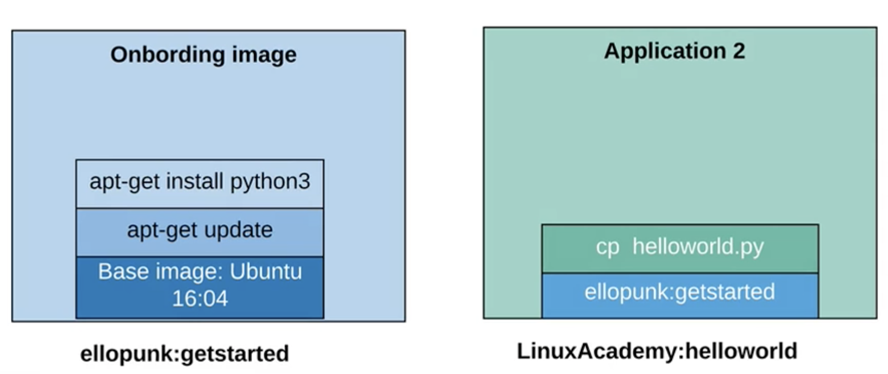

# Using the Docker Hub

### The Docker Hub

```zsh
docker login --username=<DOCKER_HUB_USERNAME>
```

### Adding a Repo

Re-tag:

```zsh
docker tag <IMAGE_NAME> <USERNAME>/<REPO_NAME>:<SUPPLIED_TAG_NAME>
```

### Pushing an Image

```zsh
docker push <USERNAME>/<REPO_NAME>:<SUPPLIED_TAG_NAME>
```

## Working w/ Docker Images



```
docker images
```

```
docker pull ubuntu:16.04
```

View image on our system:

```
docker images
```

```
docker images --no-trunc
```

```
docker run ubuntu:16.04 | <IMAGE_ID>
```

## Learning Summary

### Log in to the Docker Hub

```zsh
docker login --username=<USERNAME>
```

### Tag image for a repository

```zsh
docker tag <image> <username>/<repo>:<version>
```

### Push to repo

```zsh
docker push <username>/<repo>
```

### Log out of Docker Hub

```zsh
docker logout
```
