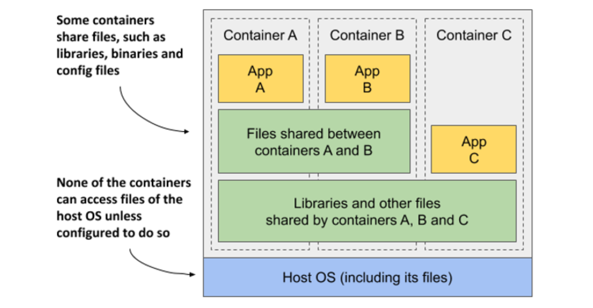
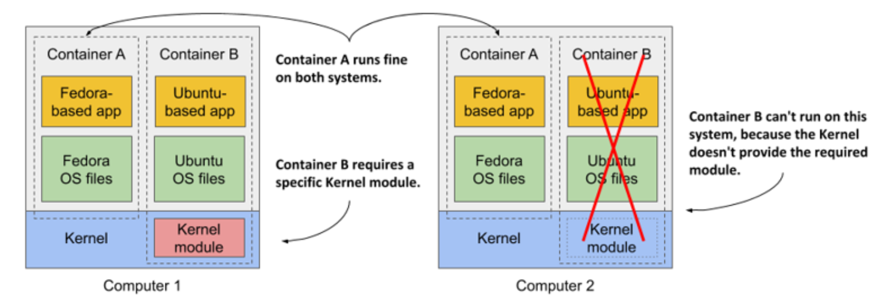

# Managing Images

**Download an image from a remote registry**:

```
docker image pull IMAGE[:TAG]
```

For example:

```zsh
docker image pull nginx:1.14.0
```

...or...

```
docker pull nginx:1.14.0
```

**List images on the system**:

```
docker image ls
```

**Add the `-a` flag to include intermediate images**:

```
docker image ls -a
```

**Get detailed information about an image**:

```
docker image inspect <IMAGE>
```

Use the `--format` flag to get only a subset of the information (uses Go templates):

```
docker image inspect <IMAGE> --format <TEMPLATE>
```

Provide a Go template to retrieve specific data fields about the image:

```
docker image inspect <IMAGE> --formate "GO_TEMPLATE"
```

```
docker image inspect nginx:1.14.0 --format "{{.Architecture}}"
```

...or...

```
docker image inspect nginx:1.14.0 --format "{{Architecture}} {{.Os}}"
```

**Delete an image.** An image can only face deletion if no containers or other image tags reference it.

```
docker image rm <IMAGE>
```

**Delete an image**:

```
docker rmi <IMAGE>
```

> [!NOTE]
>
> If an image has other tags, they must be deleted first.

Use the `-f` flag to automatically remove all tags and delete the image. Force deletion of an image, even if it gets referenced by something else:

```
docker image rm -f <IMAGE>
```

Find and delete dangling or unused images (not being referenced by any tags or not beng used by any containers):

```
docker image prune
```

## Understanding image layers

Unlike virtual machine images, which are big blobs of the entire filesystem required by the operating system installed in the VM, container images consist of layers that are usually much smaller. These layers can be shared and reused across multiple images. This means that only certain layers of an image need to be downloaded if the rest were already downloaded to the host part of another image containing the same layers.

Layers make image distribution very efficient but also help to reduce the storage footprint of images. Docker stores each layer only once. As you can see in the following figure, two containers created from two images that contain the same layers use the same files.



The figure shows that containers A and B share an image layer, which means that applications A and B read some of the same files. In addition, they also share the underlying layer w/ container C. But if all three containers have access to the same files, how can they be completely isolated from each other? Are changes that application A makes to a file stored in the shared layer not visible to application B? They aren't. Here's why.

The filesystems are isolated by the Copy-on-Write (CoW) mechanism. The filesystem of a container consists of read-only layers from the container image and additional read/write layer stacked on top. When an application running in container A changes a file in one of the read-only layers, the entire file is copied into the container's read/write layer and the file contents are changed there. Since each container has its own writable layer, changes to shared files are not visible in any other container.

When you delete a file, it is only marked as deleted in the read/write layer, but it's still present in one or more of the layers below. What follows is that deleting files never reduces the size of the image.

> [!WARNING]
> 
> Even seemingly harmless operations such as changing permissions or ownership of a file result in a new copy of the entire file being created in the read/write layer. If you perform this type of operation on a large file or many files, the image size may swell significantly.

## Understanding the portability limitations of container images

In theory, a Docker-based container image can be run on any Linux computer running Docker, but one small caveat exists, b/c containers don't have their own kernel. If a containerized application requires a particular kernel version, it may not work on every computer. If a computer is running a different version of the Linux kernel or doesn’t load the required kernel modules, the app can’t run on it. This scenario is illustrated in the following figure.



Container B requires a specific kernel module to run properly. This module is loaded in the kernel in the first computer, but not in the second. You can run the container image on the second computer, but it will break when it tries to use the missing module.

And it’s not just about the kernel and its modules. It should also be clear that a containerized app built for a specific hardware architecture can only run on computers with the same architecture. You can’t put an application compiled for the x86 CPU architecture into a container and expect to run it on an ARM-based computer just because Docker is available there. For this you would need a VM to emulate the x86 architecture.
