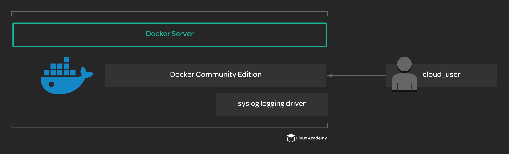

# Installing and Configuring the Docker Engine

## About this lab

Docker CE is a great way to get started using the Docker engine. It is free and open-source, but provides a high-quality container runtime. This lab will help you practice the steps involved in installing and configuring the Docker Engine. You will practice installing Docker CE and configuring a logging driver. This lab will help provide you with some basic insight into how the Docker Engine is installed and configured on systems in the real world.

Your company is ready to start using Docker on some of their servers. In order to get started, they want you to set up and configure Docker CE on a server that has already been set up. You will need to make sure that the server meets the following specifications:

* Docker CE is installed and running on the server.

* Use Docker CE version `5:18.09.5~3-0~ubuntu-bionic`.

* The user `cloud_user` has permission to run docker commands.

* The default logging driver is set to `syslog`.

## Learning Objectives

[ ] Install Docker CE on the server.

[ ] Give `cloud_user` access to run Docker commands.

[ ] Set the default logging driver to `syslog`.
