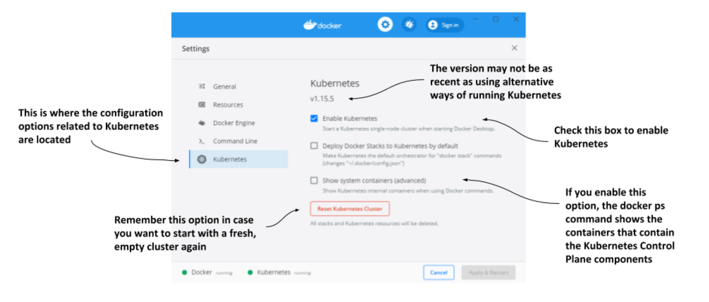
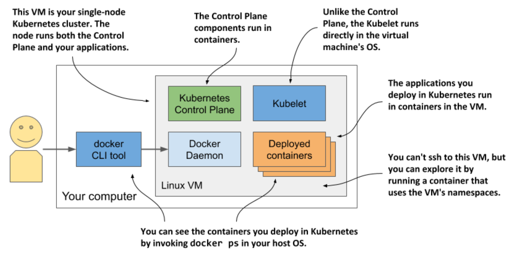

# 3.1.1 Using the built-in Kubernetes cluster in Docker Desktop

If you use macOS or Windows, you’ve most likely installed Docker Desktop to run the exercises in the previous chapter. It contains a single-node Kubernetes cluster that you can enable via its Settings dialog box.

> [!NOTE]
> 
> Although technically not a cluster, the single-node Kubernetes system provided by Docker Desktop should be enough to explore most of the topics discussed in this book. When an exercise requires a multi-node cluster, I will point this out.

## Enabling Kubernetes in Docker Desktop

Assuming Docker Desktop is already installed on your computer, you can start the Kubernetes cluster by clicking the whale icon in the system tray and opening the Settings dialog box. Click the _Kubernetes_ tab and make sure the _Enable Kubernetes_ checkbox is selected. The components that make up the Control Plane run as Docker containers, but they aren’t displayed in the list of running containers when you invoke the `docker ps` command. To display them, select the _Show system containers_ checkbox.

> [!NOTE]
> 
> The initial installation of the cluster takes several minutes, as all container images for the Kubernetes components must be downloaded.



Remember the _Reset Kubernetes Cluster_ button if you ever want to reset the cluster to remove all the objects you’ve deployed in it.

## Visualizing the system

To understand where the various components that make up the Kubernetes cluster run in Docker Desktop, look at the following figure:



Docker Desktop sets up a Linux virtual machine that hosts the Docker Daemon and all the containers. This VM also runs the Kubelet - the Kubernetes agent that manages the node. The components of the Control Plane run in containers, as do all the applications you deploy.

To list the running containers, you don't need to log on to the VM b/c the docker CLI tool available in your host OS displays them.

## Exploring the virtual machine from the inside

At the time of writing, Docker Desktop provides no command to log into the VM if you want to explore it from the inside. However, you can run a special container configured to use the VM's namespaces to run a remote shell, which is virtually identical to using SSH to access a remote server. To run the container, execute the following command:

```zsh
$ docker run --net=host --ipc=host --uts=host --pid=host --privileged \ --security-opt=seccomp=unconfined -it --rm -v /:/host alpine chroot /host
```

This long command requires explanation:

* The container is created from the `alpine` image.

* The `--net`, `--ipc`, `--utc`, and `--pid` flags make the container use the host's namespaces instead of being sandboxed, and the `--privileged` and `--security-opt` flags give the container unrestricted access to all sys-calls.

* The `-it` flag runs the container interactive mode and the `--rm` flags ensures the container is deleted when it terminates.

* The `-v` flag mounts the host's root directory to the `/host` directory in the container. The `chroot /host` command then makes this directory the root directory in the container.

After you run the command, you are in a shell that's effectively the same as if you had used SSH to enter the VM. Use this shell to explore the VM -try listing processes by executing the `ps aux` command or explore the network interfaces by running `ip addr`.
