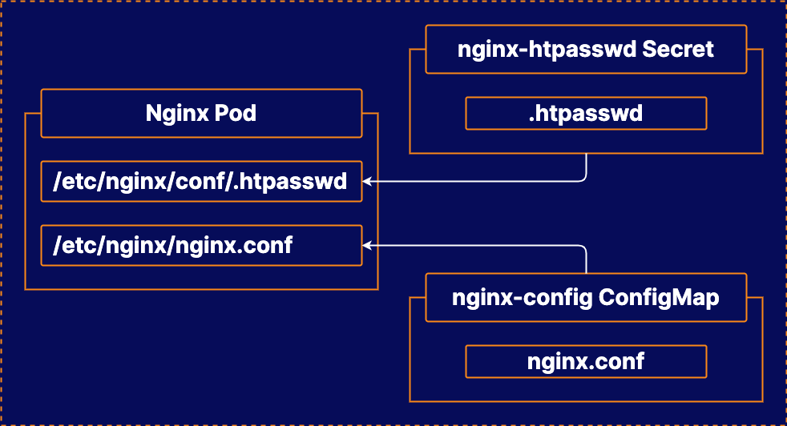

# Configuring Applications in Docker Kubernetes Service

## About this lab

Application configuration is a necessary skill in any technology stack. In this lab, you will be able to practice your ability to configure containerized applications in Docker Kubernetes Service. This will familiarize you with the various methods of managing application configuration in Kubernetes.

## Learning objectives

[ ] Create a ConfigMap to Contain the Nginx Configuration File

[ ] Create a Secret to Contain the htpasswd Data

[ ] Create the Nginx Pod

## Additional resources

* **Docker Enterprise Cluster**: The Docker Enterprise cluster is already set up for you to use.

* Create a **ConfigMap** to store the Nginx config file.

* Create a **Secret** to store the htpasswd data.

* Create an **Nginx Pod** that uses the ConfigMap and Secret data.

Your company wants to use Docker Kubernetes Service to run a simple Nginx web server, secured with basic authentication. They want to use Kubernetes to manage configuration for an Nginx container, including the nginx config file and the .htpasswd file.

Your task is to access the UCP cluster and set up an Nginx Pod. This Pod should use an Nginx configuration file, which is stored in a ConfigMap, and an .htpasswd file stored using a Secret.

A NodePort service has already been created in the cluster to expose the Pod. Create the Pod with the label `app=nginx`, and you should be able to use this service to access the Pod in a browser at `http://<UCP_MANAGER_PUBLIC_IP_ADDRESS>:32768`.

If you have configured the Pod correctly, you should be prompted to provide credentials (they are username `user` and password `docker`). Once you enter the credentials, you should see the Nginx welcome page.

> [!NOTE]
> 
> You can access UCP at `https://<UCP_MANAGER_PUBLIC_IP>`. You can log in to the UCP using the username `admin` and the randomly generated password associated with any of the lab servers.
