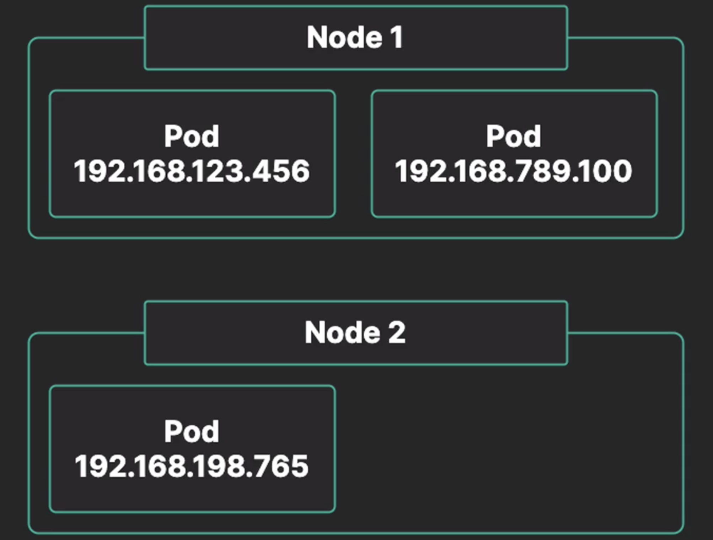

# The Kubernetes Network Model

The **Kubernetes Network Model** is a set of standards that define how networking between pods behaves.

The Kubernetes network model defines how pods communicate w/ each other, regardless of which node they are running on.

Each pod has its own **unique IP address** within the cluster.

Any pod can reach any other pod using that pod's IP address. This creates a **virtual network** that allows pods to easily communicate w/ each other, regardless of which node they are on.
