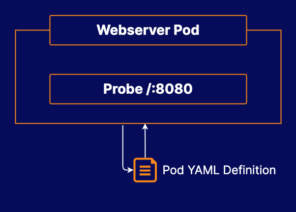

# Using Probes in Docker Kubernetes Service

## About this lab

Probes are a great tool for making some applications more resilient in Kubernetes. In this lab, you will have the opportunity to explore how to use probes to make Kubernetes react more quickly to application failures. This will help you design more robust applications in your Kubernetes clusters.

## Learning objectives

[ ] Get the Pod Definition

[ ] Add a Probe to the Pod

## Additional Resources

Your company is exploring using Docker Kubernetes Service to manage some applications.

They have a Pod called `webserver` that has been running on the Docker Kubernetes cluster for awhile, but unfortunately the Pod periodically stops working and needs to be restarted. While the developers are looking into why the Pod keeps breaking, your job is to build some automation in Kubernetes to automatically restart the Pod when it becomes unhealthy.

Since this is a stand-alone Pod, you will need to delete and re-create the Pod in order to make the necessary changes. Obtain the existing Pod definition from UCP and change it so that Kubernetes is able to detect when the Pod is unhealthy. Then, delete and re-create the Pod.

* **Docker Enterprise Cluster**: The Docker Enterprise cluster is already set up for you to use.

* Get the **YAML Definition** for the Pod so that you can make changes to it.

* Add a **probe** to the Pod that can detect when the Pod has stopped responding appropriately to HTTP requests.

> [!NOTE]
> 
> You can access UCP at `https://<UCP_MANAGER_PUBLIC_IP>`. You can log in to the UCP using the username `admin` and the randomly-generated password associated with any of the lab servers.
