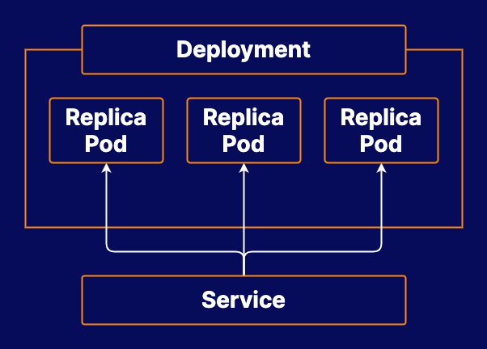

# Services and Deployments in Docker Kubernetes Service

## About this lab

Services and Deployments, when used together, are a great way to build and manage applications in Kubernetes. In this lab, you will have the opportunity to build an application around deployments and services in a Docker Kubernetes Service cluster. This will provide hands-on experience in architecting robust Kubernetes applications.

## Learning objectives

[ ] Create a Deployment to Manage the Application

[ ] Create a service to expose the application externally.

## Additional resources

Your company recently purchased Docker Enterprise and is experimenting with using Docker Kubernetes Service to orchestrate some applications. They would like to create a simple Nginx server with three replica instances and expose it externally.

Your task is to build a deployment with `3` replicas in the Docker Enterprise Kubernetes cluster. You will then need to expose these containers externally on port `32768` using a service.

* **Docker Enterprise Cluster**: The Docker Enterprise cluster is already set up for you to use.

* Create a **Deployment** w/ 3 replicas.

* Create a **Service** to expose the application outside the cluster.

> [!NOTE]
> 
> Access UCP Manager at `https://<UCP_MANAGER_PUBLIC_IP>`. Since we use a self-signed certificate, choose to proceed to the site. Log in to the UCP using the username **admin** and the randomly-generated password associated with any of the lab servers. The worker will be tested on http at the lab's end.

