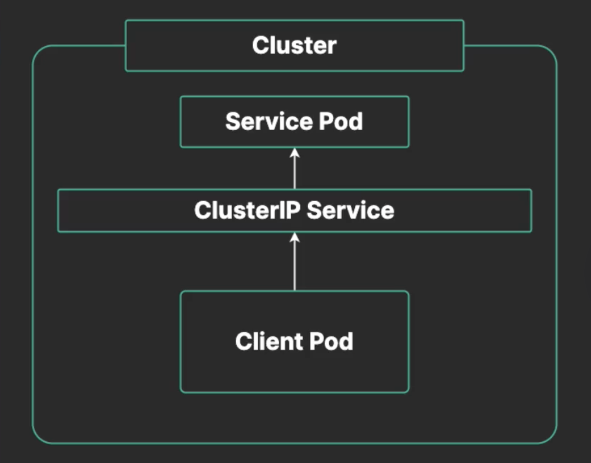
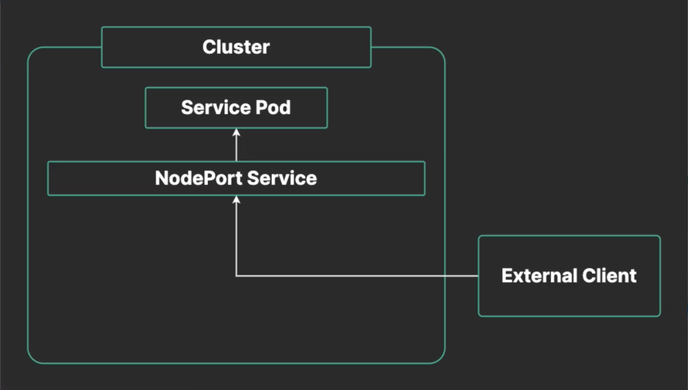
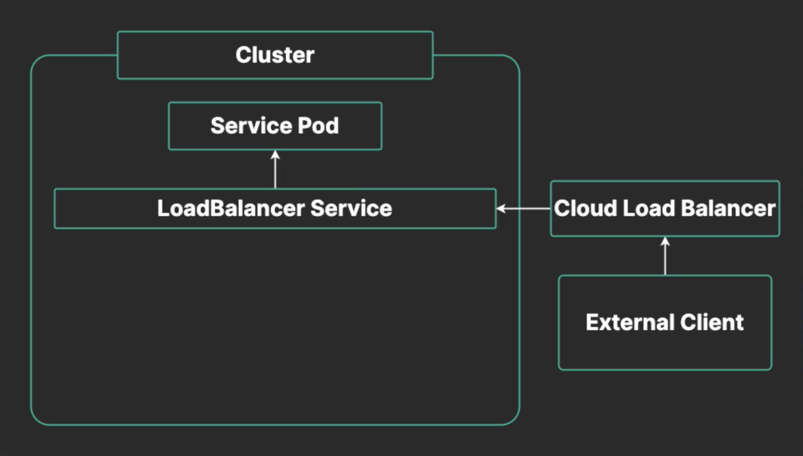
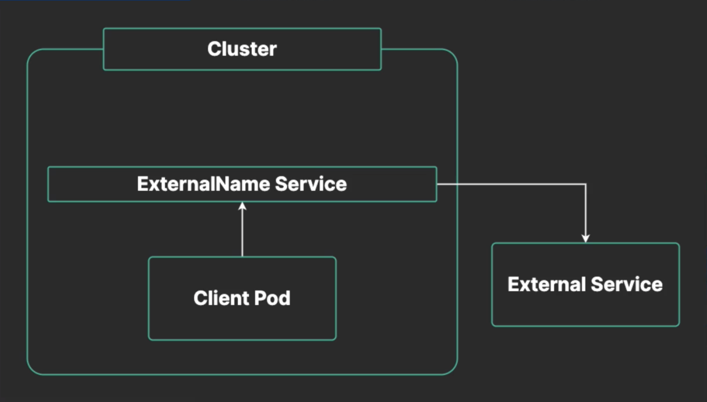

# Services and DNS

## Services

Services allow us to expose an application that is running as a set of pods.

A service exposes a set of pods, load-balancing client traffic across them. These pods can then be dynamically created and destroyed w/o interruption to clients using the service.

## Service Types

Each service has a **type**. The type determines the behavior of the service and what it can be used for.



* **ClusterIp** (the default) ▶︎ Exposes service to pods within the cluster using a unique IP on the cluster's virtual network.

  * So ClusterIp services are internal to the cluster and are used by pods. For example, if you have an application database and application frontend containers that need to communicate w/ that database, and both are running as pods in the cluster, you could use a ClusterIP service to expose the database.



* **NodePort** ▶︎ Exposes the service outside the cluster on each Kubernetes node, using a static port.

  * Your users that want to communicate w/ your actual application pods, they might need to use a NodePort service since they are external to the cluster. So you'll need to expose those pods externally, so that your users can access them.



* **LoadBalancer** ▶︎ Expose the service externally using a cloud provider's load balancing functionality.

  * Similar to NodePort services in that they expose services externally, but instead of just listening on a port on each node, LoadBalancer services use a cloud provider's load balancing functionality. So if you're running a Kubernetes cluster in AWS, for instance, the LoadBalancer service type will automatically create an AWS load balancer and that's how you'll access the Kubernetes service.



* **ExternalName** ▶︎ Expose an external resource inside the cluster network using DNS.

  *  So if you want to expose an external service, something that's running outside the cluster and you want to represent that inside the cluster so that your pods can access it easily, you can use the ExternalName service type to do that.

## Cluster DNS

Kubernetes clusters include a **cluster DNS** that helps containers locate Services using domain names.

Pods within the same namespace as a service can simply use the service name as a domain name.

Pods in a different namespace must use the full domain name, which takes the form:

```zsh
my-svc.my-namespace.svc.cluster-domwin.example
```
