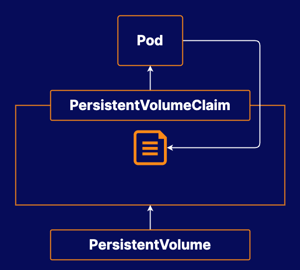

# Using Storage in Docker Kubernetes Service

## About this lab

Kubernetes has the ability to provide external storage for your containerized applications. In this lab, you will be able to work with Kubernetes storage hands-on, designing your own solution to a real-world problem using Kubernetes features. This will help you familiarize yourself with Kubernetes features, such as volumes, and PersistentVolumes.

## Learning objectives

[ ] Create a Persistent Volume

[ ] Create a Persistent Volume Claim.

[ ] Create a Pod That Will Output Data to the Persistent Volume

[ ] Resize the Persistent Volume Claim

## Additional resources

Your company is exploring using Docker Enterprise to manage containers with Docker Kubernetes Service. Your developers would like to experiment with running an application that requires persistent storage. They also want to know how their application will behave if the storage volume size is increased in the future.

Your task is to create a `PersistentVolume` and a `Pod` which uses that PersistentVolume's storage resources. You will need to create a `PersistentVolume`, and a `PersistentVolumeClaim`, then create a `Pod` that mounts the `PersistentVolumeClaim`, and outputs some data to it. Finally, you will need to increase the size of the `PersistentVolumeClaim` after the `Pod` is already using it.

> [!NOTE]
> 
> You can access UCP at `https://<UCP_MANAGER_PUBLIC_IP>`. You can log in to the UCP using the username `admin` and the randomly-generated password associated with any of the lab servers.

* **Docker Enterprise Cluster**: The Docker Enterprise cluster is already set up for you to use.

* Create a `PersistentVolume`.

* Create a `PersistentVolumeClaim` that will bind to that `PersistentVolume`.

* Create a **Pod** that uses the `PersistentVolumeClaim`.

* **Resize** the `PersistentVolumeClaim`.
