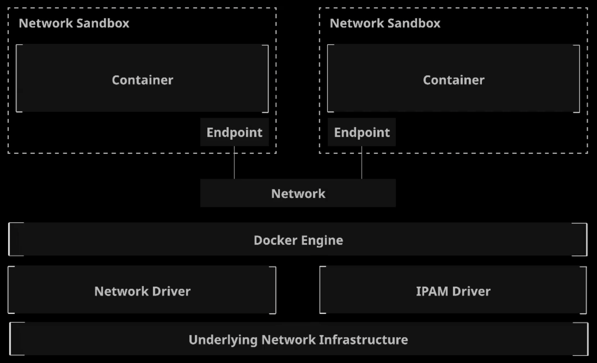
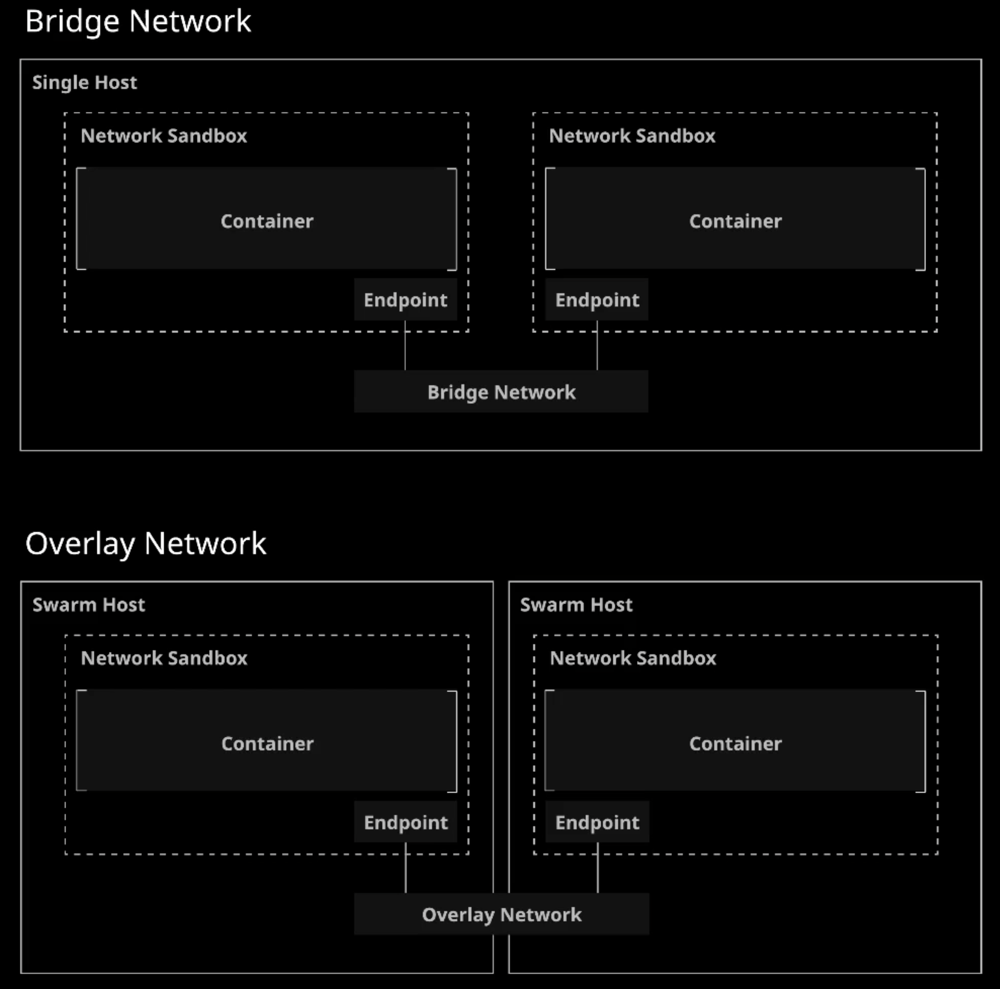

# Docker Networking

Docker uses an architecture called the **Container Networking Model (CNM)** to manage networking for Docker containers.

**Docker Container Networking Model (CDM)**: A conceptual model that describes the components and concepts of Docker networking. 

The CNM utilizes the following concepts:

* **Sandbox**: An isolated unit containing all networking components associated w/ a single container. Usually a Linux Network namespace.

* **Endpoint**: Connects a sandbox to a network. Each sandbox/container can have any number of endpoints, but has exactly one endpoint for each network it is connected to.

* **Network**: A collection of endpoints that can communicate w/ each other.

* **Network Driver**: A pluggable driver that provides a specific implementation of the CNM. Handles the actual implementation of the CNM concepts.

* **IPAM Driver**: Provides IP Address management. Allocates and assigns IP addresses. Automatically allocates subnets and IP addresses for networks and endpoints.

