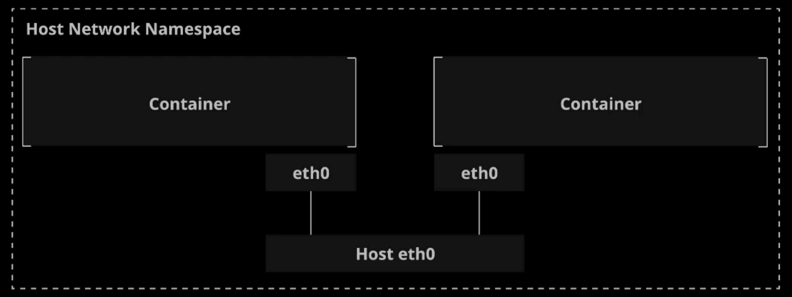
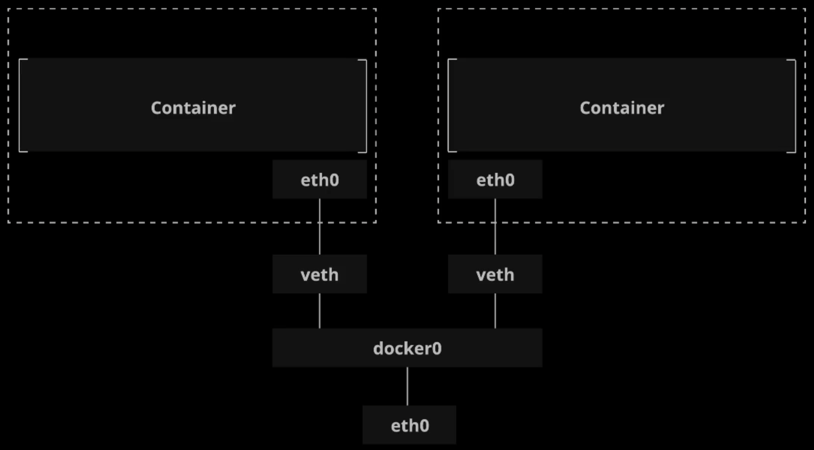
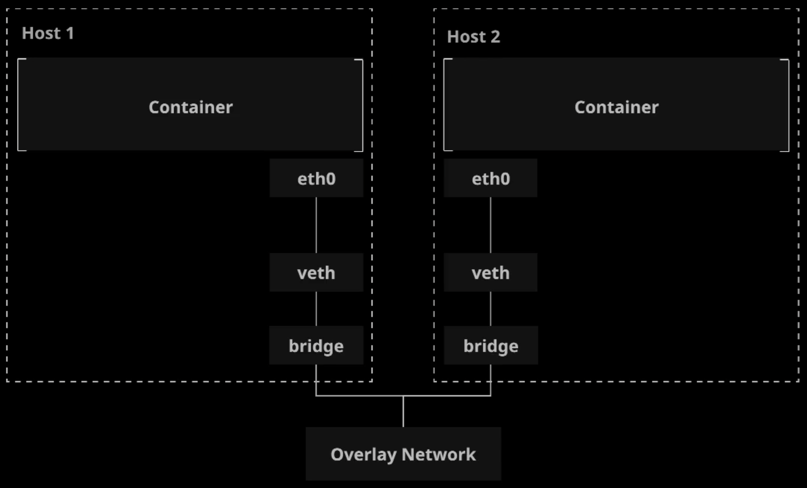
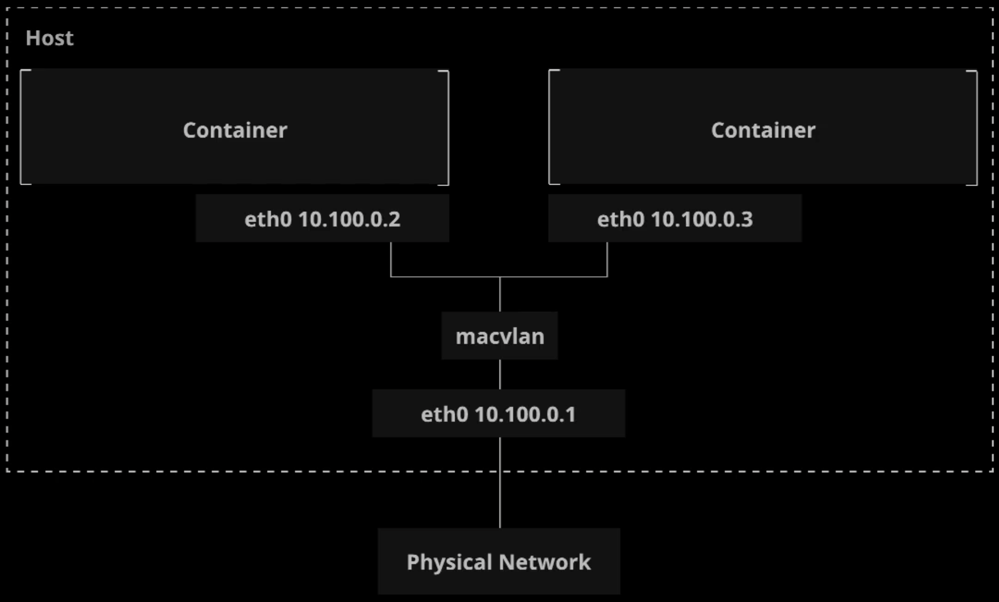
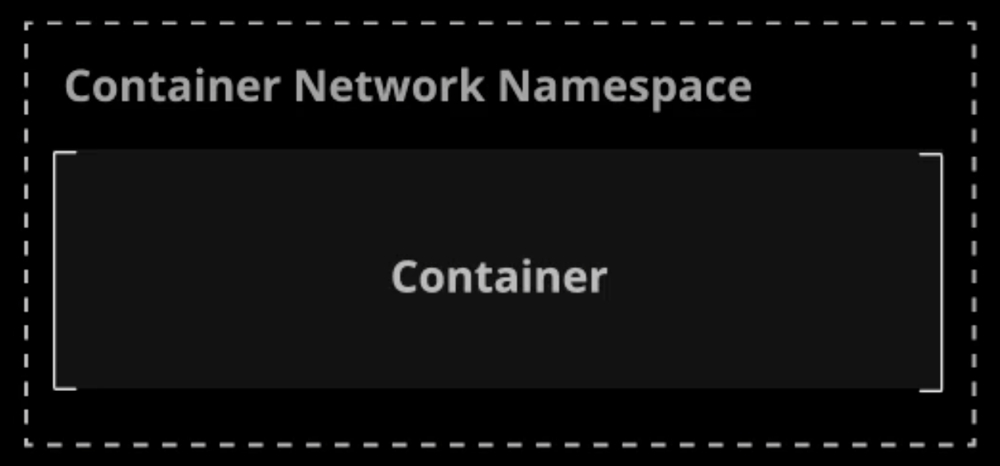

# Built-In Network Drivers

Docker includes several built-in network drivers, known as **Native Network Drivers**.

These network drivers implement the concepts described in the **Container Networking Model (CNM)**.

The **Native Network Drivers** are:

* Host

* Bridge

* Overlay

* MACVLAN

* None

W/ `docker run`, you can choose a network driver by using `--net=DRIVER`.

## The Host Network Driver



The Host Network Driver connects the container directly to the host's networking stack. It provides no isolation between containers or between containers and the host.

```zsh
docker run --net host nginx
```

* Containers use the host's networking resources directly.

* No sandboxes, all containers on the host using the host driver share the same network namespace.

* No two containers can use the same port(s).

### Use cases:

> Simple and easy setup, one or only a few containers on a single host.

```zsh
docker run -d --net host --name host_busybox radial /busyboxplus:curl sleep 3600
```

Run another container on the host network:

```zsh
docker run -d --net host --name host_nginx nginx
```

View `eth0` network device:

```zsh
ip add | grep eth0
```

```zsh
docker exec host_busybox ip add | grep eth0
```

```zsh
docker exec host_busybox curl localhost:80
```

```zsh
curl localhost:80
```

## The Bridge Network Driver



The Bridge Network Driver uses Linux bridge networks to provide connectivity between containers on the same host.

```zsh
docker network create --driver bridge my-bridge-net
docker run -d --network my-bridge-net nginx
```

* This is the default driver for containers running on a single host (i.e., not in a swarm).

* Creates a Linux Bridge for each Docker network.

* Creates a default Linux bridge network called `bridge0`. Containers automatically connect to this if no other network is specified.

### Use cases:

> Isolated networking among containers on a single host.

Automatically connects to `docker0` default bridge network on host:

```zsh
ip link
```

```zsh
docker network create --driver bridge my-bridge-net
```

```zsh
docker run -d --name bridge_nginx --network my-bridge-net nginx
```

Run `busybox` container:

```zsh
docker run --rm --name bridge_busybox --network my-bridge-net radial/busyboxplus:curl curl bridge_nginx:80
```

## The Overlay Network Driver



The Overlay Network Driver uses a routing mesh to connect containers across multiple Docker hosts, usually in a Docker swarm.

```zsh
docker network create --driver overlay my-overlay-net
docker service create --network my-overlay-net nginx
```

* Uses a VXLAN data plane, which allows the underlying network infrastructure (underlay) to route data between hosts in a way that is transparent to the containers themselves.

* Automatically configures network interfaces, bridges, etc. on each host as needed.

### Use cases:

> Networking between containers in a swarm.

Create custom Overlay Network:

```zsh
docker network create --driver overlay my-overlay-net
```

Create a service since we are functioning in Docker Swarm:

```zsh
docker service create --name overlay_nginx --network my-overlay-net nginx
```

Run another service-`busybox`:

```
docker service create --name overlay_busybox --network my-overlay-net radial/busyboxplus:curl sh -c 'curl overlay_nginx:80 && sleep 3600'
```

```zsh
docker service logs overlay_busybox
```

## The MACVLAN Network Driver



The MACVLAN Network Driver offers a more lightweight implementation by connecting container interfaces directly to host interfaces. This driver connects containers directly to the host's network interfaces, but uses special configuration to provide isolation.

```zsh
docker network create -d macvlan --subnet 192.168.0.0/24 --gateway 192.168.0.1 -o
parent=eth0 \
my-macvlan-net

docker run -d --net my-macvlan-net nginx
```

* Uses direct association w/ Linux interfaces instead of a bridge interface.

* Harder to configure and greater dependency between MACVLAN and the external network.

* More lightweight and less latency.

### Use cases: 

> When there is a need for extremely low latency, or a need for containers w/ IP addresses in the external subnet.

Create network:

```zsh
docker network create -d macvlan --subset 192.168.0.0/24 --gateway 192.168.0.1 -o parent=eth0 my-macvlan-net
```

Create `nginx` container:

```zsh
docker run -d --name macvlan_nginx --net my_macvlan -net nginx
```

```zsh
docker run --rm --name macvlan_busybox --net my-macvlan-net radial/busyboxplus:curl curl 192.168.0.2:80
```

## The None Network Driver



This driver provides sandbox isolation, but it does not provide any implementation for networking between containers or between containers and the host.

```zsh
docker run --net none -d nginx
```

* Container is completely isolated from other containers and the host.

* If you want networking w/ the None driver, you must set everything up manually.

* None does create a separate networking namespace for each container, but no interfaces or endpoints.

### Use Cases:

> When there is no need for container networking, or you want to set all of the networking up yourself.

```zsh
docker run --net none -d --name none_nginx nginx
```

```zsh
docker run --rm radial/busyboxplus:curl curl none_nginx:80
```
