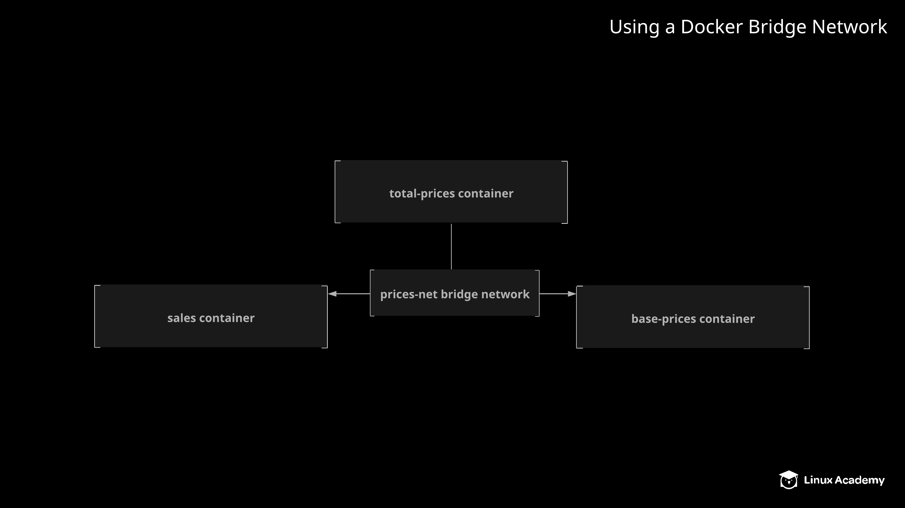

# Using a Docker Bridge Network

## About this Lab

By default, all containers on a host can communicate with one another over a default bridge network. However, in some cases, you may want to isolate groups of containers by allowing them to communicate over their own isolated network.

In this lab, you will have the opportunity to create a custom bridge network designed to facilitate communication between containers on a Docker host.

## Learning Objectives

[ ] Create the bridge network.

[ ] Create the base-price container.

[ ] Create the sales container.

[ ] Create the total-price container.

## Additional Resources

Your fruit stand company has a Docker server set up to run three application components. There is a `base-price` component which serves a list of the base prices for the products sold at the fruit stand. There is also a `sales` component which provides a list of products that are on sale and their discount percentages. Finally, there is a `total-price` component that queries data from the other two services and calculates the total price for each item, including the discounts from sales.

You have been asked to configure these three components by running containers on the Docker server. They need to communicate with each other using their own bridge network, which you will also need to create. A Docker server has been made available for you to use.

Configure these application components on the Docker server so that the following specifications are met:

* Create a bridge network called `prices-net`.

* Run a container called `base-price` w/ the `linuxacademycontent/prices-base-price:1` image. Configure this container to use the `prices-net` network.

* Run a container called `sales` w/ the `linuxacademycontent/prices-sales:1` image. Configure this container to use the `prices-net` network.

* Run a container called `total-price` w/ the `linuxacademycontent/prices-total-price:1` image. Configure this container to use the `prices-net` network. Publish this container's port `80` to port `8080` on the host.

If everything is set up correctly, you should be able to access the total prices list w/ `curl localhost:8080`.
