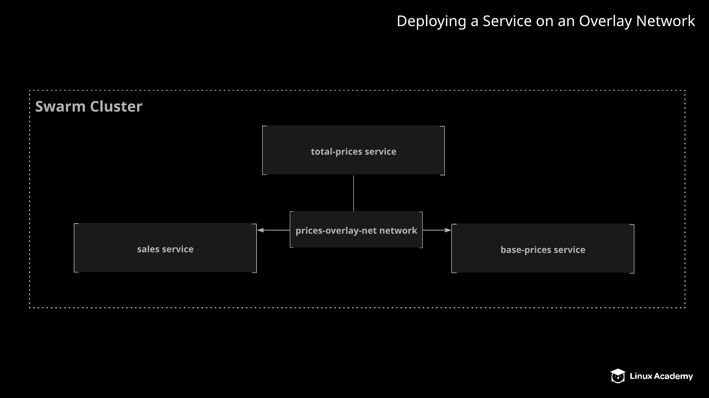

# Deploying a Service on an Overlay Network

## About this Lab

Bridge networks are a powerful tool for controlling communication between containers on a single host, but what if you need to provide isolated networking between containers in Docker Swarm? With Docker Swarm, you can use custom overlay networks to allow groups of containers to communicate transparently, even if they are running on different swarm nodes.

In this lab, you will have the opportunity to work with overlay networks. You will set up a custom overlay network and deploy three different services that communicate with each other using this network.

## Learning Objectives

[ ] Create the overlay network.

[ ] Create the base-price service.

[ ] Create the sales service.

[ ] Create the total-price service.

## Additional Resources

Your fruit stand company has some software that calculates and serves a list of products and their prices, taking into account items that are on sale and how the sales affect the total price. This software consists of three components: a `base-price` component which serves the base prices of fruits sold by the fruit stand, a `sales` component which provides a list of items that are on sale and how much each item is discounted, and a `total-price` component which communicates with the other two and calculates the final price for each item.

These components have been running on a single Docker host, but as your business is expanding, it is time to upgrade to a swarm cluster for greater flexibility. Run these three application components as services in your swarm cluster, and provide them with a custom overlay network to facilitate isolated communication between them.

Configure these application components on the Swarm cluster so that the following specifications are met:

* Create an overlay network called `prices-overlay-net`.

* Create a service called `base-price` with `3` replicas using the `linuxacademycontent/prices-base-price:1` image. Configure the service to use the `prices-overlay-net` network.

* Create a service called `sales` with `3` replicas using the `linuxacademycontent/prices-sales:1` image. Configure the service to use the `prices-overlay-net` network.

* Create a service called `total-price` with `2` replicas using the `linuxacademycontent/prices-total-price:1` image. Configure the service to use the `prices-overlay-net` network. Expose this service's port `80` on port `8080`.

If everything is set up correctly, you should be able to access the total prices list with `curl localhost:8080`.
