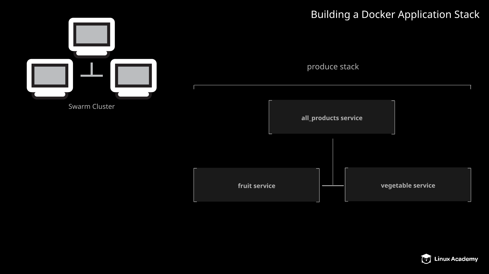

# Building a Docker Application Stack

## Introduction

Stacks are one of the most powerful orchestration features available in Docker Swarm. They allow you to easily manage complex applications consisting of multiple interdependent components running in separate containers.

In this lab, you will have the opportunity to work with Docker stacks by building a multi-component application as a Docker stack. You will also learn how to manage existing stacks by scaling a stack's services after it has already been deployed. This will give you some hands-on insight into Docker stacks.



## Solution

1. Begin by logging in to the lab server using the credentials provided on the hands-on lab page:

```
ssh cloud_user@<PUBLIC_IP_ADDRESS>
```

### Build and deploy the application stack

1. Create an empty project directory with a Docker compose YAML file inside.

```
cd ~/

mkdir produce

cd produce

vi produce.yml
```

2. Build a stack definition in `produce.yml` to meet the provided specifications.

```yml
version: '3'
services:
   fruit:
     image: linuxacademycontent/fruit-service:1.0.1
   vegetables:
     image: linuxacademycontent/vegetable-service:1.0.0
   all_products:
     image: linuxacademycontent/all-products:1.0.0
     ports:
     - "8080:80"
     environment:
     - FRUIT_HOST=fruit
     - FRUIT_PORT=80
     - VEGETABLE_HOST=vegetables
     - VEGETABLE_PORT=80
```

3. Deploy the stack using the compose file.

```
docker stack deploy -c produce.yml produce
```

4. Verify that the stack is working.

```
curl localhost:8080
```

> [!NOTE]
>
> After deploying, it may take a few moments for the stack to become responsive. You can check the status of the services with `docker stack services produce`. Once the services are up and running, you should get some JSON data containing a combined list of fruits and vegetables.

### Scale the _Fruit_ and _Vegetable_ services in the stack

1. Set the number of replicas to `3` for the _Fruit_ and _Vegetable_ services in the compose file.

```
vi produce.yml
```

```yml
version: '3'
services:
   fruit:
     image: linuxacademycontent/fruit-service:1.0.1
     deploy:
       replicas: 3
   vegetables:
     image: linuxacademycontent/vegetable-service:1.0.0
     deploy:
       replicas: 3
   all_products:
     image: linuxacademycontent/all-products:1.0.0
     ports:
     - "8080:80"
     environment:
     - FRUIT_HOST=fruit
     - FRUIT_PORT=80
     - VEGETABLE_HOST=vegetables
     - VEGETABLE_PORT=80
```

2. Redeploy the stack using the compose file.

```
docker stack deploy -c produce.yml produce
```

3. Verify that the stack is still working.

```
curl localhost:8080
```

You should get some JSON data containing a combined list of fruits and vegetables.

Use `docker stack services produce` to see that the number of replicas for the Fruit and Vegetable services is now 3.
