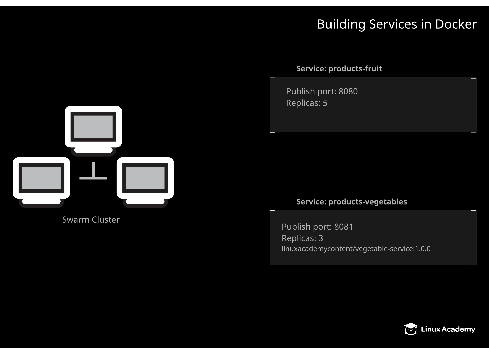

# Building Services in Docker

## About this Lab

Services are the most basic and straightforward way to run containers using a Docker swarm. They allow you to execute multiple replica containers across all nodes in the Swarm cluster.

In this lab, you will have the opportunity to work with Docker services. You will practice scaling services by changing the number of replicas for an existing service. You will also have the opportunity to create a new service and run it in the cluster.

## Learning Objectives

[ ] Scale the products-fruit service to 5 replicas.

[ ] Create the products-vegetables service.

## Additional Resources

Your supermarket company is working on expanding their Docker infrastructure. They have an existing service that provides a list of fruit sold in their stores. After measuring the amount of load on this service, they have asked you to scale this service up to a higher number of replicas.

In addition, there is a new service that provides a list of vegetables. This new service needs to be created in the cluster. The swarm has already been set up, and you have been given access to it. To complete the lab, ensure that the swarm meets the following specifications:

* Scale the service called `products-fruit` to `5` replicas.

* Create a new service called `products-vegetables` running the `linuxacademycontent/vegetable-service:1.0.0` image.

* Publish `products-vegetables` on port `8081`. The application listens on port `80`.

* Run `products-vegetables` with `3` replicas.

You can test the `products-fruit` service from any swarm node (including the manager) with curl `localhost:8080`.

Once `products-vegetables` is running, you should be able to test it from any swarm node (including the manager) with `curl localhost:8081`.
