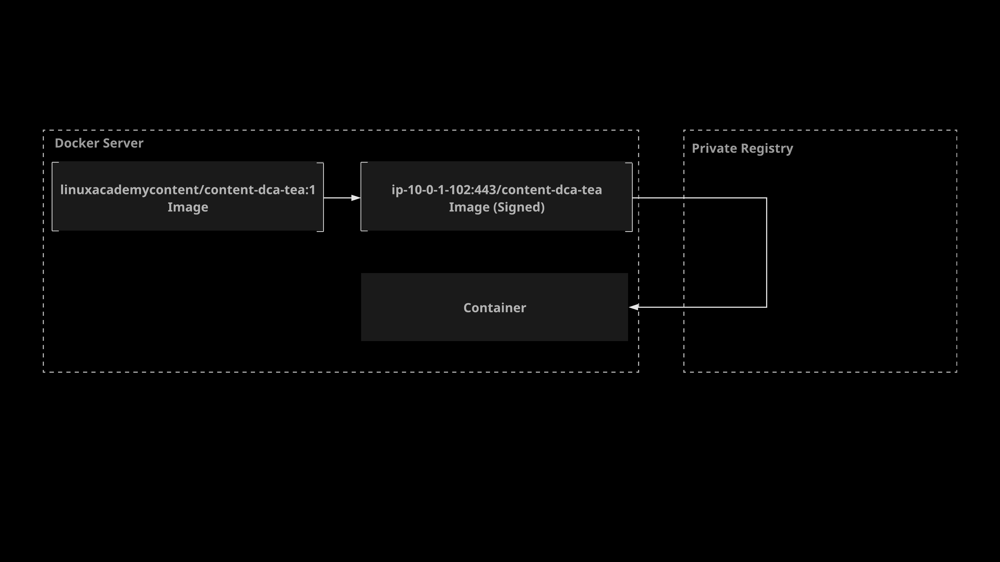

# Working with Docker Content Trust

## About this Lab

Software signing is an important aspect of security. It is imperative to verify any software you run on your system has not been tampered with, and Docker images are no exception. Docker Content Trust enables you to sign and verify images before downloading or running them on your system. In this lab, you will have the opportunity to work with Docker Content Trust (DCT) by signing a previously unsigned image and running it on a system that has DCT enabled.

## Learning Objectives

[ ] Generate a Trust Key and Add Yourself as a Signer to the New Repository

[ ] Create a New Tag for the Image, Sign It, and Push It to the Registry

## Additional Resources



Your supermarket company has a Docker server where they want to run a simple web service in a container. This web service provides a list of the various kinds of tea sold in each of the company's stores. However, Docker Content Trust on the server is enabled to bolster the overall security. The tea service cannot run on the server because the image is not currently signed.

Your task is to create a new tag for the image, sign it, and then push it to a private registry. Once you have done this, run the image to verify you can successfully execute the image with Docker Content Trust enabled.

Here is some important information to keep in mind as you work through this lab:

* The signed image should be stored in the `ip-10-0-1-102:443/content-dca-tea` repository. Generate a trust key and add yourself as a signer for this repository.

* The unsigned image is already pulled on the server and is called `linuxacademycontent/content-dca-tea:1`.

* The server is already configured to use the private registry, which is `ip-10-0-1-102:443`. You do not need to log in to the registry or configure certificate trust settings for the registry.

* Create a new tag for the image. The new tag should be `ip-10-0-1-102:443/content-dca-tea:1`.

* Sign the new tag and push it to the private registry.

Once you have pushed the signed image, you should be able to run it with:

```zsh
docker run -d -p 8080:80 ip-10-0-1-102:443/content-dca-tea:1
```

Once the image is running, you can test it with:

```zsh
curl localhost:8080
```

You should see a JSON list generated for the various kinds of tea.
