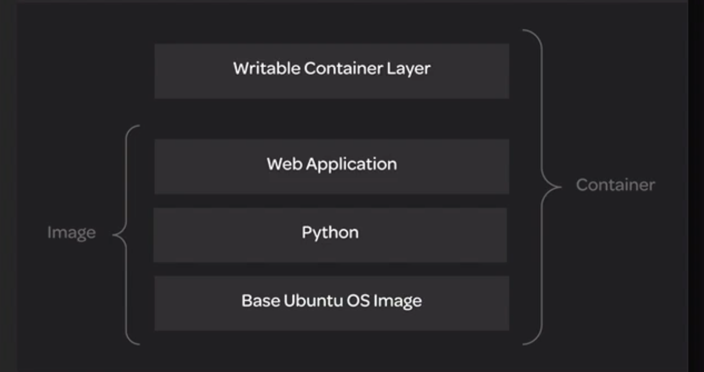

# Storage Drivers

**Storage drivers** are sometimes known as **Graph drivers**. The proper storage driver to use often depends on your operating system and other local configuration factors.

Here are what default storage drivers consist of in terms of systems:

* **overlay2**: Latest versions of Ubuntu and CentOS/RHEL.

* **devicemapper**: CentOS 7 and earlier.

* **aufs**: Ubuntu 14.04 and older.

## Storage Models

Persistent data can be managed using several storage models.

### Filesystem Storage:

* Data is stored in the form of regular files on the host disk.

* Used by `overlay2` and `aufs`.

* Efficient use of memory.

* Inefficient w/ write-heavy workloads.

### Block Storage:

* Stores data in blocks using special block storage devices.

* Used by `devicemapper`.

* Efficient w/ write-heavy workloads.

### Object Storage:

* Stores data in an external object-based store.

* Application must be designed to use object-based storage.

* Flexible and scalable.

We can inspect containers and images to locate the actual location of their data files on disk.

## Storage Layers



Both containers and images have layers. You can find the location of the layered data on disk using `docker inspect`.

```
docker run --name storage_nginx nginx
```

### Locate layered file system data:

```
docker container inspect <CONTAINER_NAME>
```

e.g.

```
docker container inspect storage_nginx | grep GraphDriver
```

```
docker image inspect <IMAGE_NAME>
```

e.g.

```
docker image inspect nginx | grep GraphDriver
```
