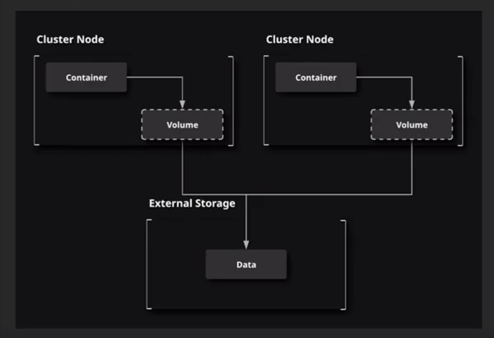

# Storage in a Cluster

Swarm clusters present special challenges when we want to share volumes between multiple containers. If the containers are running on different nodes, then they still need to be able to access the shared data.

When working w/ multiple Docker machines, such as a swarm cluster, you may need to share Docker volume storage between those machines.

Some options:

* Use application logic to store data in external object storage.

* Use a volume driver to create a volume that is external to any specific machine your cluster.



## `vieux/sshfs` plugin

Provides a volume driver that interacts w/ remote storage using SSH, allowing the storage to be accessed from multiple nodes.

1. Install the plugin:

```
docker plugin install --grant-all-permissions vieux/sshfs
```

2. Create a service that uses the `vieux/sshfs` volume driver to provide shared storage between its containers:

```zsh
docker service create \
    --replicas=3 \
    --name storage-service \
    --mount volume-driver=vieux/sshfs,source=cluster-volume,destination=/app, \
    volume-opt=sshcmd=cloud_user@<STORAGE_SERVER_PRIVATE_IP>:/home/cloud_user/external,volume-opt=password=<PASSWORD> busybox cat \
    /app/message.txt
```

```
docker service logs storage-service
```
