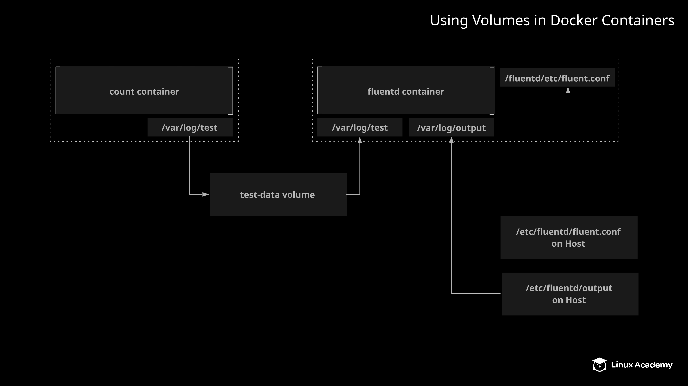

# Using Volumes in Docker Containers

## About this Lab

Containers are designed to be ephemeral, so when you need persistent data, it is usually not a good idea to store it directly in the container's file system. This is where Docker volumes come into play. Docker volumes allow you to store persistent data outside the container itself, providing greater flexibility in what you can do with your data.

In this lab, you will have the opportunity to solve a complex problem using Docker volumes. You will have a chance to work with both shared volumes and bind mounts in order to implement two containers which work together, one container transforming data created by the other. This will give you some practice in working with volumes, as well as some insight into the many ways in which Docker volumes can be used.

## Learning Objectives

[ ] Create the shared volume and counter container to generate some sample data.

[ ] Create the fluentd container to transform and output the data from the counter container.

## Additional Resources

Your team wants to use an application called `fluentd` to transform log output from containers into a standard format. In order to make use of this technology, they have asked you to design a proof-of-concept to demonstrate how this can be done. You will need to run a container that generates some log output in a file, then run a second container with `fluentd` that is able to read the log output from the first container, transform it, and output the transformed data to another file on the host machine. You do not need to have knowledge of `fluentd` to complete this task. A `fluentd` configuration file has already been provided for you.

The proof-of-concept should meet the following specifications:

* The first container should be called `counter`. It will generate some log data for testing by counting numbers.

* For the `counter` container, use the `busybox` image with the following command: `sh -c 'i=0; while true; do echo "$i: $(date)" >> /var/log/test/1.log; i=$((i+1)); sleep 1; done'`. This will write some test data to `/var/log/test/1.log` every second.

* Create a volume called test-data, and mount it to the counter container at /var/log/test. This volume will be shared with the fluentd container so that it can read the test data.

* Create a second container called `fluentd` with the `k8s.gcr.io/fluentd-gcp:1.30` image.

* Provide an environment variable to the `fluentd` container called `FLUENTD_ARGS` with the value `-c /fluentd/etc/fluent.conf`

* Mount the `test-data` volume to the `fluentd` container at `/var/log/input`.

* There is a `fluentd` configuration file located on the server at `/etc/fluentd/fluent.conf`. Use a bind mount to mount this file to the `fluentd` container at `/fluentd/etc/fluent.conf`.

* Create an additional bind mount so that the `fluentd` container can output the transformed log data to the host's file system. Mount the directory `/etc/fluentd/output` on the host to `/var/log/output` on the `fluentd` container.
