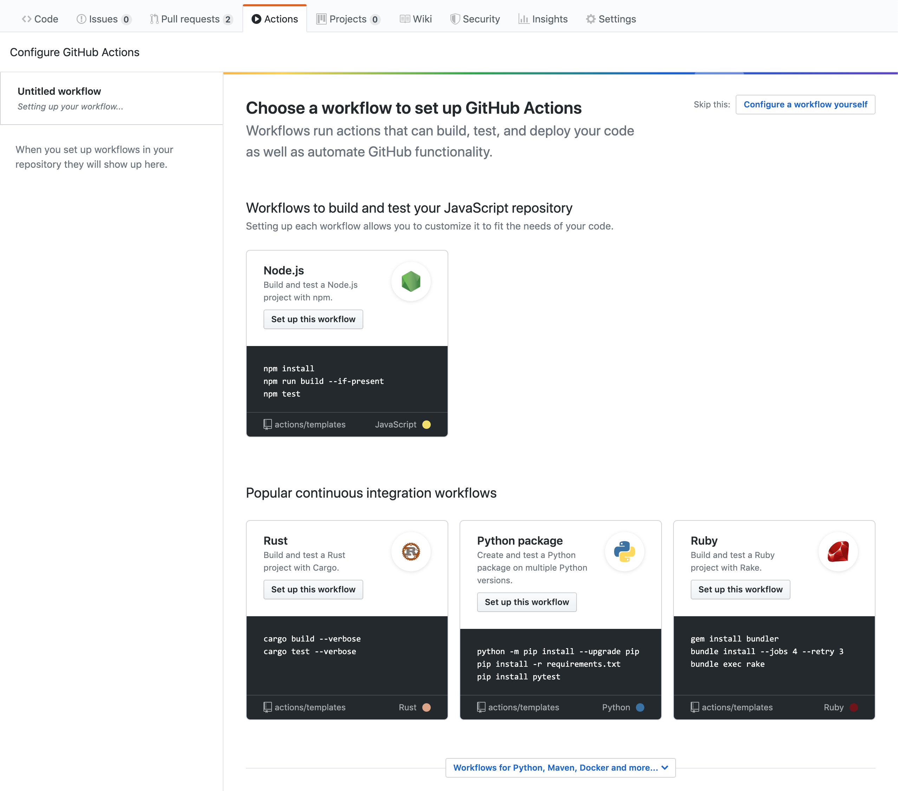

# About Continuous Integration

You can create custom continuous integration (CI) workflows directly in your GitHub repository w/ GitHub Actions.

Continuous integration (CI) is a software practice that requires frequently commiting code to a shared repository.

Committing code more often detects errors sooner and reduces the amount of code a developer needs to debug when finding the source of an error.

Frequent code updates also make it easier to merge changes from different members of a software development team.

This is great for developers, who can spend more time writing code and less time debugging errors or resolving merge conflicts.

When you commit code to your repository, you can continuously build and test the code to make sure that the commit doesn't introduce errors.

Your tests can include code linters (which check style formatting), security checks, code coverage, functional tests, and other custom checks.

Building and testing your code requires a server. You can build and test updates locally before pushing code to a repository, or you can use a CI server that checks for new code commits in a repository.

## About continuous integration using GitHub Actions

CI using GitHub Actions offers workflows that can build the code in your repository and run your tests. Workflows can run on GitHub-hosted virtual machines, or on machines that you host yourself.

You can configure your CI workflow to run when a GitHub event occurs (for example, when new code is pushed to your repository), on a set schedule, or when an external event occurs using the repository dispatch webhook.

GitHub runs your CI tests and provides the results of each test in the pull request, so you can see whether the change in your branch introduces an error.

When all CI tests in a workflow pass, the changes you pushed are ready to be reviewed by a team member or merged.

When a test fails, one of your changes may have caused the failure.

When you set up CI in your repository, GitHub analyzes the code in your repository and recommends CI workflows based on the language and framework in your repository.

For example, if you use `Node.js`, GitHub will suggest a template file that installs your Node.js packages and runs your tests.

You can use the CI workflow template suggested by GitHub, customize the suggested template, or create your own custom workflow file to run your CI tests.



In addition to helping you set up CI workflows for your project, you can use GitHub Actions to create workflows across the full software development life cycle.

For example, you can use actions to deploy, package, or release your project.

## Building and testing .NET

You can create a continuous integration (CI) workflow to build and test your .NET project.

### Introduction

This guide shows you how to build, test, and publish a .NET package.

### Starting w/ the .NET workflow template

GitHub provides a .NET workflow template that should work for most .NET projects, and this guide includes examples that show you how to customize this template.

For more information, see the [.NET workflow template](https://github.com/actions/setup-dotnet).

To get started quickly, add the template to the `.github/workflows` directory of your repository.

```yaml
name: dotnet package

on: [push]

jobs:
  build:

    runs-on: ubuntu-latest
    strategy:
      matrix:
        dotnet-version: ['3.0', '3.1.x', '5.0.x' ]

    steps:
      - uses: actions/checkout@v2
      - name: Setup .NET Core SDK ${{ matrix.dotnet-version }}
        uses: actions/setup-dotnet@v1.7.2
        with:
          dotnet-version: ${{ matrix.dotnet-version }}
      - name: Install dependencies
        run: dotnet restore
      - name: Build
        run: dotnet build --configuration Release --no-restore
      - name: Test
        run: dotnet test --no-restore --verbosity normal
```

### Specifying a .NET version

To use a preinstalled version of the .NET Core SDK on a GitHub-hosted runner, use the `setup-dotnet` action.

This action finds a specific version of .NET from the tools cache on each runner, and adds the necessary binaries to `PATH`.

These changes will persist for the remainder of the job.

The `setup-dotnet` action is the recommended way of using .NET w/ GitHub Actions, b/c it ensures consistent behavior across different runners and different versions of .NET.

If you are using a self-hosted runner, you must install .NET and add it to `PATH`.

For more information, see the [`setup-dotnet`](https://github.com/marketplace/actions/setup-net-core-sdk) action.

**Using multiple .NET versions**

```yaml
name: dotnet package

on: [push]

jobs:
  build:

    runs-on: ubuntu-latest
    strategy:
      matrix:
        dotnet: [ '3.0', '3.1.x', '5.0.x' ]

    steps:
      - uses: actions/checkout@v2
      - name: Setup dotnet ${{ matrix.dotnet-version }}
        uses: actions/setup-dotnet@v1
        with:
          dotnet-version: ${{ matrix.dotnet-version }}
      # You can test your matrix by printing the current dotnet version
      - name: Display dotnet version
        run: dotnet --version
```

**Using a specific .NET version**

You can configure your job to use a specific version of .NET, such as `3.1.3`.

Alternatively, you can use semantic version syntax to get the latest minor release.

This example uses the latest minor release of .NET 3.

```yaml
    - name: Setup .NET 3.x
      uses: actions/setup-dotnet@v1
      with:
        # Semantic version range syntax or exact version of a dotnet version
        dotnet-version: '3.x'
```

### Installing dependencies

GitHub-hosted runners have the NuGet package manager installed.

You can use the dotnet CLI to install dependencies from the NuGet package registry before building and testing your code.

For example, the YAML below installs the `Newtonsoft` package.

```yaml
steps:
- uses: actions/checkout@v2
- name: Setup dotnet
  uses: actions/setup-dotnet@v1
  with:
    dotnet-version: '3.1.x'
- name: Install dependencies
  run: dotnet add package Newtonsoft.Json --version 12.0.1
```

**Caching dependencies**

You can cache NuGet dependencies using a unique key, which allows you to restore the dependencies for future workflows w/ the `cache` action.

For example, the YAML below installs the `Newtonsoft` package.

For more information, see "[Caching dependencies to speed up workflows](https://docs.github.com/en/actions/guides/caching-dependencies-to-speed-up-workflows)."

```yaml
steps:
- uses: actions/checkout@v2
- name: Setup dotnet
  uses: actions/setup-dotnet@v1
  with:
    dotnet-version: '3.1.x'
- uses: actions/cache@v2
  with:
    path: ~/.nuget/packages
    # Look to see if there is a cache hit for the corresponding requirements file
    key: ${{ runner.os }}-nuget-${{ hashFiles('**/packages.lock.json') }}
    restore-keys: |
      ${{ runner.os }}-nuget
- name: Install dependencies
  run: dotnet add package Newtonsoft.Json --version 12.0.1
```

Note: Depending on the number of dependencies, it may be faster to use the dependency cache.

Projects w/ many large dependencies should see a performance increase as it cuts down the time required for downloading.

Projects w/ fewer dependencies may not see a significant performance increase and may even see a slight decrease due to how NuGet installs cached dependencies.

The performance varies from project to project.

### Building and testing your code

You can use the same commands that you use locally to build and test your code.

This example demonstrates how to use `dotnet build` and `dotnet test` in a job:

```yaml
steps:
- uses: actions/checkout@v2
- name: Setup dotnet
  uses: actions/setup-dotnet@v1
  with:
    dotnet-version: '3.1.x'
- name: Install dependencies
  run: dotnet restore
- name: Build
  run: dotnet build
- name: Test with the dotnet CLI
  run: dotnet test
```

### Packaging workflow data as artifacts

After a workflow completes, you can upload the resulting artifacts for analysis.

For example, you may need to save log files, core dumps, test results, or screenshots.

The following example demonstrates how you can use the `upload-artifact` action to upload test results.

For more information, see "[Persisting workflow data using artifacts](https://docs.github.com/en/github/automating-your-workflow-with-github-actions/persisting-workflow-data-using-artifacts)."

```yaml
name: dotnet package

on: [push]

jobs:
  build:

    runs-on: ubuntu-latest
    strategy:
      matrix:
        dotnet-version: [ '3.0', '3.1.x', '5.0.x' ]

      steps:
        - uses: actions/checkout@v2
        - name: Setup dotnet
          uses: actions/setup-dotnet@v1
          with:
            dotnet-version: ${{ matrix.dotnet-version }}
        - name: Install dependencies
          run: dotnet restore
        - name: Test with dotnet
          run: dotnet test --logger trx --results-directory "TestResults-${{ matrix.dotnet-version }}"
        - name: Upload dotnet test results
          uses: actions/upload-artifact@v2
          with:
            name: dotnet-results-${{ matrix.dotnet-version }}
            path: TestResults-${{ matrix.dotnet-version }}
          # Use always() to always run this step to publish test results when there are test failures
          if: ${{ always() }}
```

### Publishing to package registries

You can configure your workflow to publish your Dotnet package to a package registry when your CI tests pass.

You can use repository secrets to store any tokens or credentials needed to publish your binary.

The following example creates and publishes a package to GitHub packages using `dotnet core cli`:

```yaml
name: Upload dotnet package

on:
  release:
    types: [created]

jobs:
  deploy:
    runs-on: ubuntu-latest
    permissions:
      packages: write
      contents: read
    steps:
      - uses: actions/checkout@v2
      - uses: actions/setup-dotnet@v1
        with:
          dotnet-version: '3.1.x' # SDK Version to use.
          source-url: https://nuget.pkg.github.com/<owner>/index.json
        env:
          NUGET_AUTH_TOKEN: ${{secrets.GITHUB_TOKEN}}
      - run: dotnet build --configuration Release <my project>
      - name: Create the package
        run: dotnet pack --configuration Release <my project>
      - name: Publish the package to GPR
        run: dotnet nuget push <my project>/bin/Release/*.nupkg
```
