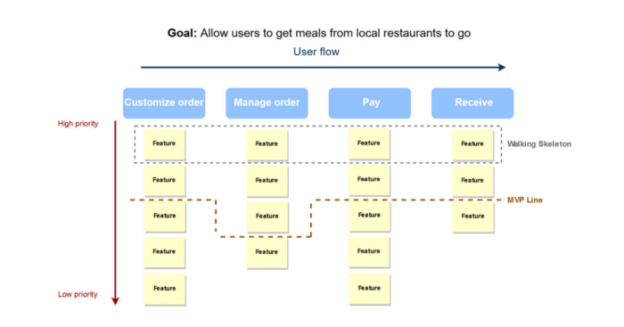

# Productivity: Walking Skeleton the simple prioritization technique for MVPs

"A tiny implementation of the system that performs a small end-to-end function. It need not use the final architecture, but it should link together the main architectural components. The architecture and the functionality can then evolve in parallel."

A Walking Skeleton is a proof of concept of your basic architectural concept. Where a typical proof of concept focuses on a single functionality, a Walking Skeleton is a minimalistic end-to-end implementation.

A Walking Skeleton is not an outline of your concept, it is really executable and shippable (it can "walk") and should be accompanied w/ tests.

B/c of the nature of this technique, the Walking Skeleton is used in prioritizing features in Minimum Viable Products (MVP) and defines which of them are absolutely critical for the product to work.

Sometimes the Walking Skeleton may be smaller than the actual MVP but it puts the necessary features first.

## How does it work?

All of the features are arranged as columns, acting like vertebrae and stories hang down like ribs.

This [representation](https://www.altexsoft.com/blog/business/most-popular-prioritization-techniques-and-methods-moscow-rice-kano-model-walking-skeleton-and-others/) allows you to visualize the importance of user stories within certain features and focus on implementing one set of stories at a time.

After you've defined the backbone and listed all your main features, you can start prioritizing the stories within each rib. The higher the story is, the closer it is to the backbone, the more important and urgent it is. Stories that are closer to the bottom are less important.

Once you've arranged the stories, you'll see a minimum implementation of your product at the top of the story map, a very minimal but working product that is usually ready for user testing.

## When to use

The main goal of the Walking Skeleton model is to ensure that the MVP will eventually "walk", meaning, it will function in accordance w/ the requirements. Thus, if you evaluate the features by this model, you will need to identify the following:

* The must-haves that make the system work

* The ones that should be there in correspondence w/ the requirements

* The ones that resonate w/ the business goals and values

* The ones that passed the tests

If you select and realize these features, you will receive a functioning MVP as an outcome.

On the other hand, this model does not imply delivering a more sustainable and complex product with numerous extra features or additional business value, so you will have only bare functionality at your disposal.

For the latter, the stakeholders should consider something more comprehensive and detailed.

However, the biggest benefit of creating a walking skeleton is that it allows development teams to immediately focus on new product functionality. Before the first sprint even begins, you're already proven that your walking skeleton will run in a production-like environment, and you've established the automation necessary to support ongoing development.

But more than that, having a walking skeleton prior to the first sprint can help reduce risks and head off problems.

## How does a Walking Skeleton reduce innovation risks?

By having a deployable framework ready from the very beginning, you can identify and deal w/ problems before they become unmanageable.

Discovering a problem on day zero gives you options and time to explore that problem.

If you start down the path of making your walking skeleton work in a production-like environment and end up running into issues, at least you know that problem exists - and problems you know you have are much better than problems you don't know you have.

After all, one of the biggest criticisms of Scrum is that it can cause teams to paint themselves into a corner by not taking the long-term vision into account. In reality, Scrum gives teams the opportunity to think long term and act short term - and the walking skeleton can help establish the framework for that long-term thinking.

## Where do I get a walking skeleton?

There are a few possible sources for creating a walking skeleton:

1. Borrow from past products your team has already built, and strip them down for this new purpose.

2. Seek out a template, either internal or community-based.

3. Build from scratch.

If you decide yo go w/ option No. 3, make sure you minimze the process.

Ideally, a newly built walking skeleton shouldn't take more than two to four weeks.

Keep in mind that you just want to build enough to get going so you can spin up a framework and get end to end w/ source code.
